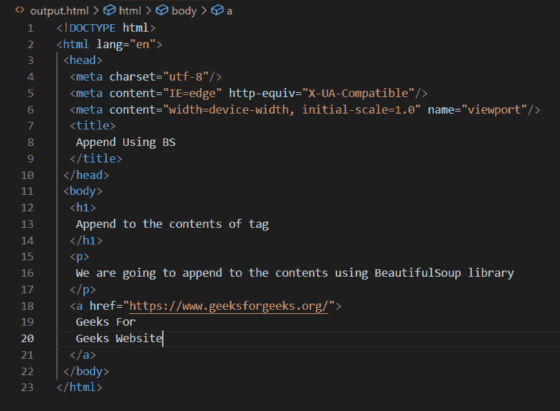

# 漂亮的组合–附加到标签的内容中

> 原文:[https://www . geesforgeks . org/beautulsoup-append-to-contents-of-tag/](https://www.geeksforgeeks.org/beautifulsoup-append-to-the-contents-of-tag/)

**先决条件:** [美丽组合](https://www.geeksforgeeks.org/implementing-web-scraping-python-beautiful-soup/)

美化程序是一个 Python 库，用于从网页中提取内容。它用于从 HTML 和 XML 结构中提取内容。要使用这个库，我们需要先安装它。这里我们将把文本附加到标签的现有内容中。我们将在美丽的牛津大学图书馆的帮助下做到这一点。

**接近**

*   导入模块
*   打开 HTML 文件
*   阅读内容
*   将内容附加到所需的标签
*   保存对文件的更改

**使用的功能:**

美化组模块的附加功能用于将内容附加到所需的标签。

**语法:**

> 追加(“<string>”)</string>

**使用的文件:**

## 超文本标记语言

```
<!DOCTYPE html>
<html lang="en">
<head>
    <meta charset="UTF-8">
    <meta http-equiv="X-UA-Compatible" content="IE=edge">
    <meta name="viewport" content="width=device-width, initial-scale=1.0">
    <title>Append </title>
</head>
<body>
    <h1>Append to the </h1>

<p>We are going to append to the contents using </p>

    <a href="https://www.geeksforgeeks.org/">Geeks For </a>
</body>
</html>
```

**Python 代码:**

## 蟒蛇 3

```
# Python program to append to the contents of tag

# Importing library
from bs4 import BeautifulSoup

# Opening and reading the html file
file = open("gfg.html", "r")
contents = file.read()

soup = BeautifulSoup(contents, "lxml")

# Appending to the contents of 'title' tag in html file
print("Current content in title tag is:-")
print(soup.title)
soup.title.append("Using BS")
print("Content after appending is:-")
print(soup.title)

print("\n")

# Appending to the contents of 'h1' tag in html file
print("Current content in heading h1 tag is:-")
print(soup.h1)
soup.h1.append("contents of tag")
print("Content after appending is:-")
print(soup.h1)

print("\n")

# Appending to the contents of 'p' tag in html file
print("Current content in paragraph p tag is:-")
print(soup.p)
soup.p.append("BeautifulSoup library")
print("Content after appending is:-")
print(soup.p)

print("\n")

# Appending to the contents of 'a' tag in html file
print("Current content in anchor a tag is:-")
print(soup.a)
soup.a.append("Geeks Website")
print("Content after appending is:-")
print(soup.a)

# Code to save the changes in 'output.html' file
savechanges = soup.prettify("utf-8")
with open("output.html", "wb") as file:
    file.write(savechanges)
```

**输出:**



output.html 档案