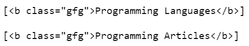
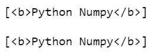

# 漂亮的组合 CSS 选择器–选择第 n 个子代

> 原文:[https://www . geesforgeks . org/beautulsoup-CSS-selector-selection-n-child/](https://www.geeksforgeeks.org/beautifulsoup-css-selector-selecting-nth-child/)

在这篇文章中，我们将看到如何使用[](https://www.geeksforgeeks.org/implementing-web-scraping-python-beautiful-soup/)**来选择第 n 个孩子。为此，使用模块的**选择()**方法。select()方法使用了一个简单的包来对解析后的文档使用 CSS 选择器。**

> ****语法:**选择(“css_selector”)**
> 
> **CSS 选择器:**
> 
>  ***   **第 n 个类型(n):** 选择父代的第 n 个段落子代。
> *   **第 n 个子代(n):** 选择作为父代第 n 个子代的段落**

****进场:****

1.  **导入模块**
2.  **从网页上删除数据。**
3.  **解析刮到 HTML 的字符串。**
4.  **使用 find()函数获取具有给定类名或 id 或 tag_name 的标记。**
5.  **使用选择(“css_selector”)查找第 n 个子代**
6.  **打印孩子。**

****例 1:****

## **蟒蛇 3**

```py
# importing module
from bs4 import BeautifulSoup

markup = """
<html>
    <head>
        <title>GEEKS FOR GEEKS EXAMPLE</title>
    </head>
    <body>
        <p class="1"><b>Geeks for Geeks</b></p>

        <p class="coding">A Computer Science portal for geeks.
            <h1>Heading</h1>
            <b class="gfg">Programming Articles</b>,
            <b class="gfg">Programming Languages</b>,
            <b class="gfg">Quizzes</b>;
        </p>

        <p class="coding">practice</p>

    </body>
</html>
    """

# parsering string to HTML
soup = BeautifulSoup(markup, 'html.parser')

parent = soup.find(class_="coding")

# assign n
n = 2

# print the 2nd <b> of parent
print(parent.select("b:nth-of-type("+str(n)+")"))
print()

# print the <b> which is the 2nd child of the parent
print(parent.select("b:nth-child("+str(n)+")"))
```

****输出:****

****

****说明:****

*   **select(" p:n-of-type(n)")表示选择父级的第 n 个段落子级。**
*   **选择(“p:第 n 个子代(n)”)表示选择父代的第 n 个子代的段落。**
*   **如果父级没有第 n 个子级，这两个函数都将返回[]。**

****例 2:****

## **蟒蛇 3**

```py
# importing module
from bs4 import BeautifulSoup
import requests

# assign website
sample_website='https://www.geeksforgeeks.org/python-programming-language/'
page=requests.get(sample_website)

# parsering string to HTML
soup = BeautifulSoup(page.content, 'html.parser')
parent = soup.find(class_="wrapper")

# assign n
n = 1

# print the 2nd <b> of parent
print(parent.select("b:nth-of-type("+str(n)+")"))
print()

# print the <b> which is the 2nd child of the parent
print(parent.select("b:nth-child("+str(n)+")"))
```

****输出:****

****