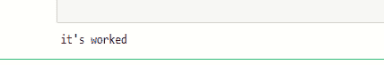

# 漂亮的输出–错误处理

> 原文:[https://www.geeksforgeeks.org/beautifulsoup-error-handling/](https://www.geeksforgeeks.org/beautifulsoup-error-handling/)

有时候，在从网站抓取数据的过程中，我们都会遇到几种类型的错误，有些是不理解的，有些是基本的语法错误。在这里，我们将讨论在编写脚本过程中面临的异常类型。

## 获取网站时出错

当我们获取任何网站内容时，我们需要知道在获取过程中发生的一些错误。这些错误可能是 **HTTPError、**T2 错误、属性错误或 XMLParserError 。现在我们将逐一讨论每个错误。

### HTTPError：

当我们在服务器上不存在或不可用的网站上执行网页抓取操作时，就会发生 HTTPError。当我们在向服务器请求时提供了错误的链接，然后我们执行程序时，总是在终端上显示一个错误**“找不到页面”**。

**示例:**

## 蟒蛇 3

```py
# importing modules
import requests
from urllib.error import HTTPError

url = 'https://www.geeksforgeeks.org/implementing-web-scraping-python-beautiful-soup/'

try:
    response = requests.get(url)
    response.raise_for_status()
except HTTPError as hp:
    print(hp)

else:
    print("it's worked")
```

**输出:**



我们提供的网址链接运行正常，没有出现错误。现在，我们通过更改链接看到了 HTTPError。

## 计算机编程语言

```py
# importing modules
import requests
from urllib.error import HTTPError

url = 'https://www.geeksforgeeks.org/page-that-do-not-exist'

try:
    response = requests.get(url)
    response.raise_for_status()
except HTTPError as hp:
    print(hp)

else:
    print("it's worked")
```

**输出:**


### 网址错误：

当我们向服务器请求错误的网站时，这意味着我们请求的网址是错误的，那么就会出现网址错误。URLError 总是作为未发现错误的服务器进行响应。

**示例:**

## 蟒蛇 3

```py
# importing modules
import requests
from urllib.error import URLError

url = 'https://www.geeksforgeks.org/implementing-web-scraping-python-beautiful-soup/'

try:
  response = requests.get(url)
  response.raise_for_status()
except URLError as ue:
  print("The Server Could Not be Found")

else:
  print("No Error")

```

**输出:**


这里我们看到程序执行正确并打印输出“无错误”。现在，我们更改网址链接以显示网址错误:-

## 蟒蛇 3

```py
# importing modules
import requests
from urllib.error import URLError

url = 'https://www.geeksforgeks.org/implementing-web-scraping-python-beautiful-soup/'

try:
    response = requests.get(url)
    response.raise_for_status()
except URLError as ue:
    print("The Server Could Not be Found")

else:
    print("No Error")
```

**输出:**


## 属性错误:

当进行无效的属性引用时，或者当属性赋值失败时，会引发美丽组中的属性错误。当在代码执行期间，我们将错误的属性传递给一个与该函数没有关系的函数时，就会发生属性错误。当我们试图从一个网站使用美化组访问标签时，该标签不在该网站上，那么美化组总是给出一个属性错误。

我们举了一个很好的例子来解释属性错误的概念。

## 蟒蛇 3

```py
# importing modules
import requests
import bs4

url = 'https://www.geeksforgeeks.org/implementing-web-scraping-python-beautiful-soup/'

# getting response from server
response = requests.get(url)

# extracting html
soup = bs4.BeautifulSoup(response.text, 'html.parser')

# for printing attribute error
print(soup.NoneExistingTag.SomeTag)
```

**输出:**


### XML 解析器错误:

在编写网页抓取脚本的过程中，我们都会遇到 XML 解析器错误，借助于漂亮的工具，我们可以非常容易地将文档解析成 HTML。如果我们坚持解析器错误，那么我们很容易通过使用美丽的输出来克服这个错误，并且它非常容易使用。

当我们解析网站中的 HTML 内容时，我们通常在美化组构造函数的参数中使用**‘XML’**或**‘XML-XML’**。它是作为 HTML 文档之后的第二个参数编写的。

> **语法:**
> 
> 汤= bs4。美丽组(响应，“xml”)
> 
> 或者
> 
> 汤= bs4。美化组(响应，“xml -xml”)

当我们没有在 find()中传递任何元素，并且文档中缺少 find_all()函数或元素时，通常会发生 XML 解析器错误。它有时会给出空括号 **[]** 或 **None** 作为它们的输出。

## 计算机编程语言

```py
import requests
import bs4

url = 'https://www.geeksforgeeks.org/implementing-web-scraping-python-beautiful-soup/'
response = requests.get(url)
soup = bs4.BeautifulSoup(response.text,'xml')

print(soup.find('div',class_='that not present in html content'))
```

**输出:**

