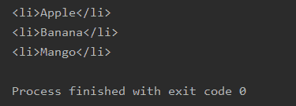

# 美丽组–查找一个元素的所有子元素

> 原文:[https://www . geesforgeks . org/beautulsoup-find-all-children-of-element/](https://www.geeksforgeeks.org/beautifulsoup-find-all-children-of-an-element/)

你可能已经看到有各种网站既复杂又冗长，从中搜索任何东西都变得困难。为了简化我们的搜索、修改和迭代工作，Python 给了我们一些内置的库，比如 Requests、Xml、美丽的汤、Selenium、Scrapy 等。在所有这些可用的库中，漂亮的汤是一个比 Python 中的其他库相对更快地进行网络废弃的库。有时候，会出现这样的情况，我们需要借助美人汤找到一个元素的所有子元素。如果不知道，怎么找到这些。别担心！在本文中，我们将讨论寻找元素的子元素的过程。

> **语法:**
> 
> 无序列表= soup . find(“# Widget Name”，{“id”:#您要查找其子元素的 Id 名称”})
> 
> children =无序 _list.findChildren()

**下面是考虑的 HTML 文件:**

## 超文本标记语言

```py
<!DOCTYPE html>
<html>
 <head>
  My First Heading
 </head>
 <body>
  <p id="para">
   Vinayak Rai
  </p>

 <ul id="list">Fruits
  <li>Apple</li>
  <li>Banana</li>
  <li>Mango</li>
 </ul>
 </body>
</html>
```

### **分步实施:**

**第一步:**首先，导入库美丽汤和 os。

## 蟒蛇 3

```py
from bs4 import BeautifulSoup as bs
import os
```

**第 2 步:**现在，通过给 abspath 赋予与 Python 文件相同的名称来删除路径的最后一段。

## 蟒蛇 3

```py
base=os.path.dirname(os.path.abspath(#Name of your Python file))
```

**第三步:**然后，打开想要打开的 HTML 文件。

## 蟒蛇 3

```py
html=open(os.path.join(base, '#Name of HTML file'))
```

**第四步:**解析美汤里的 HTML。

## 蟒蛇 3

```py
soup=bs(html, 'html.parser')
```

**步骤 5:** 此外，给出您想要查找子元素的元素的位置

## 蟒蛇 3

```py
unordered_list=soup.find("#Widget Name", 
      {"id":"#Id name of element of which you want to find children "})
```

**第六步:**接下来，找到一个元素的所有子元素。

## 蟒蛇 3

```py
children = unordered_list.findChildren()
```

**第七步:**最后，打印上一步找到的一个元素的所有子元素。

## 蟒蛇 3

```py
for child in children:
    print (child)
```

**以下是完整实现:**

## 计算机编程语言

```py
# Python program to find all the children
# of an element using Beautiful Soup

# Import the libraries BeautifulSoup and os
from bs4 import BeautifulSoup as bs
import os

# Remove the last segment of the path 
# Give same name in abspath as given to Python file
base = os.path.dirname(os.path.abspath('run.py'))

# Open the HTML in which you want to make changes
html = open(os.path.join(base, 'gfg.html'))

# Parse HTML file in Beautiful Soup
soup = bs(html, 'html.parser')

# Give location where text is stored which you wish to alter
unordered_list = soup.find("ul", {"id": "list"})

# Find children of an element
children = unordered_list.findChildren()

# Print all children of an element
for child in children:
    print(child)
```

**输出:**

