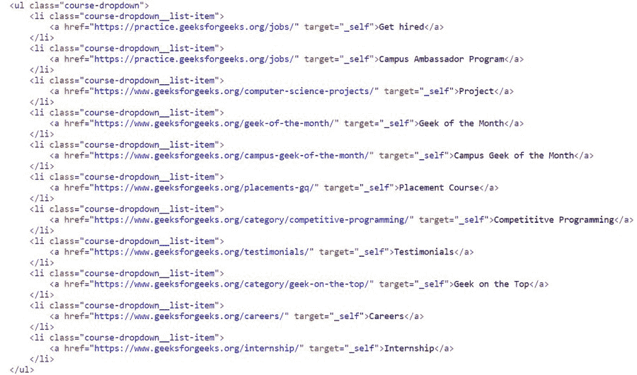

# 美丽组合–查找所有

*   在

    > 原文:[https://www . geesforgeks . org/beautulsoup-find-all-Li-in-ul/](https://www.geeksforgeeks.org/beautifulsoup-find-all-li-in-ul/)

    **先决条件:** [美丽组合](https://www.geeksforgeeks.org/implementing-web-scraping-python-beautiful-soup/)

    美化程序是一个用于网页抓取的 Python 模块。在这篇文章中，我们将讨论如何使用美化组从

    *   The content of the tag.

    ### 所需模块:

    *   **bs4:** 美人汤(bs4)是一个从 HTML 和 XML 文件中拉出数据的 Python 库。
    *   **请求:**请求让你可以极其轻松地发送 HTTP/1.1 请求。该模块也没有内置 Python。

    ### **接近**

    *   导入模块
    *   提供一个带有 ul 和 li 标签的网址
    *   提出要求
    *   创建美丽的组合对象
    *   找到所需的标签
    *   检索 li 下的内容

    在代码下面，HTML 代码片段包含一个带有 ul 和 li 标签的主体，这些标签是由 beautifulsoup 对象获得的。

    

    ### 方法 1:使用后代和查找()

    在这个方法中，我们使用存在于美化组中的**后代**属性，它基本上返回一个列表迭代器对象，该对象包含父标签的所有后代/子标签，这里的父标签是< ul >标签。

    首先，导入所需的模块，然后提供网址并创建它的请求对象，该对象将由美化的输出对象解析。现在借助 **find()** 功能，我们将找到<身体>及其对应的< ul >标签。在这之后，后代属性会给我们列表迭代器对象，它需要转换回列表。这个列表有一个下一行项目，带有文本的标签，最后是唯一的文本。因此，我们将打印列表中每隔一秒的连续元素。

    **示例:**

    ## 蟒蛇 3

    ```py
    # importing the modules
    import requests
    from bs4 import BeautifulSoup

    # providing url
    url = "https://auth.geeksforgeeks.org/user/adityaprasad1308/articles"

    # creating requests object
    html = requests.get(url).content

    # creating soup object
    data = BeautifulSoup(html, 'html.parser')

    # finding parent <ul> tag
    parent = data.find("body").find("ul")

    # finding all <li> tags
    text = list(parent.descendants)

    # printing the content in <li> tag
    print(text)
    for i in range(2, len(text), 2):
        print(text[i], end=" ")
    ```

    **输出:**

    

    ### 方法 2:使用 find_all()

    方法与上面的例子相同，但是我们将找到 ul 标签，然后在 **find_all()** 函数的帮助下找到所有 li 标签，该函数以标签名称为参数并返回所有 li 标签。在此之后，我们将简单地遍历所有的< li >标签，并且借助于文本属性，我们将打印出现在< li >标签中的文本。

    **示例:**

    ## 蟒蛇 3

    ```py
    # importing the modules
    import requests
    from bs4 import BeautifulSoup

    # providing url
    url = 'https://auth.geeksforgeeks.org/user/adityaprasad1308/articles'

    # creating request object
    req = requests.get(url)

    # creating soup object
    data = BeautifulSoup(req.text, 'html')

    # finding all li tags in ul and printing the text within it
    data1 = data.find('ul')
    for li in data1.find_all("li"):
        print(li.text, end=" ")
    ```

    **输出:**

    