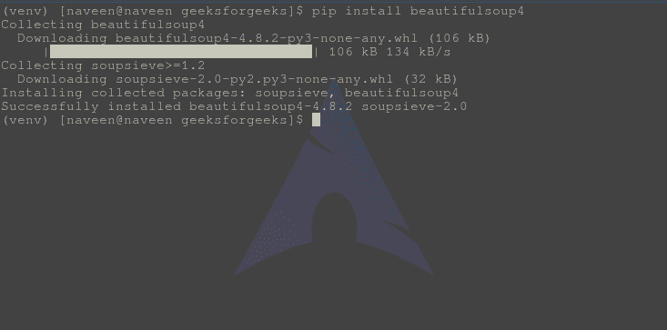
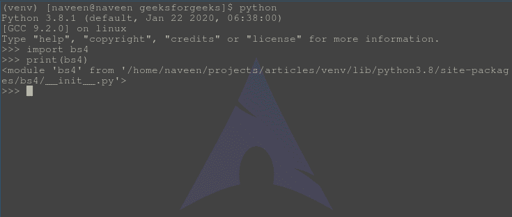

# 美丽的 ulsoup 安装–python

> 哎哎哎:# t0]https://www . geeksforgeeks . org/beautiful ulsoup 安装-python/

美丽的汤是一个 Python 库，用于从 HTML 和 XML 文件中提取数据。它与您最喜欢的解析器一起工作，提供导航、搜索和修改解析树的惯用方式。它通常可以节省程序员数小时或数天的工作。从现在开始，最新版本的美化软件是 4.9.3 版。

#### 先决条件

*   [蟒蛇](https://www.geeksforgeeks.org/download-and-install-python-3-latest-version/)
*   [Pip](https://www.geeksforgeeks.org/how-to-install-pip-on-windows/) 

#### 如何安装美化程序？

要在 Windows、Linux 或任何操作系统上安装美化软件包，需要 pip 包。要查看如何在您的操作系统上安装画中画，请查看–画中画安装–[窗口](https://www.geeksforgeeks.org/how-to-install-pip-on-windows/) || [Linux](https://www.geeksforgeeks.org/how-to-install-pip-in-linux/) 。
现在，运行一个简单的命令，

```
pip install beautifulsoup4
```

等待和放松，美丽的组将很快安装。



#### 使用源代码安装美化套件 4

可以安装 beautulsup，直接使用源代码，从这里安装 beautulsup tarball–[下载美人汤 4 源码 tarball](https://www.crummy.com/software/BeautifulSoup/bs4/download/4.0/)
将 cd 下载到目录后运行，

```
Python setup.py install
```

#### 验证安装

为了检查安装是否完成，让我们尝试使用 python
来实现它

