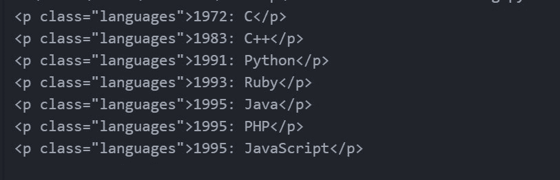
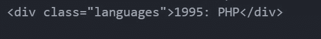
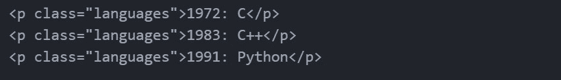

# 美丽的组合–下一个兄弟

> 原文:[https://www.geeksforgeeks.org/beautifulsoup-nextsibling/](https://www.geeksforgeeks.org/beautifulsoup-nextsibling/)

**nextSibling** 属性用于将指定节点的下一个节点作为 node 对象返回，如果指定节点是列表中的最后一个节点，则返回 null。它是只读属性。在本文中，我们将找到满足给定标准的给定标签的下一个兄弟，并出现在文档中该标签之后。

**示例:**

> **HTML_DOC :**
> 
> """
> 
> <title>寻找下一个兄弟姐妹</title>
> 
> 1957 年:FORTRAN
> 
> 1972 年:C
> 
> 1983 年:C++
> 
> 1991 年:Python
> 
> 1993 年:红宝石
> 
> 1995 年:爪哇
> 
> 1995 年:PHP
> 
> 1995 年:JavaScript
> 
> """
> 
> **元素:**T2【p class = " languages ">1957:FORTran</p>
> 
> **输出:**
> 
> 1972 年:C
> 
> 1983 年:C++
> 
> 1991 年:Python
> 
> 1993 年:红宝石
> 
> 1995 年:爪哇
> 
> 1995 年:PHP
> 
> 1995 年:JavaScript

**所需模块:**

*   **美化程序(bs4):** 是一个从 HTML 和 XML 文件中拉出数据的 Python 库。这个模块没有内置 Python。在终端中运行以下命令来安装这个库-

```py
pip install bs4
or
pip install beautifulsoup4
```

**寻找下一个兄弟姐妹:**

> **find _ next _ 姐弟()**函数用于查找标签/元素的所有下一个姐弟。
> 
> 它返回所有匹配的下一个兄弟。

**查找下一个兄弟:**

> **find_next_sibling()** 函数用于查找标签/元素的后续同级。
> 
> 它只返回标签/元素旁边的第一个匹配项。

**示例 1:查找标签/元素的所有下一个兄弟**

## 蟒蛇 3

```py
# Import Module
from bs4 import BeautifulSoup

# HTML Document
HTML_DOC = """
              <html>
               <head>
                   <title> Find Next Siblings </title>
               </head>
               <body>
                    <p class = "languages">1957: FORTRAN</p>

                    <p class = "languages">1972: C</p>

                    <p class = "languages">1983: C++</p>

                    <p class = "languages">1991: Python</p>

                    <p class = "languages">1993: Ruby</p>

                    <p class = "languages">1995: Java</p>

                    <p class = "languages">1995: PHP</p>

                    <p class = "languages">1995: JavaScript</p>

               </body>
             </html>
            """

# Function to find all the next siblings
def findNextSiblings(html):

    # parse html content
    soup = BeautifulSoup(html, "html.parser")

    element = soup.p

    # Extracting all the next siblings of an element
    nextSiblings = element.find_next_siblings("p")

    # Printing all the next siblings
    for nextSibling in nextSiblings:
        print(nextSibling)

# Function Call
findNextSiblings(HTML_DOC)
```

**输出:**



**示例 2:查找标签/元素的下一个兄弟**

## 蟒蛇 3

```py
# Import Module
from bs4 import BeautifulSoup

# HTML Document
HTML_DOC = """
              <html>
               <head>
                   <title> Find Next Sibling </title>
               </head>
               <body>
                    <p class = "languages">1957: FORTRAN</p>

                    <p class = "languages">1972: C</p>

                    <p class = "languages">1983: C++</p>

                    <p class = "languages">1991: Python</p>

                    <p class = "languages">1993: Ruby</p>

                    <p class = "languages">1995: Java</p>

                    <p class = "languages">1995: PHP</p>

                    <p class = "languages">1995: JavaScript</p>

               </body>
             </html>
            """

# Function to find the next sibling
def findNextSibling(html):

    # parse html content
    soup = BeautifulSoup(html, "html.parser")

    element = soup.p

    # Extracting the next sibling of an element
    nextSibling = element.find_next_sibling("p")

    # Printing next sibling of an element
    print(nextSibling)

# Function Call
findNextSibling(HTML_DOC)
```

**输出:**


**示例 3:查找父标签的下一个同级(在嵌套结构的情况下)**

## 蟒蛇 3

```py
# Import Module
from bs4 import BeautifulSoup

# HTML Document
HTML_DOC = """
              <html>
               <head>
                   <title> Find Next Sibling Of Parent </title>
               </head>
               <body>
                    <div class = "languages">

<p>1957: FORTRAN</p>

                    </div>
                    <div class = "languages">1995: PHP</div>
                    <div class = "languages">1995: JavaScript</div>
               </body>
             </html>
            """

# Function to find the next sibling
def findNextSibling(html):

    # parse html content
    soup = BeautifulSoup(html, "html.parser")

    element = soup.p

    # Parent tag of the element
    parent_tag = element.parent

    # Extracting the next sibling of parent
    nextSibling = parent_tag.find_next_sibling("div")

    # Printing next sibling of parent
    print(nextSibling)

# Function Call
findNextSibling(HTML_DOC)
```

**输出:**



**示例 4:找到指定数量的下一个兄弟。**

例如，只查找一个元素的后 3 个兄弟。
这可以通过使用*极限*参数来实现

## 蟒蛇 3

```py
# Import Module
from bs4 import BeautifulSoup

# HTML Document
HTML_DOC = """
              <html>
               <head>
                   <title> Find Next 3 Siblings </title>
               </head>
               <body>
                    <p class = "languages">1957: FORTRAN</p>

                    <p class = "languages">1972: C</p>

                    <p class = "languages">1983: C++</p>

                    <p class = "languages">1991: Python</p>

                    <p class = "languages">1993: Ruby</p>

                    <p class = "languages">1995: Java</p>

                    <p class = "languages">1995: PHP</p>

                    <p class = "languages">1995: JavaScript</p>

               </body>
             </html>
            """

# Function to find 3 next siblings
def findNextSiblings(html):

    # parse html content
    soup = BeautifulSoup(html, "html.parser")

    element = soup.p

    # Extracting the next 3 siblings of an element
    nextSiblings = element.find_next_siblings("p", limit=3)

    # Printing the next 3 siblings
    for nextSibling in nextSiblings:
        print(nextSibling)

# Function Call
findNextSiblings(HTML_DOC)
```

**输出:**

