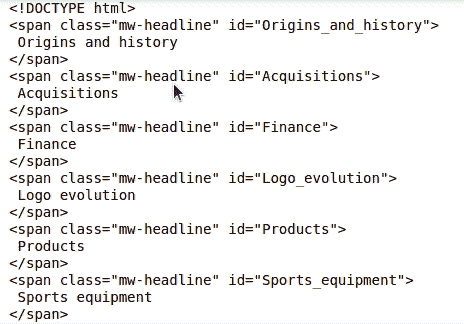

# 漂亮的输出–仅解析文档的一部分

> 原文:[https://www . geeksforgeeks . org/beautulsoup-仅解析文档部分/](https://www.geeksforgeeks.org/beautifulsoup-parsing-only-section-of-a-document/)

[](https://www.geeksforgeeks.org/implementing-web-scraping-python-beautiful-soup/)**是一个 Python 模块，用于从抓取的网站中查找特定的网站内容/标签，任何模块都可以抓取，如 [**【请求】**](https://www.geeksforgeeks.org/python-requests-tutorial/) 或 [**【抓取】**](https://www.geeksforgeeks.org/implementing-web-scraping-python-scrapy/) 。请记住，美丽组不会抓取网站，而是通过其他模块以可读的形式处理和显示抓取的内容。所以，为了理解我们如何在网站上收集数据，我们可以通过例子来理解。**

### **需要的模块**

**首先，我们需要在计算机上安装所有这些模块。**

*   ****美化程序:**我们的主模块包含一个通过 HTTP 访问网页的方法。**

```
pip install bs4
```

*   ****lxml:** 处理 python 语言网页的助手库。**

```
pip install lxml
```

*   ****请求:**使发送 HTTP 请求的过程完美无缺。函数的输出**

```
pip install requests
```

**让我们从抓取一个示例网站开始，看看如何只抓取页面的一部分。**

****第 1 步:**我们导入我们的漂亮的输出模块和请求。我们声明了 Header 并添加了一个用户代理。这确保了我们要进行网页抓取的目标网站不会将来自我们程序的流量视为垃圾邮件，并最终被它们阻止。**

## **蟒蛇 3**

```
from bs4 import BeautifulSoup,SoupStrainer 
import requests 

URL = "https://en.wikipedia.org/wiki/Nike,_Inc."

HEADERS = ({'User-Agent': 
        'Mozilla/5.0 (X11; Linux x86_64) AppleWebKit/537.36\
        (KHTML, like Gecko) Chrome/44.0.2403.157 Safari/537.36',
            'Accept-Language': 'en-US, en;q=0.5'}) 

webpage = requests.get(URL, headers= HEADERS) 
```

****第二步:**现在我们用第一行导入的**汤过滤器**只过滤出我们需要的网站部分。请注意，如果我们根据元素的 id 过滤掉元素，类后面的下划线就不会出现。在这种情况下，我们只想解析类属性为“MW-header”的元素。最后一行以漂亮的方式打印解析的内容。**

**类告诉提取哪个部分，解析树只包含这些元素。我们只需要将过滤对象作为**解析参数**传递给美丽的输出构造函数。**

## **蟒蛇 3**

```
soup = BeautifulSoup(webpage.content, "lxml",
                     parse_only = SoupStrainer(
                       'span', class_ = 'mw-headline'))

print(soup.prettify())
```

****完整代码:****

## **蟒蛇 3**

```
from bs4 import BeautifulSoup,SoupStrainer 
import requests 

URL = "https://en.wikipedia.org/wiki/Nike,_Inc."

HEADERS = ({'User-Agent': 
        'Mozilla/5.0 (X11; Linux x86_64) AppleWebKit/537.36 \
        (KHTML, like Gecko) Chrome/44.0.2403.157 Safari/537.36',
            'Accept-Language': 'en-US, en;q=0.5'}) 

webpage = requests.get(URL, headers= HEADERS) 
soup = BeautifulSoup(webpage.content, "lxml", 
                     parse_only = SoupStrainer(
                       'span', class_ = 'mw-headline'))

print(soup.prettify())
```

****输出:****

****