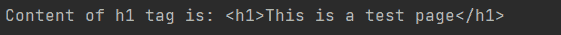
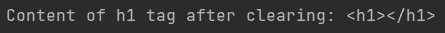

# 美观组–移除标签的内容

> 原文:[https://www . geesforgeks . org/beautulsoup-remove-contents-of-tag/](https://www.geeksforgeeks.org/beautifulsoup-remove-the-contents-of-tag/)

在这篇文章中，我们将看到如何使用美化组从 HTML 中移除内容标签。是一个 python 库，用于提取 html 和 xml 文件。

**所需模块:**

[**【漂亮组:**](https://www.geeksforgeeks.org/implementing-web-scraping-python-beautiful-soup/) 我们的主模块包含一个通过 HTTP 访问网页的方法。

**安装时，在您的终端中运行以下命令:**

```
pip install bs4
```

### **进场:**

*   首先，我们将导入所需的库。
*   我们将阅读 html 文件或文本。
*   我们将把提取的文本馈送给汤对象。
*   然后我们会找到所需的标签，然后清除它的元素。

### **分步**实施 **:**

**第一步:**我们将初始化程序，导入库，读取或创建我们想要汤的 HTML 文档。

## 蟒蛇 3

```
# Importing libraries
from bs4 import BeautifulSoup

# Reading the html text we want to parse
text = "<html> <head><title> Welcome </title></head><body><h1>This is a test page</h1></body></html>"
```

**第 2 步:**我们将把检索到的文本传递给 set 对象，并设置解析器在这种情况下，我们使用的是 html 解析器。可以使用的其他标记是 xml 或 html5。然后我们将提到我们必须从中移除内容的标签。

## 蟒蛇 3

```
# creating a soup
soup = BeautifulSoup(text,"html.parser")

# printing the content in h1 tag
print(f"Content of h1 tag is: {soup.h1}")
```

**输出:**



**第三步:**我们将使用。清除功能。它清除所提到的标签的内容。

## 蟒蛇 3

```
# clearing the content of the tag
soup.h1.clear()

# printing the content in h1 tag after clearing
print(f"Content of h1 tag after clearing: {soup.h1}")
```



**以下是完整实现:**

## 蟒蛇 3

```
# Importing libraries
from bs4 import BeautifulSoup

# Reading the html text we want to parse
text = "<html> <head><title> Welcome </title></head><body><h1>This is a test page</h1></body></html>"

# creating a soup
soup = BeautifulSoup(text,"html.parser")

# printing the content in h1 tag
print(f"Content of h1 tag is: {soup.h1}")

# clearing the content of the tag
soup.h1.clear()

# printing the content in h1 tag after clearing
print(f"Content of h1 tag after clearing: {soup.h1}")
```

