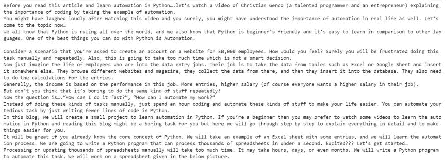

# 漂亮的组图–从 HTML 中抓取段落

> 原文:[https://www . geesforgeks . org/beautulsoup-scratch-段落-from-html/](https://www.geeksforgeeks.org/beautifulsoup-scraping-paragraphs-from-html/)

在本文中，我们将讨论如何使用美丽的汤从 HTML 中删除段落

**方法 1:使用 bs4 和 urllib。**

**所需模块:**

*   **bs4:** 美人汤(bs4)是一个从 HTML 和 XML 文件中拉出数据的 Python 库。用于安装模块-

```py
pip install bs4.
```

*   **urllib:** urllib 是一个包，它收集了几个用于处理 URL 的模块。它也可以用同样的方式安装，它大部分内置在环境本身。

```py
pip install urllib
```

html 文件包含几个标签，如锚点标签

**说明:**

导入模块 **urllib** 和 **bs4** 后，我们将提供一个带有要读取的 url 的变量， **urllib.request.urlopen()** 函数将请求转发给服务器以打开该 url。**beautulsoup()**函数帮助我们解析 html 文件或者你说 html 中的编码。这里与 **find_all()** 一起使用的循环查找所有包含段落标记< p > < /p >的标记，它们之间的文本通过 **get_text()** 方法收集。

**下面是实现:**

## 蟒蛇 3

```py
# importing modules
import urllib.request 
from bs4 import BeautifulSoup

# providing url
url = "https://www.geeksforgeeks.org/how-to-automate-an-excel-sheet-in-python/?ref=feed"

# opening the url for reading
html = urllib.request.urlopen(url)

# parsing the html file
htmlParse = BeautifulSoup(html, 'html.parser')

# getting all the paragraphs
for para in htmlParse.find_all("p"):
    print(para.get_text())
```

**输出:**



**方法 2:使用请求和 bs4**

**所需模块:**

*   **bs4:** 美人汤(bs4)是一个从 HTML 和 XML 文件中拉出数据的 Python 库。这个模块没有内置 Python。要安装此软件，请在终端中键入以下命令。

```py
pip install bs4
```

*   **请求:** Requests 可以让你极其轻松地发送 HTTP/1.1 请求。该模块也没有内置 Python。要安装此软件，请在终端中键入以下命令。

```py
pip install requests
```

**进场:**

*   导入模块
*   创建一个 HTML 文档，并在代码中指定“

    ”标记

*   将 HTML 文档传递到美化程序()函数中
*   使用“P”标记从“美丽的组合”对象中提取段落
*   使用 get_text()从 HTML 文档中获取文本。

**代码:**

## 蟒蛇 3

```py
# import module 
import requests 
import pandas as pd 
from bs4 import BeautifulSoup 

# link for extract html data 
def getdata(url): 
    r = requests.get(url) 
    return r.text 

htmldata = getdata("https://www.geeksforgeeks.org/how-to-automate-an-excel-sheet-in-python/?ref=feed") 
soup = BeautifulSoup(htmldata, 'html.parser') 
data = '' 
for data in soup.find_all("p"): 
    print(data.get_text()) 
```

**输出:**

