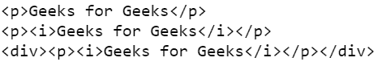
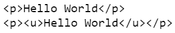
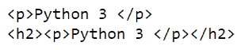

# 漂亮的组合–用新标签包装元素

> 原文:[https://www . geesforgeks . org/beautulsoup-wrap-a-element in-new-tag/](https://www.geeksforgeeks.org/beautifulsoup-wrap-an-element-in-a-new-tag/)

[**美化程序**](https://www.geeksforgeeks.org/implementing-web-scraping-python-beautiful-soup/)**是一个用于网页抓取的 Python 库。这个强大的 python 工具也可以用来修改 HTML 网页。本文描述了如何使用美丽的输出将一个元素包装在一个新的标签中。**

**要执行此任务，请使用模块的 wrap()方法。wrap()方法包装一个实体，或者将指定的标记放在实体的前后。它返回一个新的包装。**

****进场:****

*   **导入模块。**
*   **从网页上删除数据。**
*   **解析刮到 HTML 的字符串。**
*   **使用 wrap()函数包装元素。**
*   **打印结果。**

**以下是上述方法的一些实现:**

****例 1:****

## **蟒蛇 3**

```py
# importing BeautifulSoup Module
from bs4 import BeautifulSoup

markup = '

<p>Geeks for Geeks</p>

'

# parsering string to HTML
soup = BeautifulSoup(markup, 'html.parser')
print(soup)

# wraping around the string
soup.p.string.wrap(soup.new_tag("i"))
print(soup)

# wraping around the tag
soup.p.wrap(soup.new_tag("div"))
print(soup)
```

****输出:****

****

****例 2:****

## **蟒蛇 3**

```py
# importing BeautifulSoup Module
from bs4 import BeautifulSoup

markup = '

<p>Hello World</p>

'

# parsering string to HTML
soup = BeautifulSoup(markup, 'html.parser')
print(soup)

# wraping around the string
soup.p.string.wrap(soup.new_tag("u"))
print(soup)
```

****输出:****

****

****例 3:****

## **蟒蛇 3**

```py
# importing BeautifulSoup Module
from bs4 import BeautifulSoup

markup = '

<p>Python 3 </p>

'

# parsering string to HTML
soup = BeautifulSoup(markup, 'html.parser')
print(soup)

# wraping around the tag
soup.p.wrap(soup.new_tag("h2"))
print(soup)
```

****输出:****

****