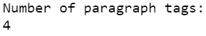
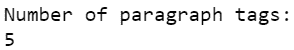

# 使用美丽组

统计段落标签的数量

> 原文:[https://www . geeksforgeeks . org/count-the-number-of-parameter-tag-using-beautulsoup/](https://www.geeksforgeeks.org/count-the-number-of-paragraph-tag-using-beautifulsoup/)

有时，在从 HTML 网页中提取数据时，您想知道给定的 HTML 文档中使用了多少段落标记吗？别担心，我们会在这篇文章中讨论这个问题。

### 语法:

```py
print(len(soup.find_all("p")))
```

### 方法:

**步骤 1:** 首先，导入库、美化程序和操作系统。

```py
from bs4 import BeautifulSoup as bs
import os
```

**步骤 2:** 现在，通过输入您当前工作所在的 Python 文件的名称来删除路径的最后一段。

> base = OS . path . dirname(OS . path . abpath(#您当前工作的 Python 文件的名称')

**第三步:**然后，打开要从中读取值的 HTML 文件。

> html=open(os.path.join(base，' #您希望从中读取值的 html 文件的名称'))

**第四步:**此外，解析美化组中的 HTML 文件。

```py
soup=bs(html, 'html.parser')
```

**第五步:**接下来，如果想打印某一行。

```py
print("Number of paragraph tags:")
```

**第六步:**最后，计算并打印 HTML 文档中段落标签的数量。

```py
print(len(soup.find_all("p")))
```

### 实施:

**例 1**

让我们考虑一下简单的 HTML 网页，它有许多段落标签。

## 超文本标记语言

```py
<!DOCTYPE html>
<html>

 <head>
   Geeks For Geeks
 </head>

 <body>

 <div>

<p>King</p>

<p>Prince</p>

<p>Queen</p>

 </div>

 <p id="vinayak">Princess</p>

  </body>

</html>
```

要在上面的 HTML 网页中找到段落标记的数量，请实现以下代码。

## 计算机编程语言

```py
# Python program to get number of paragraph tags
# of a given HTML document in Beautifulsoup

# Import the libraries beautifulsoup 
# and os
from bs4 import BeautifulSoup as bs
import os

# Open the HTML file
html = open('gfg.html')

# Parse HTML file in Beautiful Soup
soup = bs(html, 'html.parser')

# Print a certain line
print("Number of paragraph tags:")

# Calculating and printing the
# number of paragraph tags
print(len(soup.find_all("p")))
```

**输出:**



**例 2**

在下面的程序中，我们将找到特定网站上段落标签的数量。

## 计算机编程语言

```py
# Python program to get number of paragraph tags
# of a given Website in Beautifulsoup

# Import the libraries beautifulsoup 
# and os
from bs4 import BeautifulSoup as bs
import os
import requests

# Assign URL
URL = 'https://www.geeksforgeeks.org/'

# Page content from Website URL
page = requests.get(URL)

# Parse HTML file in Beautiful Soup
soup = bs(page.content, 'html.parser')

# Print a certain line
print("Number of paragraph tags:")

# Calculating and printing the
# number of paragraph tags
print(len(soup.find_all("p")))
```

**输出:**

