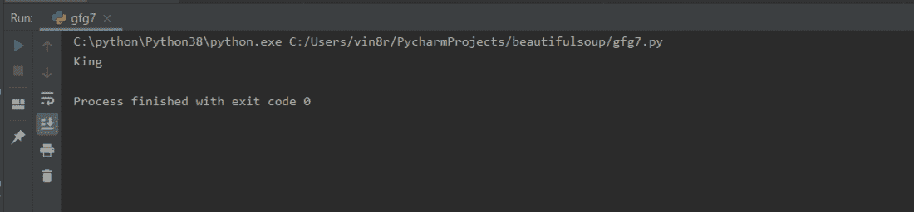
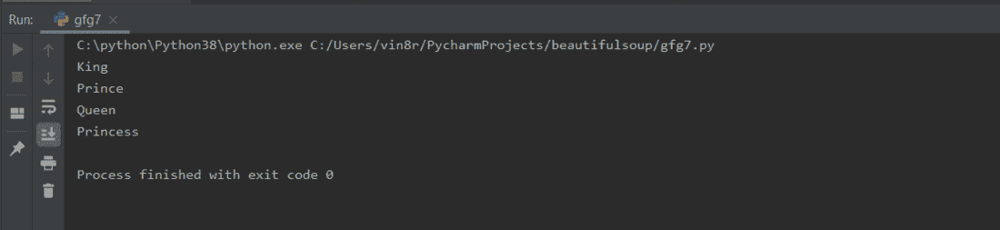

# find 和 find_all 之间的区别在 beauty sup–Python 中

> 原文:[https://www . geesforgeks . org/find-and-find _ all-in-beauty sup-python/](https://www.geeksforgeeks.org/difference-between-find-and-find_all-in-beautifulsoup-python/)

**美化程序**是 Python 中最常见的库之一，用于导航、搜索和从 HTML 或 XML 网页中拉出数据。在网页上查找任何东西最常用的方法是 **find()** 和 **find_all()** 。不过这两者略有不同，我们来详细讨论一下。

### find()方法

find 方法用于找出具有指定名称或 id 的第一个标记，并返回 bs4 类型的对象。

> **语法:**find _ Syntax = soup . find(“# Widget Name”，{“id”:#您要编辑的 Widget 的 Id 名称”})。get_text()

**示例:**

例如，考虑这个简单的网页有不同的段落标签。

## 超文本标记语言

```
<!DOCTYPE html>
<html>

 <head>
   Geeks For Geeks
 </head>

 <body>
 <div>
     <p id="vinayak">King</p>

     <p id="vinayak1">Prince</p>

     <p id="vinayak2">Queen</p>

 </div>
 <p id="vinayak3">Princess</p>

  </body>

</html>
```

为了获得文本国王，我们使用查找方法。

## 计算机编程语言

```
# Find example

# Import the libraries BeautifulSoup
# and os
from bs4 import BeautifulSoup as bs
import os

# Remove the last segment of the path
base=os.path.dirname(os.path.abspath(__file__))

# Open the HTML in which you want to
# make changes
html=open(os.path.join(base, 'gfg.html'))

# Parse HTML file in Beautiful Soup
soup=bs(html, 'html.parser')

# Obtain the text from the widget after 
# finding it
find_example=soup.find("p", {"id":"vinayak"}).get_text()

# Printing the text obtained received 
# in previous step
print(find_example)
```

**输出:**



### find_all()方法

find_all 方法用于找出具有指定标签名称或 id 的所有标签，并将它们作为 bs4 类型的列表返回。

> #### 语法:
> 
> for word in soup.find_all('id '):
> 
> find _ all _ 语法=word.get_text()
> 
> 打印(查找全部语法)

**示例:**

例如，考虑这个简单的网页有不同的段落标签。

## 超文本标记语言

```
<!DOCTYPE html>
<html>

 <head>
   Geeks For Geeks
 </head>

 <body>
 <div>
     <p id="vinayak">King</p>

     <p id="vinayak1">Prince</p>

     <p id="vinayak2">Queen</p>

 </div>
 <p id="vinayak3">Princess</p>

  </body>

</html>
```

为了获得所有的文本，即国王、王子、王后、公主，我们使用 find_all 方法。

## 计算机编程语言

```
# find_all example

# Import the libraries BeautifulSoup
# and os
from bs4 import BeautifulSoup as bs
import os

# Remove the last segment of the path
base=os.path.dirname(os.path.abspath(__file__))

# Open the HTML in which you want to 
# make changes
html=open(os.path.join(base, 'gfg.html'))

# Parse HTML file in Beautiful Soup
soup=bs(html, 'html.parser')

# Construct a loop to find all the
# p tags
for word in soup.find_all('p'):

    # Obtain the text from the received
    # tags
    find_all_example=word.get_text()

    # Print the text obtained received 
    # in previous step
    print(find_all_example)
```

**输出:**



## 查找和全部查找之间的差异表

<figure class="table">

| 

### **Serial number**

 | 

### **Find**

 | 

### **Find _ all**

 |
| --- | --- | --- |
| one | find 用于在页面上找到搜索到的元素时返回结果。 | find_all 用于在扫描整个文档后返回所有匹配项。 |
| Two | 它仅用于获取满足条件的传入 HTML 对象的第一个标记。 | 它用于获取满足条件的所有传入的 HTML 对象。 |
| three | 查找的返回类型为<class>。</class> | find_all 的返回类型为<class></class> |
| four | 我们只能打印第一次搜索作为输出。 | 我们可以打印任何搜索，即第二、第三、最后等。或将所有搜索作为输出。 |
| five | 原型:查找(标签、属性、递归、文本、关键词) | 原型:findAll(标签、属性、递归、文本、限制、关键词) |

</figure>