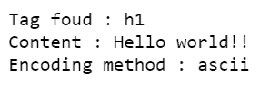

# 在美丽组中编码

> 原文:[https://www.geeksforgeeks.org/encoding-in-beautifulsoup/](https://www.geeksforgeeks.org/encoding-in-beautifulsoup/)

字符编码在解释 HTML 和 XML 文档的内容中起着重要作用。文档不仅包含英语字符，还包含希伯来语、拉丁语、希腊语等非英语字符。为了让解析器知道应该使用哪种编码方法，文档将包含一个专用的标记和属性来指定这一点。例如:

**在 HTML 文档中**

> *<元字符集=“–编码方法名称–”内容=“文本/html”>*

**在 XML 文档中**

> *<？XML version = " 1.0 "****编码= "–编码方法名–"？>***

**这些标签向浏览器传达了可以使用哪种编码方法进行解析。如果没有指定正确的编码方法，要么是内容呈现不正确，要么有时是替换字符“﹍”。**

## **XML 编码方法**

**XML 文档可以用下面列出的格式之一进行编码。**

*   ****UTF-8****
*   ****UTF-16****
*   **拉丁语 1**
*   ****美国 ASCII****
*   ****ISO-8859-1 至 ISO-8859-10****

**在这些方法中，UTF-8 是常见的。UTF-16 允许每个字符有 2 个字节，带有“0xx”的文档用这种方法编码。Latin1 涵盖西欧字符。**

## **HTML 编码方法**

**HTML 和 HTML5 文档可以通过以下任何一种方法进行编码。**

*   ****UTF-8****
*   ****UTF-16****
*   ****ISO-8859-1****
*   ****UTF-16BE(大印第安人)****
*   ****UTF-16LE(小印第安人)****
*   ****WINDOWS-874****
*   ****WINDOWS-1250 转 WINDOWS-1258****

**对于 HTML5 文档，建议大部分使用 UTF-8。ISO-8859-1 主要用于 XHTML 文档。像 UTF-7、UTF-32、BOCU-1、CESU-8 这样的方法被明确提到不要使用，因为它们用替换字符“﹍”替换了大部分字符。**

## **漂亮的输出和编码**

**被普遍导入为 bs4 的美丽输出模块是一个福音，它让 HTML/XML 解析变得轻而易举。它有很多方法，其中一个帮助通过标签名称或标签中存在的属性来选择内容，一个帮助基于层次提取内容，打印带有 HTML 所需缩进的内容，等等。bs4 模块自动检测文档中使用的编码方法，并有效地将其转换为合适的格式。返回的美丽组对象将具有各种属性，这些属性提供了更多信息。然而，有时它会错误地预测编码方法。因此，如果用户知道编码方法，最好将其作为参数传递。本文提供了在 bs4 模块中指定编码方法的各种方法。**

### **原始编码**

**bs4 模块有一个名为 Unicode，该死的子库，它找到编码的方法，并使用该方法转换成 Unicode 字符。original_encoding 属性用于返回检测到的编码方法。**

****例 1 :****

****给定一个 HTML 元素，解析它并找到使用的编码方法。****

## **蟒蛇 3**

```py
from bs4 import BeautifulSoup

# HTML element with content
h1 = b"<h1>Hello world!!</h1>"

# parsing with html parser
parsed = BeautifulSoup(h1, "html.parser")

# tag found
print("Tag foud :", parsed.h1.name)

# the content inside the tag
print("Content :", parsed.h1.string)

# the encoded method
print("Encoding method :", parsed.original_encoding)
```

****输出:****

****

**这里，HTML 元素字符串以“ **b** 为前缀，这意味着将其视为字节文字。因此，解析器检测并使用 ASCII 编码方法。在现实世界中，原始编码将是 HTML 文档中提到的编码**

****例 2:****

****给定一个 URL，解析内容，找到原来的编码方式。****

## **蟒蛇 3**

```py
from bs4 import BeautifulSoup
import requests

URL = 'https://www.geeksforgeeks.org/python-update-nested-dictionary/'

# request the page from server
page = requests.get(URL)

# parse the contentes of the page
soup = BeautifulSoup(page.content, "html.parser")

# encoded method
print("Encoded method :", soup.original_encoding)
```

****输出****

```py
Enoded method : utf-8
```

****验证输出:****

## **蟒蛇 3**

```py
from bs4 import BeautifulSoup

soup=BeautifulSoup(page.content,"html.parser")

# fetching the <meta> tag's
# charset attribute
# of the content above
tag=soup.meta['charset']

print("Encoding method :",tag)
```