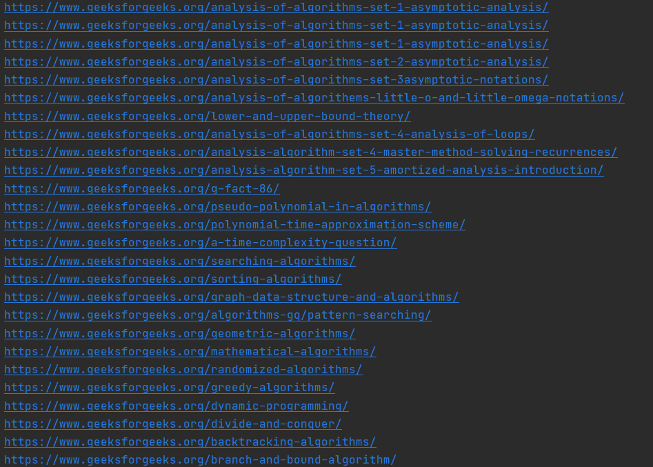

# 提取所有嵌套在

内的网址*   tags using BeautifulSoup

    > 原文:[https://www . geeksforgeeks . org/extract-所有嵌套在 li 标签中的 urls 使用-beauty sup/](https://www.geeksforgeeks.org/extract-all-the-urls-that-are-nested-within-li-tags-using-beautifulsoup/)

    美丽的汤是一个 python 库，用于提取 html 和 xml 文件。在本文中，我们将了解如何从网页中提取嵌套在

    *   All URLs in the tag.

### 所需模块和安装:

*   [**【美观组:**](https://www.geeksforgeeks.org/implementing-web-scraping-python-beautiful-soup/) 我们的主模块包含一个通过 HTTP 访问网页的方法。

```
pip install bs4
```

*   [**Requests:**](https://www.geeksforgeeks.org/python-requests-tutorial/) 用于对网页执行 GET 请求并获取其内容。

**注意:**你不需要单独安装，因为它是用 bs4 自动下载的，但是如果有问题可以手动下载。

```
pip install requests
```

### 方法

1.  我们将首先导入所需的库。
2.  我们将执行一个获取所需网页的请求，我们想要所有的网址。
3.  我们将文本传递给美丽的输出功能，并将其转换为汤对象。
4.  使用 for 循环，我们将在网页中查找所有
5.  标签。
6.  如果一个
7.  标签中有一个锚标签，我们将寻找 href 属性并将其参数存储在一个列表中。这是我们要找的网址。
8.  打印包含所有 URL 的列表。

### 让我们看看代码，我们将看到在每一个重要的步骤发生了什么。

**第一步:**初始化 Python 程序，方法是导入所有必需的库，并设置网页的 URL，您希望锚标签中包含的所有 URL 都来自该网页。

在下面的例子中，我们将采取另一个极客为极客的文章，实现网页抓取使用美丽的组，并提取所有的网址存储在锚标签嵌套在

*   Label.

文章的链接为:[https://www . geeksforgeeks . org/impering-web-scratch-python-beautiful-soup/](https://www.geeksforgeeks.org/implementing-web-scraping-python-beautiful-soup/)

## 蟒蛇 3

```
# Importing libraries
import requests
from bs4 import BeautifulSoup

# setting up the URL
URL = 'https://www.geeksforgeeks.org/implementing-web-scraping-python-beautiful-soup/'
```

**第二步:**我们将执行一个获取所需 URL 的请求，并将其中的所有文本传递到美丽组，并将其转换为汤对象。我们将解析器设置为 html.parser。您可以根据您抓取的网页设置不同的解析器。

## 蟒蛇 3

```
# perform get request to the url
reqs = requests.get(URL)

# extract all the text that you received 
# from the GET request  
content = reqs.text

# convert the text to a beautiful soup object
soup = BeautifulSoup(content, 'html.parser')
```

**第三步:**创建一个空列表来存储所有你将收到的作为你想要的输出的网址。运行一个 for 循环，遍历网页中所有的< li >标签。然后对于每个< li >标签，检查它是否有锚标签。如果那个锚标签有一个 href 属性，那么把那个 href 的参数存储在你创建的列表中。

## 蟒蛇 3

```
# Empty list to store the output
urls = []

# For loop that iterates over all the <li> tags
for h in soup.findAll('li'):

    # looking for anchor tag inside the <li>tag
    a = h.find('a')
    try:

        # looking for href inside anchor tag
        if 'href' in a.attrs:

            # storing the value of href in a separate 
            # variable
            url = a.get('href')

            # appending the url to the output list
            urls.append(url)

    # if the list does not has a anchor tag or an anchor 
    # tag does not has a href params we pass
    except:
        pass
```

**第 4 步:**我们通过迭代 url 的列表来打印输出。

## 蟒蛇 3

```
# print all the urls stored in the urls list
for url in urls:
    print(url)
```

**完整代码:**

## 蟒蛇 3

```
# Importing libraries
import requests
from bs4 import BeautifulSoup

# setting up the URL
URL = 'https://www.geeksforgeeks.org/implementing-web-scraping-python-beautiful-soup/'

# perform get request to the url
reqs = requests.get(URL)

# extract all the text that you received from
# the GET request
content = reqs.text

# convert the text to a beautiful soup object
soup = BeautifulSoup(content, 'html.parser')

# Empty list to store the output
urls = []

# For loop that iterates over all the <li> tags
for h in soup.findAll('li'):

    # looking for anchor tag inside the <li>tag
    a = h.find('a')
    try:

        # looking for href inside anchor tag
        if 'href' in a.attrs:

            # storing the value of href in a separate variable
            url = a.get('href')

            # appending the url to the output list
            urls.append(url)

    # if the list does not has a anchor tag or an anchor tag
    # does not has a href params we pass
    except:
        pass

# print all the urls stored in the urls list
for url in urls:
    print(url)
```

**输出:**

