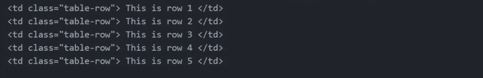
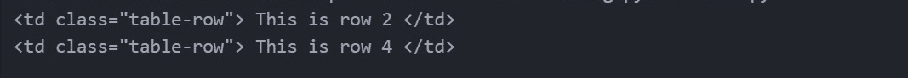
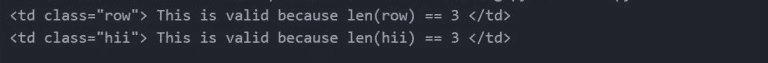
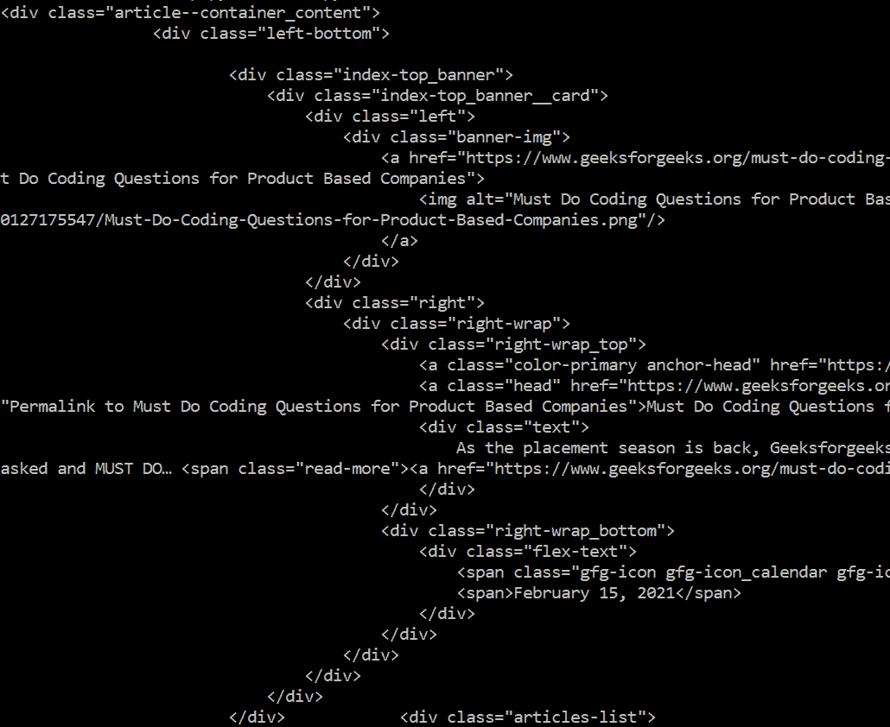

# 使用美观组

按 CSS 类查找标签

> 原文:[https://www . geesforgeks . org/find-tags-by-CSS-class-using-beauty ulsup/](https://www.geeksforgeeks.org/find-tags-by-css-class-using-beautifulsoup/)

在本文中，我们将讨论如何通过 CSS 使用 BeautifulSoup 来查找标签。给我们一个 HTML 文档，我们需要使用 CSS 类从文档中找到并提取标签。

**示例:**

```
HTML Document:
<html>
<head>
    <title> Geeksforgeeks </title>
</head>
<body>
    <div class="ext" >Extract this tag</div>
</body>
</html>

Output:
<div class="ext" >Extract this tag</div>
```

**所需模块:**

*   **bs4:** 它是一个 python 库，用于从 HTML、XML 和其他标记语言中抓取数据。
    确保您的系统上安装了 [pip](https://www.geeksforgeeks.org/download-and-install-pip-latest-version/) 。
    在终端运行以下命令安装该库-

```
pip install bs4
or
pip install beautifulsoup4
```

**进场:**

*   导入 bs4 库
*   创建一个超文本标记语言文档
*   将内容解析成一个[美丽的耦合对象](https://www.geeksforgeeks.org/beautifulsoup-object-python-beautifulsoup/)
*   **按 CSS 类搜索–**CSS 属性的名称**“类”**，是 Python 中的保留字。如果将**类**用作关键字参数，编译器会给出语法错误。我们可以使用关键字参数 **class_**
    来搜索 CSS 类。我们可以传递 class_ 一个字符串、一个正则表达式、一个函数或 True。
*   **find_all()** 带关键字参数 **class_** 用于查找给定 CSS 类的所有标签
    如果我们只需要查找一个标签，则使用 **find()**
*   打印提取的标签。

**例 1:使用 Find()方法**查找标签

## 蟒蛇 3

```
# Import Module
from bs4 import BeautifulSoup

# HTML Document
HTML_DOC = """
              <html>
               <head>
                   <title> Geeksforgeeks </title>
               </head>
               <body>
                   <div class="ext" >Extract this tag</div>
               </body>
             </html>
            """

# Function to find tags
def find_tags_from_class(html):

    # parse html content
    soup = BeautifulSoup(html, "html.parser")

    # find tags by CSS class
    div = soup.find("div", class_= "ext")

    # Print the extracted tag
    print(div)

# Function Call
find_tags_from_class(HTML_DOC)
```

**输出:**


**例 2:使用 find_all()方法**查找所有标签

## 蟒蛇 3

```
# Import Module
from bs4 import BeautifulSoup

# HTML Document
HTML_DOC = """
              <html>
               <head>
                   <title> Table Data </title>
               </head>
               <body>
                <table>
                   <tr>
                    <td class = "table-row"> This is row 1 </td>
                    <td class = "table-row"> This is row 2 </td>
                    <td class = "table-row"> This is row 3 </td>
                    <td class = "table-row"> This is row 4 </td>
                    <td class = "table-row"> This is row 5 </td>
                   </tr>
                </table>
               </body>
             </html>
            """

# Function to find tags
def find_tags_from_class(html):

    # parse html content
    soup = BeautifulSoup(html, "html.parser")

    # find tags by CSS class
    rows = soup.find_all("td", class_= "table-row")

    # Print the extracted tag
    for row in rows:
        print(row)

# Function Call
find_tags_from_class(HTML_DOC)
```

**输出:**



**示例 3:使用正则表达式按 CSS 类查找标签。**

## 蟒蛇 3

```
# Import Module
from bs4 import BeautifulSoup
import re

# HTML Document
HTML_DOC = """
              <html>
               <head>
                   <title> Table Data </title>
               </head>
               <body>
                <table>
                   <tr>
                    <td class = "table"> This is row 1 </td>
                    <td class = "table-row"> This is row 2 </td>
                    <td class = "table"> This is row 3 </td>
                    <td class = "table-row"> This is row 4 </td>
                    <td class = "table"> This is row 5 </td>
                   </tr>
                </table>
               </body>
             </html>
            """

# Function to find tags
def find_tags_from_class(html):

    # parse html content
    soup = BeautifulSoup(html, "html.parser")

    # find tags by CSS class using regular expressions
    # $ is used to match pattern ending with
    # Here we are finding class that ends with "row"
    rows = soup.find_all("td", class_= re.compile("row{content}quot;))

    # Print the extracted tag
    for row in rows:
        print(row)

# Function Call
find_tags_from_class(HTML_DOC)
```

**输出:**



**说明:**

```
<td class="table-row"> This is row 2 </td>
<td class="table-row"> This is row 4 </td>
```

上面两个标签类名以“row”结尾。因此，它们被提取出来。其他标签类名不以“row”结尾。因此，它们不会被提取。

**示例 4:使用用户定义的函数按 CSS 类查找标签。**

## 蟒蛇 3

```
# Import Module
from bs4 import BeautifulSoup

# HTML Document
HTML_DOC = """
              <html>
               <head>
                   <title> Table Data </title>
               </head>
               <body>
                <table>
                   <tr>
                    <td class = "table"> This is invalid because len(table) != 3 </td>
                    <td class = "row"> This is valid because len(row) == 3 </td>
                    <td class = "data"> This is invalid because len(data) != 3 </td>
                    <td class = "hii"> This is valid because len(hii) == 3 </td>
                    <td> This is invalid because class is None </td>
                   </tr>
                </table>
               </body>
             </html>
            """

# Returns true if the css_class is not None
# and length of css_class is equal to 3
# else returns false
def has_three_characters(css_class):
    return css_class is not None and len(css_class) == 3

# Function to find tags
def find_tags_from_class(html):

    # parse html content
    soup = BeautifulSoup(html, "html.parser")

    # find tags by CSS class using user-defined function
    rows = soup.find_all("td", class_= has_three_characters)

    # Print the extracted tag
    for row in rows:
        print(row)

# Function Call
find_tags_from_class(HTML_DOC)
```

**输出:**



**示例 5:从网站中按 CSS 类查找标签**

## 蟒蛇 3

```
# Import Module
from bs4 import BeautifulSoup
import requests

# Assign website
import requests
URL = "https://www.geeksforgeeks.org/"
HTML_DOC = requests.get(URL)

# Function to find tags
def find_tags_from_class(html):

    # parse html content
    soup = BeautifulSoup(html.content, "html5lib")

    # find tags by CSS class
    div = soup.find("div", class_= "article--container_content")

    # Print the extracted tag
    print(div)

# Function Call
find_tags_from_class(HTML_DOC)
```

**输出:**

