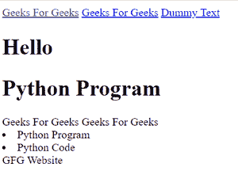

# 如何使用 BeautifulSoup 找到包含特定文本的 HTML 标签？

> 原文:[https://www . geesforgeks . org/how-to-find-a-html-tag-the-contains-seven-text-use-beauty sup/](https://www.geeksforgeeks.org/how-to-find-a-html-tag-that-contains-certain-text-using-beautifulsoup/)

在这篇文章中，我们将看到如何使用“美丽组”找到包含特定文本的 HTML 标签。

**使用的方法:**

> **打开(文件名，模式):**它以我们已经通过的模式打开给定的文件名。
> 
> **find_all ( ):** 它查找文件中与传递的表达式匹配的所有模式。

在这里，在下面给出的代码中，我们发现在程序中，在各种不同的标签中，某个文本被称为模式。现在代码将提供所有这些标签，这些标签将具有与模式匹配的文本。

**进场:**

在这里，我们首先导入正则表达式和美丽的输出库。然后我们使用我们想要解析的 open 函数打开 HTML 文件。然后使用 find_all 函数，我们找到一个在该函数中传递的特定标签，以及我们想要在标签中包含的文本。如果传递的标签有特定的文本，那么它将被添加到列表中。

因此，所有具有特定文本的标签都存储在一个列表中，然后打印该列表。如果我们得到空列表，那么这意味着没有这样的标签包含我们试图检查的文本。

**下面是演示用的 HTML 文件:**

## 超文本标记语言

```py
<!DOCTYPE html>
<html lang="en">
<head>
    <meta charset="UTF-8">
    <meta http-equiv="X-UA-Compatible" content="IE=edge">
    <meta name="viewport" content="width=device-width, initial-scale=1.0">
    <title>GFG </title>
</head>
<body>
    <a href="https://www.geeksforgeeks.org/">Geeks For Geeks</a>
    <a href="Dummy Check Text">Geeks For Geeks</a>
    <a href="Dummywebsite.com">Dummy Text</a>

    <h1>Hello</h1>
    <h1>Python Program</h1>

   <span class = true>Geeks For Geeks</span>
   <span class = false>Geeks For Geeks</span>

   <li class = 1 >Python Program</li>
   <li class = 2 >Python Code</li>

   <table>
       <tr>GFG Website</tr>
   </table>

</body>
</html>
```

**输出:**



**下面是实现:**

## 蟒蛇 3

```py
# Python program to find a HTML tag
# that contains certain text Using BeautifulSoup

# Importing library
from bs4 import BeautifulSoup
import re

# Opening and reading the html file
file = open("gfg.html", "r")
contents = file.read()

soup = BeautifulSoup(contents, 'html.parser')

# Finding a pattern(certain text)
pattern = 'Geeks For Geeks'

# Anchor tag
text1 = soup.find_all('a', text = pattern)
print(text1)

# Span tag
text2 = soup.find_all('span', text = pattern) 
print(text2)

# Finding a pattern(certain text)
pattern2 = 'Python Program'

# Heading tag
text3 = soup.find_all('h1', text = pattern2) 
print(text3)

# List tag
text4 = soup.find_all('li', text = pattern2) 
print(text4)

# Finding a pattern(certain text)
pattern3 = 'GFG Website'

# Table(row) tag
text5 = soup.find_all('tr', text = pattern3) 
print(text5)
```

**输出:**

> [ [极客对极客](”https://www.geeksforgeeks.org/”)，[极客对极客](”Dummy) ]
> 
> [ 极客对极客，极客对极客 ]
> 
> 【
> 
> # Python 程序
> 
> 】
> 
> 【
> 
> *   计算机编程语言程序】
> 
> 【 GFG 网站】