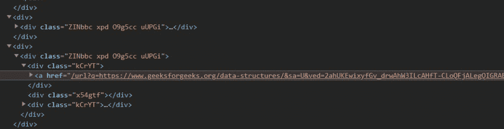

# 如何使用 BeautifulSoup 获取谷歌搜索结果中页面的排名？

> 原文:[https://www . geeksforgeeks . org/如何在 Google-search-results-use-beauty sup 中获得页面排名/](https://www.geeksforgeeks.org/how-to-get-rank-of-page-in-google-search-results-using-beautifulsoup/)

在本文中，我们将学习如何通过使用 Python 搜索关键词来获得谷歌页面排名。让我们了解一下谷歌排名的基础知识，然后使用 Python 继续进行搜索。

### **谷歌排名**

谷歌关键词排名是用户搜索关键词时，网站在*谷歌搜索*中出现的位置。换句话说，谷歌搜索基本上是在搜索索引中对数千亿个网页进行排序，在几分之一秒内找到最相关、最有用的结果，并以帮助您找到所需内容的方式呈现出来。

### **如何找到排名？**

我们使用一个名为 *requests* 的模块，它有一个方法 *get* 返回一个包含页面内容、状态等的响应，我们将响应保存到一个对象 *page* 中，并使用 *page.text* 方法从该对象中提取页面内容，并使用漂亮的汤使用 python 内置的 HTML 解析器解析 HTML 中的文档，这样我们就可以从 HTML 文档中访问数据，并从搜索到的关键字中获取 URL。

### 需要的模块

我们需要通过 pip 在您的系统中分别安装两个模块，requests 和 bs4。

**Requests:**Requests 模块允许您发送 HTTP 请求，并返回一个包含状态、页面内容等所有数据的响应。

```py
Syntax: pip install requests
```

**美汤:**美汤模块允许您使用 python 内置的 HTML 解析器解析原始 HTML 或 XML 文档，这样我们就可以从解析后的文档中提取数据。

```py
pip install bs4
```

### **进场:**

**1。**我们需要提供要搜索的关键词，以及在给定数量的搜索查询中存在排名的网站。

> 谷歌搜索的基本网址:"https://www.google.com/search？q="
> 通过用“+”
> 替换空格来添加关键字添加& num=30 以及将搜索结果的数量表示为 30
> 最终 URL = "https://www.google.com/search？q =最佳+每日生活津贴+练习+问题& num=30 "


**2。**使用 *requests.get(url)* 方法向谷歌搜索发送一个 HTTP 请求，该请求返回来自搜索引擎的响应，该响应作为对象保存到页面中。

> page = requests . get(" https://www . Google . com/search？q =最佳+每日生活津贴+练习+问题&数量=30”)

**3。**使用 *page.text* 方法获取页面内容，并使用漂亮的汤解析原始 HTML。

```py
soup = BeautifulSoup(page.text, 'html.parser')
```

这将创建一个解析树，有助于从 HTML 文档中访问数据。

**4。**使用 soup.find_all() 查找 div，所有 div 都有一个名为“ZinBB XPD o9 g5cc Uupgi”*的类，因为它包含所有搜索查询以及< a >标签中的网址，并将其存储在 result_div 中。(请参考下面带有开发工具的图片)*

> *result_div = soup.find_all('div '，attrs = { ' class ':' ZinBBc XPD o9 g5cc uUPGi ' })*

**

*这是一张开发者工具的图片，其中所有的搜索查询都有相同的 div 类，但是包含不同的 URL，我们可以通过检查*

***5。**迭代 result_div，找到<一个>标签，检查是否存在任何网址，如果找到，检查是否与输入中提供的网站匹配，并将排名添加到 rank_list 中。 *(rank_list 是一个字符串变量，因为可以出现多个等级)**

```py
*link = div.find("a", href=True)
if link['href'][7:7+len(website)] == website:
    rank_list += str(rank)+","*
```

***6。**迭代结束后，返回 rank_list，打印排名。*

***以下是完整实现:***

## *蟒蛇 3*

```py
*# import the required modules
import requests
from bs4 import BeautifulSoup

# Function will get all the ranks of the website
# by searching the keyword in google and returns
# a string of ranks or Website Missing if the website
# doesn't occur in the given number of search queries.
def find_rank(keyword, website, search_query):

    # Initialise the required variables
    rank, rank_list = 1, ""

    # Base search url of google
    url = "https://www.google.com/search?q="

    # Replaces whitespace with "+" in keyword
    keyword = keyword.replace(" ", "+")

    # Base url is updated with the keyword to be
    # searched in given number of search results.
    url = url + keyword + "&num=" + str(search_query)

    # requests.get(url) returns a response that is saved
    # in a response object called page.
    page = requests.get(url)

    # page.text gives us access to the web data in text
    # format, we pass it as an argument to BeautifulSoup
    # along with the html.parser which will create a
    # parsed tree in soup.
    soup = BeautifulSoup(page.text, 'html.parser')

    # soup.find_all finds the div, all having the same
    # class "ZINbbc xpd O9g5cc uUPGi" that is stored
    # in result_div
    result_div = soup.find_all(
        'div', attrs={'class': 'ZINbbc xpd O9g5cc uUPGi'})

    # Iterate result_div and check for the given website
    # inside <a> tag adding the rank to the
    # rank_list if found.
    for div in result_div:
        try:

          # Finds <a> tag and checks if the url is present,
          # if present then check with the provided
          # website in main()
            link = div.find("a", href=True)
            if link['href'][7:7+len(website)] == website:
                rank_list += str(rank)+","
            rank += 1
        except:
            pass
    return (rank_list, "Website Missing")[rank_list == ""]

# Main Function
if __name__ == "__main__":
    keyword = "dsa practice questions"
    website = "https://www.geeksforgeeks.org"
    search_query = 30
    rank = find_rank(keyword, website, search_query)

    if rank == "Website Missing":
        print(rank)
    else:
        print("Rank of Website :", rank[:-1])*
```

***输出:***

```py
*Rank of Website : 1,2*
```