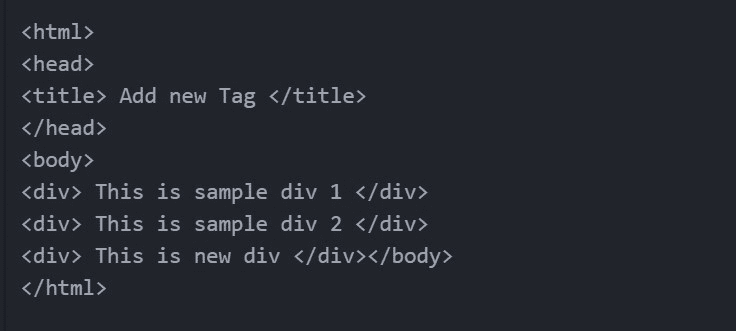

# 如何将新标签插入到一个美丽的输出对象中？

> 原文:[https://www . geeksforgeeks . org/如何将新标签插入到美丽的对象中/](https://www.geeksforgeeks.org/how-to-insert-a-new-tag-into-a-beautifulsoup-object/)

在本文中，我们将看到如何在一个美丽的输出对象中插入一个新标签。请看下面的例子来获得关于这个主题的更好的想法。

**示例:**

> **HTML_DOC :**
> 
> """
> 
> <title>表格数据</title>
> 
> 这是样品 1这是样品 2
> 
> """
> 
> **new _ tag:**T2 分区>这里是新分区</分区>
> 
> **修改后的美丽组合对象:**
> 
> """
> 
> <title>表格数据</title>
> 
> 这是样品 1这是样品 2这是新分区
> 
> """

**所需模块:**

**beauty sup(bs4):**它是一个用于从 HTML 和 XML 文件中提取数据的 Python 库。这个模块没有内置 Python。在终端运行以下命令安装该库-

```
pip install bs4
or
pip install beautifulsoup4
```

**使用 new_tag()方法创建新标签:**

通过调用美化组的内置函数 **new_tag()** ，可以创建一个新的标签。

**使用 append()方法插入新标签:**

新标签被附加到父标签的末尾。

## 蟒蛇 3

```
# Import Module
from bs4 import BeautifulSoup

# HTML Document
HTML_DOC = """
              <html>
               <head>
                   <title> Add new Tag </title>
               </head>
               <body>
                    <div> This is sample div 1 </div>
                    <div> This is sample div 2 </div>
               </body>
             </html>
            """

# Function to append new tag
def addTag(html):

    # parse html content
    soup = BeautifulSoup(html, "html.parser")

    # create new tag
    # Here we are creating a new div
    new_div = soup.new_tag("div")

    # Adding content to div
    new_div.string = " This is new div "

    # Appending new div to html tree
    soup.html.body.append(new_div)

    # Printing the modified object
    print(soup)

# Function Call
addTag(HTML_DOC)
```

**输出:**



**使用 insert()方法插入新标签:**

使用此方法，新标记不会附加到父标记的末尾，而是插入到给定的数字位置。它的工作原理与[相同。Python 列表的 insert()](https://www.geeksforgeeks.org/python-list-insert/) 方法。例如，如果我们想在 div 1 和 div 2 之间插入新的 div，我们可以使用

```
soup.html.body.insert(2, new_div)
```

这将在位置 2 插入新的 div，即在旧的 2 个 div 之间。

## 蟒蛇 3

```
# Import Module
from bs4 import BeautifulSoup

# HTML Document
HTML_DOC = """
              <html>
               <head>
                   <title> Add new Tag </title>
               </head>
               <body>
                    <div> This is sample div 1 </div>
                    <div> This is sample div 2 </div>
               </body>
             </html>
            """

# Function to inset new tag
def addTag(html):

    # parse html content
    soup = BeautifulSoup(html, "html.parser")

    # create new tag
    # Here we are creating a new div
    new_div = soup.new_tag("div")

    # Adding content to div
    new_div.string = " This is new div "

    # Inserting new div to html tree
    # Here, 2 represents the position
    # where we want to insert the new tag
    soup.html.body.insert(2, new_div)

    # Printing the modified object
    print(soup)

# Function Call
addTag(HTML_DOC)
```