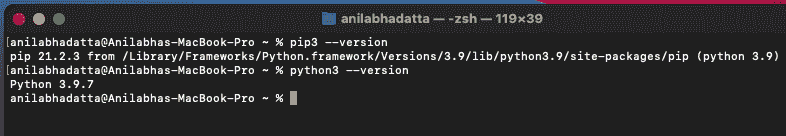
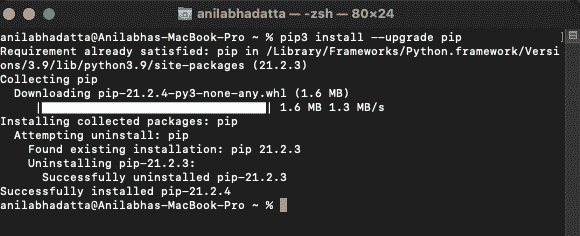
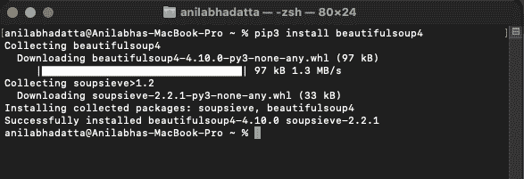
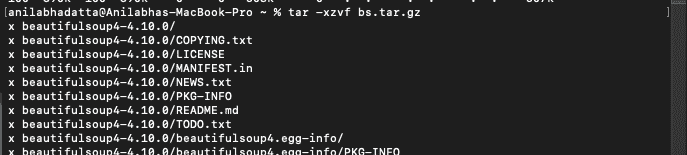
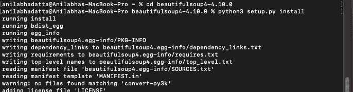
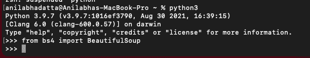

# 如何在 MacOS 上安装 Python 中的美丽套件？

> 原文:[https://www . geesforgeks . org/how-install-with-beautulsup-in-python-on-macos/](https://www.geeksforgeeks.org/how-to-install-beautifulsoup-in-python-on-macos/)

在本文中，我们将学习如何在 MacOS 上安装 Python 中的美丽汤。

## 装置

### 方法一:用画中画安装漂亮的画中画

**步骤 1:** [在 MacOS](https://www.geeksforgeeks.org/download-and-install-python-3-latest-version/) 中安装最新的 Python3

**步骤 2:** 检查 pip3 和 python3 是否安装正确。

```py
python3 --version
pip3 --version
```



**第三步:**升级 pip，避免安装时出错。

```py
pip3 install --upgrade pip
```



**第 4 步:**输入以下命令，使用 pip 安装美人汤。

```py
pip3 install beautifulsoup4
```



### 方法 2:使用 setup.py 安装美观的套件

**第一步:**下载最新的蟒之美汤套装 3。

> curl https://files . pythonghosted . org/packages/a1/69/daee 6 D8 f22c 997 e 522 cdbeb 59641 c 4 d31 ab 120 ABA 0 F2 c 799500 f 7456 b7e/beautiful ulsoup 4-4 . 10 . 0 . tar . gz > bs . tar . gz


**步骤 2:** 使用以下命令提取下载的包。

```py
tar -xzvf bs.tar.gz 
```



**第三步:**进入文件夹输入以下命令安装软件包。

```py
cd beautifulsoup4-4.10.0
python3 setup.py install
```



## 验证安装

在 Python 终端中导入模块，检查美丽汤是否安装正确

```py
from bs4 import BeautifulSoup
```



**注意:**如果导入模块时出现任何错误，则说明安装不正确。