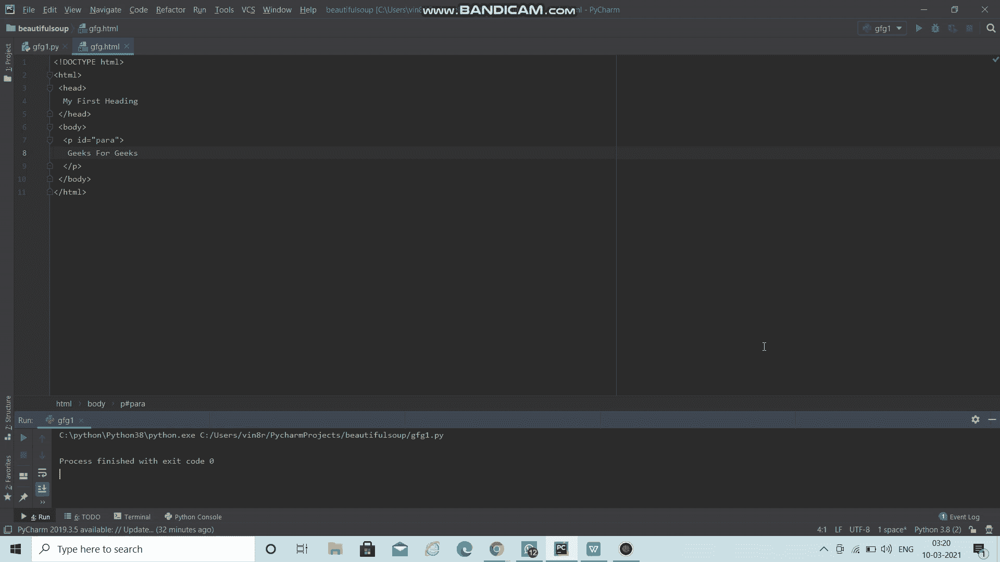

# 如何使用美化程序修改 HTML？

> 原文:[https://www . geesforgeks . org/how-to-modify-html-using-beautiful sup/](https://www.geeksforgeeks.org/how-to-modify-html-using-beautifulsoup/)

Python 中的[](https://www.geeksforgeeks.org/implementing-web-scraping-python-beautiful-soup/)****有助于从由 HTML 或 XML 组成的网页中抓取信息。它不仅涉及废弃数据，还涉及搜索、修改和迭代解析树。在本文中，我们将讨论如何使用“美丽的输出”直接在 HTML 网页上修改内容。****

******语法:******

> ****old _ text = soup . find(“# Widget”，{“id”:#您要编辑的 Widget 的 Id 名称”})****
> 
>  ****new _ Text = old _ Text . find(Text =重新编译('您想要编辑的文本'))。替换为(#要替换的新文本)****

### ****使用的术语:****

*   ******widget:** 这里，Widget 代表您希望从网站替换的文本当前存储在其中的特定 Widget。****
*   ******Id 名称:**这里，Id 名称代表您为存储文本的特定小部件的 Id 指定的名称。****

******示例:******

****例如，考虑这个简单的页面源。****

## ****超文本标记语言****

```py
**<!DOCTYPE html>
<html>
  <head>
    My First Heading
  </head>
<body>
  <p id="para">
    Geeks For Geeks
  </p>

</body>
</html>**
```

****一旦你创建了一个驱动程序，你可以用–****

> ****old _ text = soup . find(“p”，{“id”:“para”})****
> 
> ****new _ text = old _ text . find(text = re . compile(‘极客为极客’)。替换为(' Vinayak Rai ')****

### ****逐步方法:****

******第一步:**首先，导入库美丽汤、os 和 re。****

> ****从 bs4 导入美丽的组作为 bs****
> 
> ****导入操作系统****
> 
> ****进口 re****

******步骤 2:** 现在，移除路径的最后一段。****

> ****base = OS . path . dirname(OS . path . split _ _ file _)****

******第三步:**然后，打开您希望进行更改的 HTML 文件。****

> ****html =打开(os.path.join(base，' #要编辑的 html 文件的名称'))****

******第四步:**此外，解析美人汤中的 HTML 文件。****

> ****shoot = bs(html，‘html . parser’)****

******第 5 步:**进一步，给出您想要替换的文本的适当位置。****

> ****old _ text = soup . find(“# Widget Name”，{“id”:#您要编辑的 Widget 的 Id 名称”})****

******步骤 6:** 接下来，用您希望分配的新文本替换已经存储的文本。****

> ****new _ Text = old _ Text . find(Text =重新编译('您想要编辑的文本'))。替换为(#要替换的新文本)****

******第 7 步:**最后，更改 HTML 文件，查看上一步所做的更改。****

> ****以 f_output 形式打开(“#要在其中存储已编辑文本的 HTML 文件的名称”、“wb”):****
> 
> ****f _ output . write(soup . pretify(" utf-8 "))****

### ****实施:****

## ****计算机编程语言****

```py
**# Python program to modify HTML
# with the help of Beautiful Soup

# Import the libraries 
from bs4 import BeautifulSoup as bs
import os
import re

# Remove the last segment of the path
base = os.path.dirname(os.path.abspath(__file__))

# Open the HTML in which you want to make changes
html = open(os.path.join(base, 'gfg.html'))

# Parse HTML file in Beautiful Soup
soup = bs(html, 'html.parser')

# Give location where text is 
# stored which you wish to alter
old_text = soup.find("p", {"id": "para"})

# Replace the already stored text with 
# the new text which you wish to assign
new_text = old_text.find(text=re.compile(
    'Geeks For Geeks')).replace_with('Vinayak Rai')

# Alter HTML file to see the changes done
with open("gfg.html", "wb") as f_output:
    f_output.write(soup.prettify("utf-8"))**
```

******输出:******

********