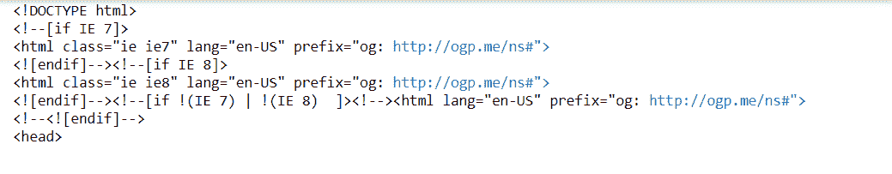

# 如何使用 Python 中的 BeautifulSoup 移除空标签？

> 原文:[https://www . geesforgeks . org/如何移除空标签-使用 python 中的-beautulsoup/](https://www.geeksforgeeks.org/how-to-remove-empty-tags-using-beautifulsoup-in-python/)

**先决条件:** [请求](https://www.geeksforgeeks.org/python-requests-tutorial/)[美化组](https://www.geeksforgeeks.org/implementing-web-scraping-python-beautiful-soup/)[剥离](https://www.geeksforgeeks.org/python-string-strip/)

任务是编写一个程序，从 HTML 代码中移除空标签。在美丽的汤没有内置的方法来删除没有内容的标签。

### 所需模块:

*   [**bs4:**](https://www.geeksforgeeks.org/implementing-web-scraping-python-beautiful-soup/) 美人汤(bs4)是一个从 HTML 和 XML 文件中拉出数据的 Python 库。这个模块没有内置 Python。要安装此软件，请在终端中键入以下命令。

```py
pip install bs4

```

*   [**请求:**](https://www.geeksforgeeks.org/python-requests-tutorial/) 请求让你发送 HTTP/1.1 请求极其轻松。该模块也没有内置 Python。要安装此软件，请在终端中键入以下命令。

```py
pip install requests

```

### 方法:

*   获取 HTML 代码
*   遍历每个标签
    *   从标签中获取文本，并使用条删除空白。
    *   删除空白后，检查文本的长度是否为零，从 HTML 代码中删除标签。

**示例 1:** 移除空标签。

## 蟒蛇 3

```py
# Import Module
from bs4 import BeautifulSoup

# HTML Object
html_object = """

<p>
<p></p>
<strong>some<br>text<br>here</strong></p>

"""

# Get HTML Code
soup = BeautifulSoup( html_object , "lxml")

# Iterate each line
for x in soup.find_all():

    # fetching text from tag and remove whitespaces
    if len(x.get_text(strip=True)) == 0:

        # Remove empty tag
        x.extract()

# Print HTML Code with removed empty tags
print(soup)
```

**输出:**

```py
<html><body><strong>sometexthere</strong>
</body></html>

```

**示例 2:** 从给定的网址中删除空标签。

## 蟒蛇 3

```py
# Import Module
from bs4 import BeautifulSoup
import requests

# Page URL
URL = "https://www.geeksforgeeks.org/"

# Page content from Website URL
page = requests.get( URL )

# Get HTML Code
soup = BeautifulSoup( page.content , "lxml" )

# Iterate each line
for x in soup.find_all():

    # fetching text from tag and remove whitespaces
    if len( x.get_text ( strip = True )) == 0:

        # Remove empty tag
        x.extract()

# Print HTML Code with removed empty tags
print(soup)
```

**输出:**

