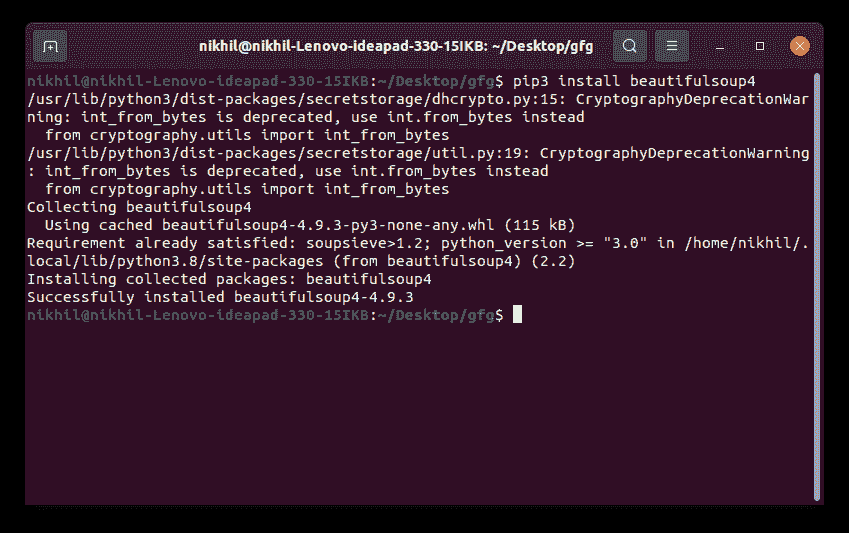
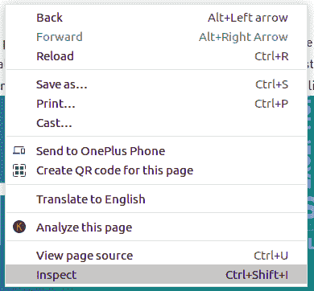
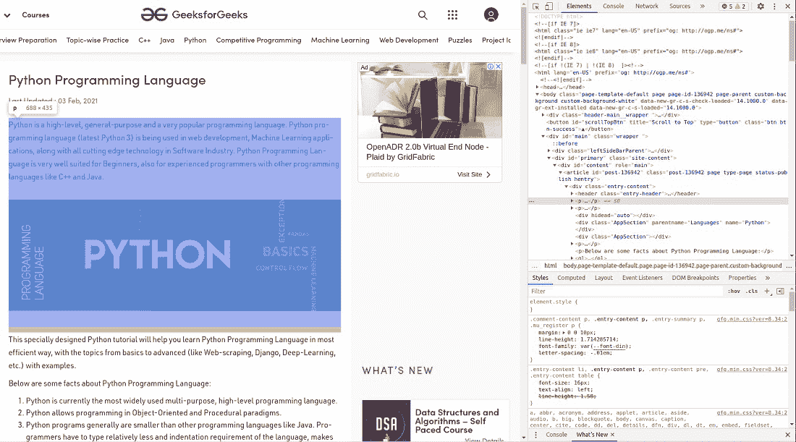
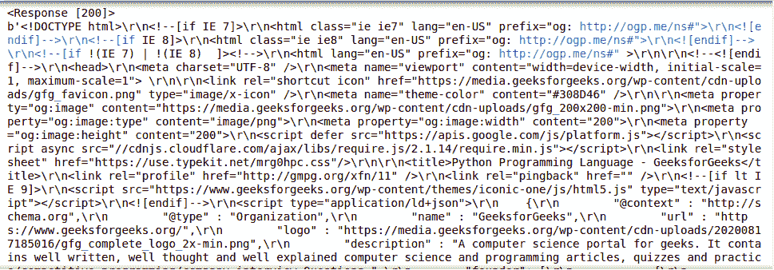
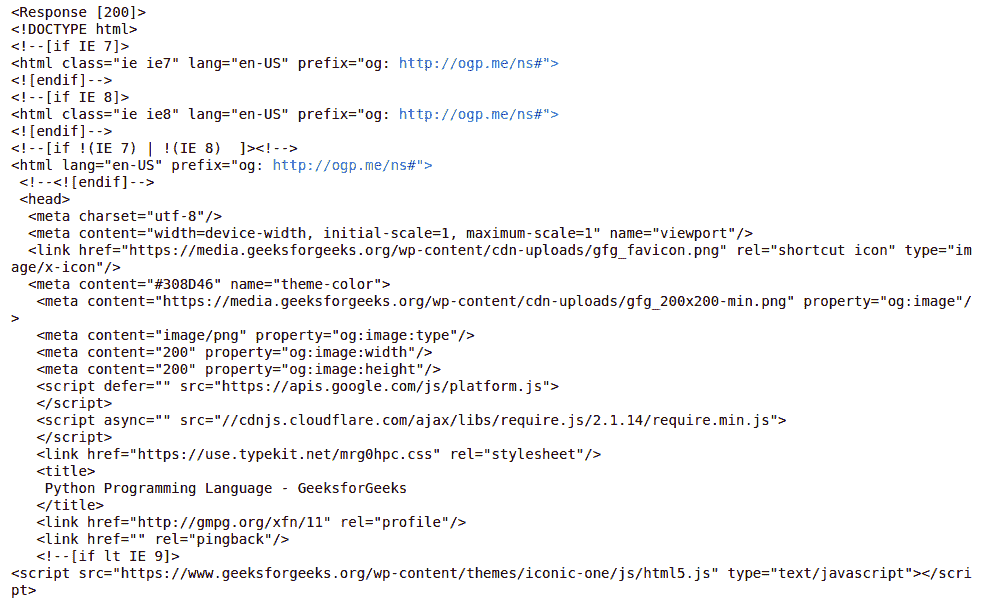

# 如何用美图和 Python 刮网站？

> 原文:[https://www . geeksforgeeks . org/how-to-scratch-sites-with-beauty sup-and-python/](https://www.geeksforgeeks.org/how-to-scrape-websites-with-beautifulsoup-and-python/)

你有没有想过每天有多少数据在互联网上产生，如果你想处理这些数据呢？不幸的是，这些数据没有像一些 CSV 或 JSON 文件那样正确组织，但幸运的是，我们可以使用网页抓取从互联网上抓取数据，并可以根据自己的需要使用它。刮除数据的方法有很多，其中一种方法就是使用**美化组。**

在开始学习美丽组之前，让我们先了解什么是网页抓取，以及我们是否应该这样做？

### 什么是网页抓取？

通俗地说，网页抓取就是从任何网站收集数据的过程。就像把网站的数据复制粘贴到自己的文件中一样，但是**会自动**。从技术角度来说，网络脚本是一种从网站获取大量数据的自动方法。这些数据大部分是 HTML 格式的非结构化数据，然后在电子表格或数据库中转换成结构化数据，以便在各种应用程序中使用。

**注:**更多信息请参考[什么是刮网，如何使用？](https://www.geeksforgeeks.org/what-is-web-scraping-and-how-to-use-it/)

**刮网合法化**

刮网合法化是一个敏感的话题，取决于如何使用，它可能是好事，也可能是坏事。一方面，用好的 bot 进行网页抓取，使搜索引擎能够索引网页内容，提供比价服务，为客户节省资金和价值。但是网页抓取可以被重新定位，以满足更多的恶意和滥用的目的。网页抓取可以与其他形式的恶意自动化(称为“坏机器人”)相结合，后者可以进行其他有害活动，如拒绝服务攻击、竞争性数据挖掘、账户劫持、数据窃取等。

现在，在学习了网页抓取的基础知识之后，让我们不要再浪费时间了，直接进入美丽的世界吧。让我们从安装开始。

### 装置

要在 Windows、Linux 或任何操作系统上安装美观套件，需要 **pip** 包。要查看如何在您的操作系统上安装画中画，请查看–画中画安装–[视窗](https://www.geeksforgeeks.org/how-to-install-pip-on-windows/)|[Linux](https://www.geeksforgeeks.org/how-to-install-pip-in-linux/)。现在在终端运行下面的命令。

```
pip install beautifulsoup4
```



如果上述方法对您不起作用，请参考以下文章了解更多安装美观套件的方法。

*   [美丽的 ulsoup 安装–python](https://www.geeksforgeeks.org/beautifulsoup-installation-python/)

### 检查网站

在抓取任何网站之前，你需要做的第一件事是了解网站的结构。需要这样做，以便从整个页面中选择所需的数据。我们可以通过右键单击要刮取的页面并选择 inspect element 来实现这一点。

**注意:**本教程我们将抓取 [Python 编程页面](https://www.geeksforgeeks.org/python-programming-language/)。



点击检查按钮后，浏览器的**开发工具**打开。现在几乎所有的浏览器都安装了开发者工具，我们将在本教程中使用 Chrome。



开发者工具允许查看网站的 [**【文档对象模型】**](https://www.geeksforgeeks.org/dom-document-object-model/) **。**如果你不知道 DOM，那么不要担心，只要考虑作为页面的 HTML 结构显示的文本。

### 获取网页的 HTML

在检查完页面的 HTML 之后，我们仍然需要将所有的 HTML 输入到我们的 Python 代码中，这样我们就可以抓取所需的数据。为此，Python 提供了一个名为**请求的模块。**请求库是 Python 的一个组成部分，用于向指定的网址发出 HTTP 请求。请求安装取决于 eis 使用的操作系统类型，任何地方的基本命令都是打开命令终端并运行，

```
pip install requests
```

现在让我们使用 **get()** 方法做一个简单的 GET 请求。

**示例:**

## 蟒蛇 3

```
import requests

# Making a GET request
r = requests.get('https://www.geeksforgeeks.org/python-programming-language/')

# check status code for response received
# success code - 200
print(r)

# print content of request
print(r.content)
```

**输出:**



请参考下面的教程，以获得关于请求模块的详细和解释良好的信息。

*   [Python 请求教程](https://www.geeksforgeeks.org/python-requests-tutorial/)

### 解析 HTML

获取页面的 HTML 后，让我们看看如何将这些原始的 HTML 代码解析成一些有用的信息。首先，我们将通过指定我们想要使用的解析器来创建一个美丽的输出对象。

**注意:**beautulsoup 库建立在 html5lib、lxml、html.parser 等 HTML 解析库之上。所以美化输出对象和指定解析器库可以同时创建。

**例 1:**

## 蟒蛇 3

```
import requests
from bs4 import BeautifulSoup

# Making a GET request
r = requests.get('https://www.geeksforgeeks.org/python-programming-language/')

# check status code for response received
# success code - 200
print(r)

# Parsing the HTML
soup = BeautifulSoup(r.content, 'html.parser')
print(soup.prettify())
```

**输出:**



**例 2:**

## 蟒蛇 3

```
import requests
from bs4 import BeautifulSoup

# Making a GET request
r = requests.get('https://www.geeksforgeeks.org/python-programming-language/')

# Parsing the HTML
soup = BeautifulSoup(r.content, 'html.parser')

# Getting the title tag
print(soup.title)

# Getting the name of the tag
print(soup.title.name)

# Getting the name of parent tag
print(soup.title.parent.name)

# use the child attribute to get
# the name of the child tag
```