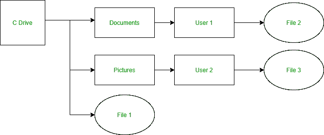
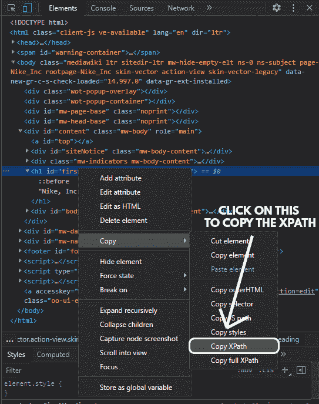

# 如何将 Xpath 与 BeautifulSoup 配合使用？

> 原文:[https://www . geesforgeks . org/how-用法-XPath-with-beauty ulsup/](https://www.geeksforgeeks.org/how-to-use-xpath-with-beautifulsoup/)

**先决条件:** [美丽组合](https://www.geeksforgeeks.org/implementing-web-scraping-python-beautiful-soup/)

在本文中，我们将看到如何将 Xpath 与美化组一起使用。使用 lxml 从网页上的元素获取数据需要使用 Xpaths。XPath 的工作方式非常像传统的文件系统

### 所需模块和安装:

首先，我们需要在计算机上安装所有这些模块。

*   [**【美观组:**](https://www.geeksforgeeks.org/implementing-web-scraping-python-beautiful-soup/) 我们的主模块包含一个通过 HTTP 访问网页的方法。

```py
pip install bs4
```

*   **lxml:** 处理 python 语言网页的助手库。

```py
pip install lxml
```

*   [**请求:**](https://www.geeksforgeeks.org/python-requests-tutorial/) 使发送 HTTP 请求的过程完美无缺

```py
pip install requests
```

使用 *lxml* 从网页上的元素获取数据需要使用*XPath*。

### 使用 XPath

*XPath* 的工作原理非常像传统的文件系统。



要访问文件 1，

```py
C:/File1
```

同样，要访问文件 2，

```py
C:/Documents/User1/File2
```

#### 要查找页面上特定元素的 XPath:

*   右键点击页面中的元素，点击*检查。*
*   右键单击*元素*选项卡中的元素。
*   点击复制 *XPath* 。



### 方法

*   导入模块
*   从网页中删除内容
*   现在要使用 XPath，我们需要将 soup 对象转换为 etree 对象，因为默认情况下，美化组不支持使用 Xpath。
*   但是，lxml 支持 XPath 1.0。它有一个漂亮的输出兼容模式，它会像汤一样尝试解析破碎的 HTML。
*   要复制一个元素的 XPath，我们需要检查这个元素，然后右击它的 HTML 并找到 XPath。
*   之后，您可以使用。lxml 模块的 etree 类中提供了 xpath 方法来解析相关元素中的值。

**注意:**如果 XPath 没有给你想要的结果，请复制完整的 XPath，而不是 XPath，其他步骤将是相同的。

下面给出了一个例子来说明 Xpath 如何与美化程序一起使用

**程序:**

## 蟒蛇 3

```py
from bs4 import BeautifulSoup
from lxml import etree
import requests

URL = "https://en.wikipedia.org/wiki/Nike,_Inc."

HEADERS = ({'User-Agent':
            'Mozilla/5.0 (X11; Linux x86_64) AppleWebKit/537.36 \
            (KHTML, like Gecko) Chrome/44.0.2403.157 Safari/537.36',\
            'Accept-Language': 'en-US, en;q=0.5'})

webpage = requests.get(URL, headers=HEADERS)
soup = BeautifulSoup(webpage.content, "html.parser")
dom = etree.HTML(str(soup))
print(dom.xpath('//*[@id="firstHeading"]')[0].text)
```

**输出:**

```py
Nike, Inc.
```