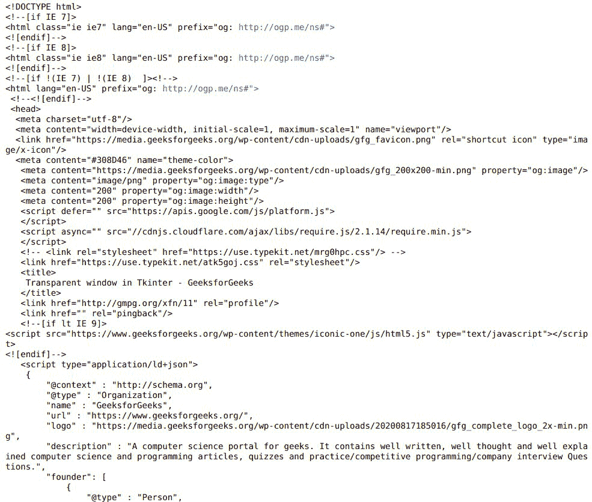

# 漂亮-在漂亮的套件中打印

> 原文:[https://www . geesforgeks . org/俏丽-printing-in-beauty ulsup/](https://www.geeksforgeeks.org/pretty-printing-in-beautifulsoup/)

**先决条件:**

*   [请求](https://www.geeksforgeeks.org/python-requests-tutorial/)
*   [美丽的脉冲星](https://www.geeksforgeeks.org/implementing-web-scraping-python-beautiful-soup/)

在这篇文章中，我们将学习如何使用 Python 在[](https://www.geeksforgeeks.org/implementing-web-scraping-python-beautiful-soup/)****中打印漂亮。**请求**库是 Python 的一个组成部分，用于向指定的网址发出 HTTP 请求。无论是 REST APIs 还是 Web 报废，都必须了解请求，以便进一步使用这些技术。当一个人向 URI 提出请求时，它会返回一个响应。Python 请求提供了管理请求和响应的内置功能。****

```
**pip install requests**
```

****美丽的汤是一个 Python 库，设计用于快速周转项目，如屏幕刮擦。****

```
**pip install beautifulsoup4**
```

## ******什么是美印？******

****简而言之，我们可以说，它用适当的缩进和一切来美化 HTML。****

******我们来了解一下分步实施:-******

*   ****导入所需模块****

## ****蟒蛇 3****

```
**# Import Required Module
import requests
from bs4 import BeautifulSoup**
```

*   ****解析超文本标记语言内容****

## ****蟒蛇 3****

```
**# Web URL
Web_url = "Enter WEB URL"

# Get URL Content
r = requests.get(Web_url)

# Parse HTML Code
soup = BeautifulSoup(r.content, 'html.parser')**
```

*   ****漂亮的 HTML 代码。美化组有一个**美化()**的方法。****

******美化()**方法将把一个美丽的汤解析树变成一个格式良好的 Unicode 字符串，每个标签和字符串有一个单独的行:****

## ****蟒蛇 3****

```
**print(soup.prettify())**
```

******下面是实现:******

## ****蟒蛇 3****

```
**# Import Required Module
import requests
from bs4 import BeautifulSoup

# Web URL
Web_url = "https://www.geeksforgeeks.org/transparent-window-in-tkinter/"

# Get URL Content
r = requests.get(Web_url)

# Parse HTML Code
soup = BeautifulSoup(r.content, 'html.parser')
print(soup.prettify())**
```

******输出:******

********