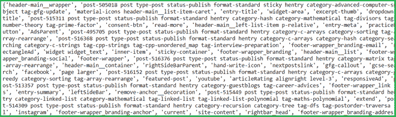

# Python 美化程序–查找所有类

> 原文:[https://www . geesforgeks . org/python-beautulsoup-find-all-class/](https://www.geeksforgeeks.org/python-beautifulsoup-find-all-class/)

**先决条件:-** [请求](https://www.geeksforgeeks.org/python-requests-tutorial/)[美化组](https://www.geeksforgeeks.org/implementing-web-scraping-python-beautiful-soup/)

任务是编写一个程序来查找给定网站网址的所有类。在《美丽的汤》中，没有找到所有类的内置方法。

**所需模块:**

*   [**bs4**](https://www.geeksforgeeks.org/implementing-web-scraping-python-beautiful-soup/)【T4:美人汤(bs4)是一个从 HTML 和 XML 文件中拉出数据的 Python 库。这个模块没有内置 Python。要安装此软件，请在终端中键入以下命令。

```
pip install bs4

```

*   [**请求**](https://www.geeksforgeeks.org/python-requests-tutorial/) **:** 请求让你发送 HTTP/1.1 请求极其轻松。该模块也没有内置 Python。要安装此软件，请在终端中键入以下命令。

```
pip install requests

```

**方法#1:** 在给定的 HTML 文档中查找类。

**进场:**

*   创建一个 HTML 文档。
*   导入模块。
*   将内容解析成漂亮的包。
*   按类名迭代数据。

**代码:**

## 蟒蛇 3

```
# html code
html_doc = """<html><head><title>Welcome  to geeksforgeeks</title></head>
<body>
<p class="title"><b>Geeks</b></p>

<p class="body">geeksforgeeks a computer science portal for geeks
</body>
"""

# import module
from bs4 import BeautifulSoup

# parse html content
soup = BeautifulSoup( html_doc , 'html.parser')

# Finding by class name
soup.find( class_ = "body" )
```

**输出:**

```
<p class="body">geeksforgeeks a computer science portal for geeks
</p>
```

**方法#2:** 下面是在一个 URL 中查找所有类的程序。

**进场:**

*   导入模块
*   创建请求实例并传入网址
*   将请求传递到一个美丽的输出()函数中
*   然后我们将迭代所有标签并获取类名

**代码:**

## 蟒蛇 3

```
# Import Module
from bs4 import BeautifulSoup
import requests

# Website URL
URL = 'https://www.geeksforgeeks.org/'

# class list set
class_list = set()

# Page content from Website URL
page = requests.get( URL )

# parse html content
soup = BeautifulSoup( page.content , 'html.parser')

# get all tags
tags = {tag.name for tag in soup.find_all()}

# iterate all tags
for tag in tags:

    # find all element of tag
    for i in soup.find_all( tag ):

        # if tag has attribute of class
        if i.has_attr( "class" ):

            if len( i['class'] ) != 0:
                class_list.add(" ".join( i['class']))

print( class_list )
```

**输出:**

