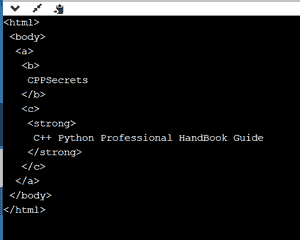

# 蟒蛇美图导航树侧身

> 原文:[https://www . geeksforgeeks . org/python-beautelsup-navigating-tree-side/](https://www.geeksforgeeks.org/python-beautifulsoup-navigating-tree-sideways/)

在本文中，我们将看到如何横向浏览这个漂亮的解析树。横向导航意味着标签处于同一水平。请看下面的例子来获得一个更好的想法。

```py
<a>
<b></b>
<c></c>
</a>
```

在上面的例子中，标签**和<c>处于同一级别。</c>**

**所需模块的安装:**

**bs4:** 我们需要在机器中手动安装 BeautifulSoup 库，因为 Python 语言 Configuration 中默认不提供这个库。因此，让我们通过在系统中运行以下命令来安装它:

```py
pip install bs4
```

**lxml:** lxml 是 pythonic libxml2 和 libxlst 库之间的成熟绑定，借助 ElementTree API，它提供了对那些库的安全便捷的访问。

```py
pip install lxml 
```

**让我们用实现来理解:**

**Prestify():**Prestify()函数使我们能够观察标签在文档中是如何嵌套的。

> **语法:**(美化输出变量)。美化()

**示例:**

## 蟒蛇 3

```py
import bs4

sibling_soup = bs4.BeautifulSoup("<a><b>Welcome to Geekforgeeks</b>\
<c>Hello geeks</c></b></a>", 'html.parser')
print(sibling_soup.prettify())
```

**输出:**

```py
<a>
 <b>
  Welcome to Geekforgeeks
 </b>
 <c>
  Hello geeks
 </c>
</a>
```

## **侧向导航**

我们可以使用在文档中横向导航。next _ 同胞和。在 Python 中，这两个函数为我们提供了在树的同一级别的标签之间导航的功能。

**让我们通过一个经过验证的例子来更好地洞察这个概念:**

考虑一个示例文档:

## 蟒蛇 3

```py
# For importing BeautifulSoup
import bs4

# initiating variable of BeautifulSoup
sibling_of_soup = bs4.BeautifulSoup("<a><b>CPPSecrets</b><c><strong>\
C++ Python Professional HandBook Guide</strong></b></a>", 'lxml')  

# To print contents in the initiated BeautifulSoup
print(sibling_of_soup.prettify())
```

**输出:**



在上面的代码中，我们可以清楚地注意到**和<c>标签在同一个级别上，并且它们都是同一个标签的子标签，因此，我们可以将它们分类为兄弟。</c>**

**现在，我们可以通过使用:**在兄弟< b >和< c >标签之间导航，因为它们都是兄弟

*   **。next _ 同胞()**
*   **。上一个 _ 同级:**

**1。使用导航。next _ 同胞:**

## 蟒蛇 3

```py
import bs4

sibling_of_soup = bs4.BeautifulSoup("<a><b>CPPSecrets</b><c><strong>\
C++ Python Professional HandBook Guide</strong></b></a>",'lxml')

# printing contents in BeautifulSoup Variable
print(sibling_of_soup.b.next_sibling)
```