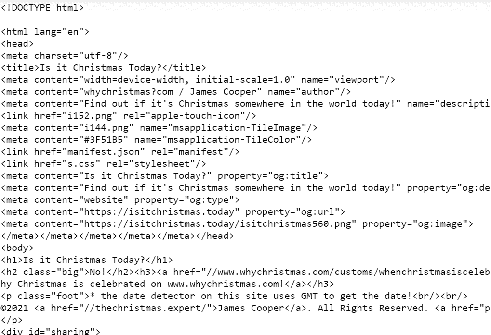

# Python–使用漂亮的输出查找文本，然后在原始汤变量中替换

> 原文:[https://www . geeksforgeeks . org/python-find-text-using-beauty ulsup-then-replace-in-original-soup-variable/](https://www.geeksforgeeks.org/python-find-text-using-beautifulsoup-then-replace-in-original-soup-variable/)

Python 提供了一个名为[**的库，可以轻松实现网页抓取。美丽的输出对象由美丽的汤提供，这是一个 Python 的网页抓取框架。网页抓取是使用自动化工具从网站中提取数据的过程，以使该过程更快。美化输出对象将解析后的文档作为一个整体来表示。在本文中，我们将废弃一个简单的网站，并替换解析后的“汤”变量中的内容。**](https://www.geeksforgeeks.org/implementing-web-scraping-python-beautiful-soup/)

**出于本文的目的，让我们创建一个虚拟环境 **(venv)** ，因为它帮助我们管理不同项目的独立包安装，并避免弄乱依赖项和解释器！**

**更多关于如何创建虚拟环境可以从这里阅读:[创建虚拟环境](https://www.geeksforgeeks.org/creating-python-virtual-environment-windows-linux/)**

## ****创建虚拟**环境**

**导航到项目目录并运行此命令，在项目目录中创建一个名为“env”的虚拟环境。**

```
python3 -m venv env
```

**通过键入激活“env”。**

```
 source env/bin/activate
```

**激活解释器后，我们可以在命令行中的 ***前看到解释器的名称:~$符号*****

## ****安装所需模块****

*   ****美观组:**一个刮网页的库。**

```
pip install bs4
```

*   ****请求:**这使得发送 HTTP 请求的过程。**

```
pip install requests
```

### **逐步方法**

*   **让我们从导入库并在变量中存储“GET”请求响应开始。**

## **蟒蛇 3**

```
import bs4
from bs4 import BeautifulSoup
import requests

# sending a GET req.
response = requests.get("https://isitchristmas.today/")
print(response.status_code)
```

****输出:****

```
200
```

**状态为 200 表示请求成功。**

*   **现在，让我们将内容解析为一个美丽的输出对象，以提取网站的标题和标题标签(就本文而言)，并将其替换为原始的汤变量。 **find()** 方法从汤对象中返回第一个匹配的案例。**

## **蟒蛇 3**

```
# create object
soup = BeautifulSoup(r.text, "html.parser")

# find title
title = soup.find("title")

# find heading
heading = soup.find("h1")

print(title)
```

****输出:****

****

**用**替换解析后的汤对象的内容。串"**法。**

## **蟒蛇 3**

```
# replace
title.string = "Is GFG day today?"
heading.string = "Welcome to GFG"
```

****输出:****

****

**因此，标题标签和标题标签已经在原始的汤变量中被替换。**

****注意:**我们无法将修改后的页面推回到网站，因为这些页面是从托管它们的服务器呈现的。**

****下面是完整的程序:****

## **蟒蛇 3**

```
import bs4
from bs4 import BeautifulSoup
import requests

# sending a GET requests
response = requests.get("https://isitchristmas.today/")

# a status 200 implies a successful requests
#print(response.status_code)

soup = BeautifulSoup(response.text, "html.parser")
#print(soup)

title = soup.find("title")
heading = soup.find("h1")

# replacde
title.string = "Is GFG day today?"
heading.string = "Welcome to GFG"

# display replaced content
print(soup)
# The title and the heading tag contents
# get changed in the parsed soup obj.
```

****输出:****

****