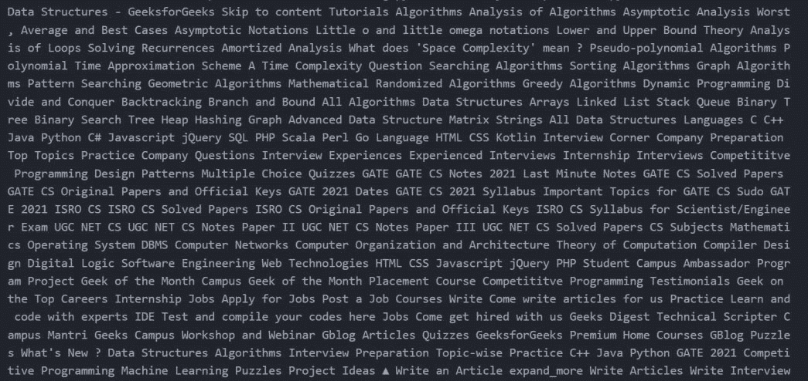

# 使用美观组

移除所有样式、脚本和 HTML 标签

> 原文:[https://www . geesforgeks . org/remove-all-style-scripts-and-html-tags-using-beauty ulsup/](https://www.geeksforgeeks.org/remove-all-style-scripts-and-html-tags-using-beautifulsoup/)

**先决条件:** [美丽组](https://www.geeksforgeeks.org/implementing-web-scraping-python-beautiful-soup/)[请求](https://www.geeksforgeeks.org/python-requests-tutorial/)

beauty Soap 是一个 Python 库，用于从 HTML 和 XML 文件中拉出数据。在本文中，我们将讨论如何使用漂亮的 soap 来移除所有样式、脚本和 HTML 标签。

**所需模块:**

*   **bs4:** 美人汤(bs4)是一个 python 库，主要用于从 HTML、XML 和其他标记语言中提取数据。这是最常用的网页抓取库之一。
    在终端运行以下命令安装此库-

```py
pip install bs4
```

*   **请求:**该库用于在 python 中进行 HTTP 请求。
    在终端运行以下命令安装此库-

```py
pip install requests
```

**进场:**

*   导入 bs4 库
*   创建一个超文本标记语言文档
*   将内容解析成一个[美丽的耦合对象](https://www.geeksforgeeks.org/beautifulsoup-object-python-beautifulsoup/)
*   使用[分解()](https://www.geeksforgeeks.org/how-to-remove-tags-using-beautifulsoup-in-python/)方法迭代数据以从文档中移除标签
*   使用 [stripped_strings()](https://www.crummy.com/software/BeautifulSoup/bs4/doc/#strings-and-stripped-strings) 方法检索标签内容
*   打印提取的数据

**实施:**

## 蟒蛇 3

```py
# Import Module
from bs4 import BeautifulSoup

# HTML Document
HTML_DOC = """
              <html>
                <head>
                    <title> Geeksforgeeks </title>
                    <style>.call {background-color:black;} </style>
                    <script>getit</script>
                </head>
                <body>
                    is a
                    <div>Computer Science portal.</div>
                </body>
              </html>
            """

# Function to remove tags
def remove_tags(html):

    # parse html content
    soup = BeautifulSoup(html, "html.parser")

    for data in soup(['style', 'script']):
        # Remove tags
        data.decompose()

    # return data by retrieving the tag content
    return ' '.join(soup.stripped_strings)

# Print the extracted data
print(remove_tags(HTML_DOC))
```

**输出:**

```py
Geeksforgeeks is a Computer Science portal.
```

## **从网址中删除所有样式、脚本和 HTML 标签**

**进场:**

*   导入 bs4 和请求库
*   使用请求实例从给定的网址获取内容
*   将内容解析成一个漂亮的输出对象
*   使用分解()方法迭代数据以从文档中移除标记
*   使用 stripped_strings()方法检索标记内容
*   打印提取的数据

**实施:**

## 蟒蛇 3

```py
# Import Module
from bs4 import BeautifulSoup
import requests

# Website URL
URL = 'https://www.geeksforgeeks.org/data-structures/'

# Page content from Website URL
page = requests.get(URL)

# Function to remove tags
def remove_tags(html):

    # parse html content
    soup = BeautifulSoup(html, "html.parser")

    for data in soup(['style', 'script']):
        # Remove tags
        data.decompose()

    # return data by retrieving the tag content
    return ' '.join(soup.stripped_strings)

# Print the extracted data
print(remove_tags(page.content))
```

**输出:**

