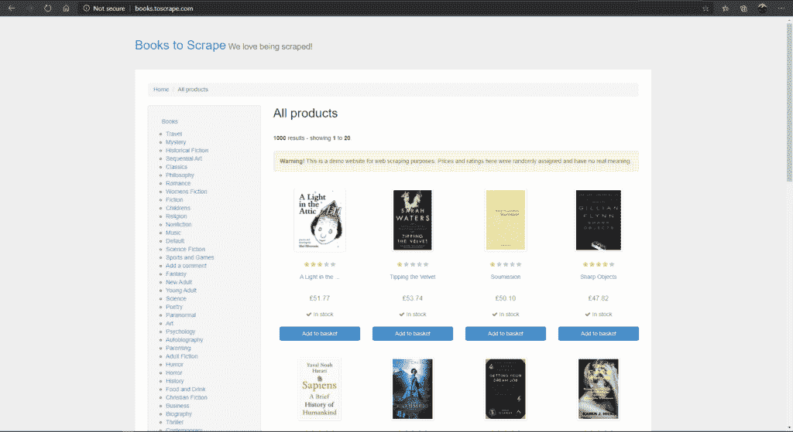
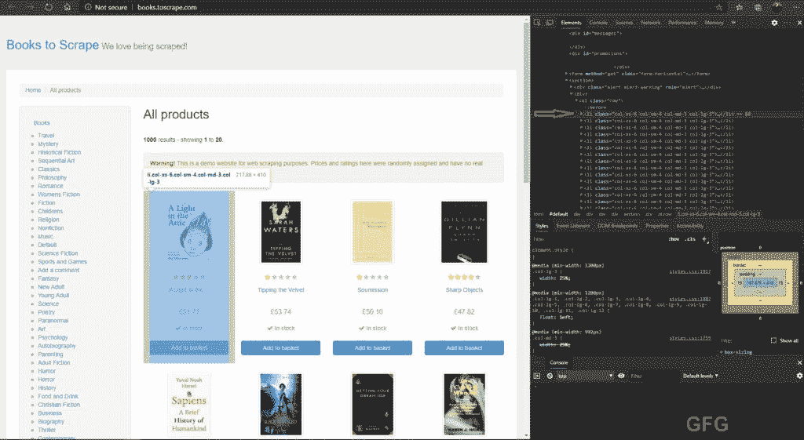
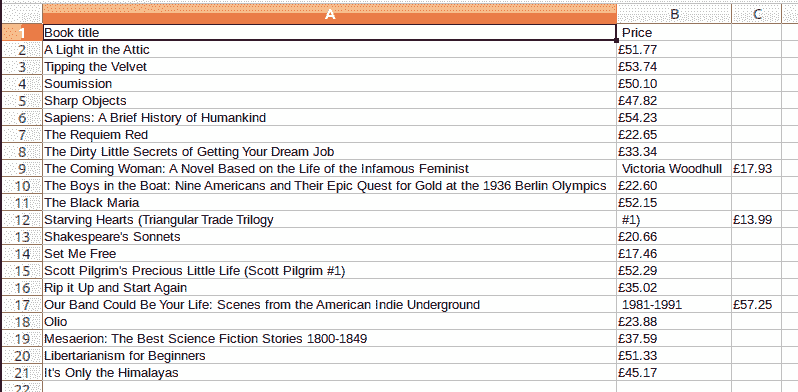

# 使用书籍中的美丽组报废书籍。使用 Python 进行报废

> 原文:[https://www . geesforgeks . org/scrap-books-using-beauty-oup-from-books-to scrap-in-python/](https://www.geeksforgeeks.org/scrap-books-using-beautifulsoup-from-books-toscrape-in-python/)

**Web**screening 是从网站中提取大量数据的技术，提取的数据保存在计算机的本地文件中。网页报废最简单的形式是手动将网页中的数据复制并粘贴到文本文件或电子表格中。有时候，当网站设置障碍时，这是唯一的解决办法。但是在大多数情况下，需要大量的数据，这对于人类来说是很难做到的。因此，我们有网络报废工具来自动化这个过程。一个这样的网络报废工具是[](https://www.geeksforgeeks.org/implementing-web-scraping-python-beautiful-soup/)****。****

****beauty sup**是一个 Python Web 报废库，用于拉出数据，解析 HTML 和 XML 文件。要安装美观的套件，请在终端中键入以下命令。**

```py
pip install BeautifulSoup4
```

**美化输出是一个用于 HTML 解析的工具，但是我们需要一个网络客户端来从互联网上获取一些东西。
这可以用 Python 通过使用包 [**urllib**](https://www.geeksforgeeks.org/python-urllib-module/) 来实现。**

**在本文中，我们的任务是–**

*   **收集产品名称和价格。**
*   **将收集的数据保存在中。csv 格式。**

**举个例子，我们会从网站上收集这本书的书名和价格: [BookToScrape](http://books.toscrape.com/)**

**

bookto 将所有产品放在第一页的搜索网站** 

### **方法**

*   **导入库:美化组和 urllib。**
*   **使用 urllib 读取 HTML 链接。**
*   **允许使用美丽的汤解析链接。**
*   **寻找包含该特定网页所有产品的标签，并将其提取出来。**
*   **寻找显示书籍名称和价格的标签，并将其提取出来。**
*   **提取所有信息后，将所有内容打印并保存在 csv 文件中。**

**

所有书籍及其底层信息。** 

**下面是实现。**

## **蟒蛇 3**

```py
# import web grabbing client and
# HTML parser
from urllib.request import urlopen as uReq
from bs4 import BeautifulSoup as soup

# variable to store website link as string
myurl = 'http://books.toscrape.com/index.html'

# grab website and store in variable uclient
uClient = uReq(myurl)

# read and close HTML
page_html = uClient.read()
uClient.close()

# call BeautifulSoup for parsing
page_soup = soup(page_html, "html.parser")

# grabs all the products under list tag
bookshelf = page_soup.findAll(
    "li", {"class": "col-xs-6 col-sm-4 col-md-3 col-lg-3"})

# create csv file of all products
filename = ("Books.csv")
f = open(filename, "w")

headers = "Book title, Price\n"
f.write(headers)

for books in bookshelf:

    # collect title of all books
    book_title = books.h3.a["title"]

    # collect book price of all books
    book_price = books.findAll("p", {"class": "price_color"})
    price = book_price[0].text.strip()

    print("Title of the book :" + book_title)
    print("Price of the book :" + price)

    f.write(book_title + "," + price+"\n")

f.close()
```

****输出:****

****

****CSV 文件:****

****

**让我们解释一下上面的代码。在本例中，单本书及其信息包含在 **< li >标签**下。所以我们使用–**

*   ****findAll()** 函数查找所有名为**“col-xs-6 col-sm-4 col-MD-3 col-LG-3”**的类(如果其 ID 为，则可以是 ID)的 li 标签，并将其存储在变量**书架**中。**

> **书架= page _ soup . find all(“Li”，{“class”:“col-xs-6 col-sm-4 col-MD-3 col-LG-3”})**

*   **它将存储该 **< li >** 类的所有信息，这些信息就是书籍。上图可以看到，每一个**T8】Li>标签**和**类:“col-xs-6 col-sm-4 col-MD-3 col-LG-3”**代表一本书。**
*   **现在我们有了所有的书，我们需要选择我们必须从每本书中提取的特定信息，那就是**书名**和**价格**。** 
*   **上图可以看到，每本书的书名都在 **< h3 >标签**下，而后者在**T6【a】>标签**下有‘书名’。所以上面的函数用来提取每本书的书名。**

```py
book_title = books.h3.a["title"]
```

*   **对于价格我们可以看到是在**T6【p】T7**标签下在类:**【price _ color】**所以我们用 **findAll()****

```py
book_price = books.findAll("p", {"class" : "price_color"})
price = book_price[0].text.strip()
```

*   ****0 指数**取该页第一本书的价格，存储在变量**价格**中。功能 **.text.strip()** 只收集前后任意空格的文本和条。**