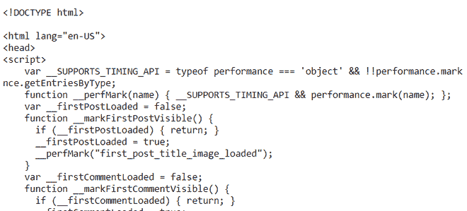
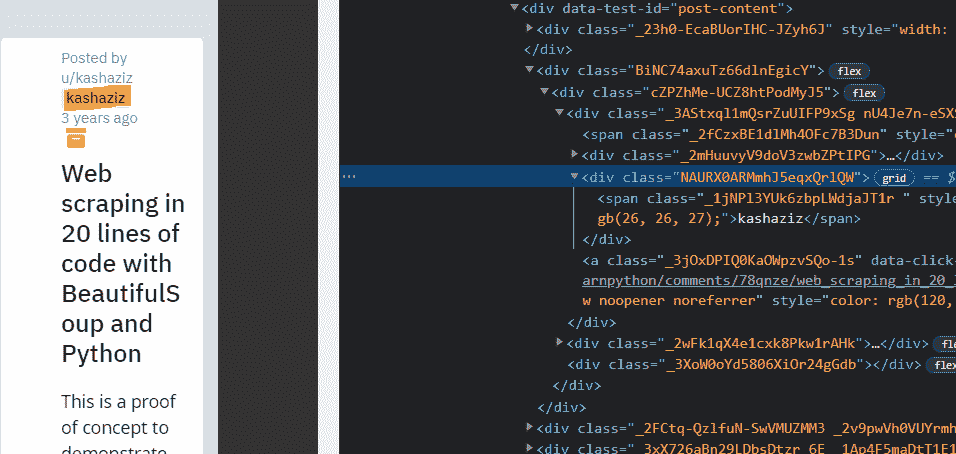
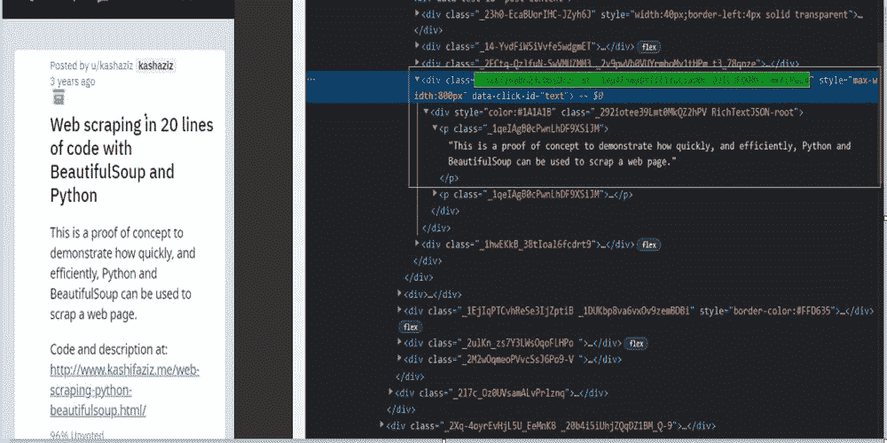
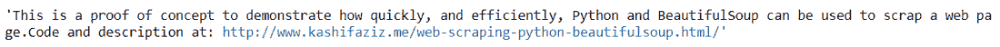
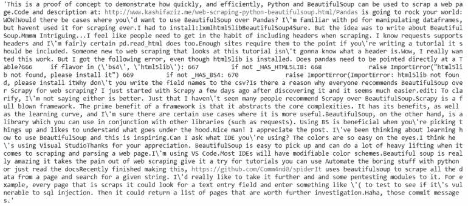

# 用 Python 和美妆套装刮红迪

> 原文:[https://www . geeksforgeeks . org/scratch-Reddit-with-python-and-beauty ulsup/](https://www.geeksforgeeks.org/scraping-reddit-with-python-and-beautifulsoup/)

在本文中，我们将看到如何使用 Python 和 BeautifulSoup 来刮除 Reddit。这里我们将使用美丽的汤和请求模块来刮数据。

### **需要的模块**

*   [**<u>bs4</u>**](https://www.geeksforgeeks.org/implementing-web-scraping-python-beautiful-soup/)**:**美人汤(bs4)是一个从 HTML 和 XML 文件中拉出数据的 Python 库。这个模块没有内置 Python。要安装此软件，请在终端中键入以下命令。

```
pip install bs4
```

*   [**<u>请求</u>**](https://www.geeksforgeeks.org/python-requests-tutorial/) **:** 请求让你发送 HTTP/1.1 请求极其轻松。该模块也没有内置 Python。要安装此软件，请在终端中键入以下命令。

```
pip install requests
```

**进场:**

*   导入所有必需的模块。
*   将 getdata 函数(UDF)中的 URL 传递给将请求传递给 URL 的函数，它会返回一个响应。我们使用 **GET** 方法从给定的服务器使用给定的网址检索信息。

> **语法:** requests.get(url，args)

*   现在使用 bs4 解析 HTML 内容。

> **语法:**soup = beautulsoup(r . content，' html5lib ')
> 
> **参数:**
> 
> *   **r.content** :是原始的 HTML 内容。
> *   **html.parser** :指定我们想要使用的 html 解析器。

*   现在使用 soup 过滤所需的数据。查找所有函数。

**我们来看看脚本的分步执行。**

**第一步:**导入所有依赖

## 蟒蛇 3

```
# import module
import requests
from bs4 import BeautifulSoup
```

**步骤 2:** 创建一个 URL 获取函数

## 蟒蛇 3

```
# user define function
# Scrape the data
def getdata(url):
    r = requests.get(url, headers = HEADERS)
    return r.text
```

**第三步:**现在获取 URL 并将 URL 传递给 getdata()函数，并将该数据转换为 HTML 代码。

## 蟒蛇 3

```
url = "https://www.reddit.com/r/learnpython/comments/78qnze/web_scraping_in_20_lines_of_code_with/"

# pass the url
# into getdata function
htmldata = getdata(url)
soup = BeautifulSoup(htmldata, 'html.parser')

# display html code
print(soup)
```

**输出:**



**注意:**这只是 HTML 代码或 Raw 数据。

### **获取作者姓名**

现在找到带有 div 标签的作者，其中 class_ ="NAURX0ARMmhJ5eqxQrlQW "。我们可以在浏览器中打开网页，通过按下右键来检查相关元素，如图所示。



**示例:**

## 蟒蛇 3

```
# find the Html tag
# with find()
# and convert into string
data_str = ""
for item in soup.find_all("div", class_="NAURX0ARMmhJ5eqxQrlQW"):
    data_str = data_str + item.get_text()

print(data_str)
```

**输出:**

```
kashaziz
```

### 获取文章包含

现在找到文章正文，这里我们将遵循与上面示例相同的方法。



**示例:**

## 蟒蛇 3

```
# find the Html tag
# with find()
# and convert into string
data_str = ""
result = ""
for item in soup.find_all("div", class_="_3xX726aBn29LDbsDtzr_6E _1Ap4F5maDtT1E1YuCiaO0r D3IL3FD0RFy_mkKLPwL4"):
    data_str = data_str + item.get_text()
print(data_str)
```

**输出:**



### 获取评论

现在 Scape 的评论，这里我们将遵循与上面的例子相同的方法。

## 蟒蛇 3

```
# find the Html tag
# with find()
# and convert into string
data_str = ""

for item in soup.find_all("p", class_="_1qeIAgB0cPwnLhDF9XSiJM"):
    data_str = data_str + item.get_text()
print(data_str)
```

**输出:**

