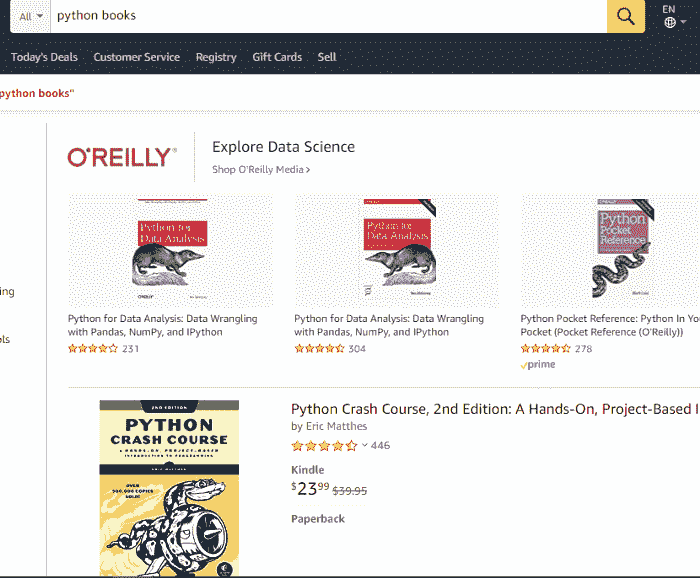
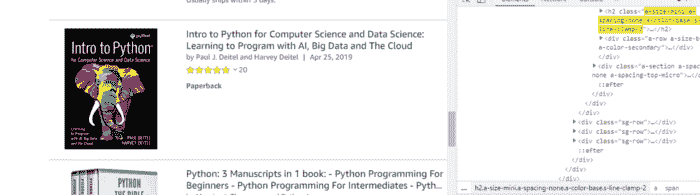

# 使用美图和刮图应用编程接口进行网页刮擦

> 原文:[https://www . geeksforgeeks . org/web-scratch-use-beautulsup-and-scratchingdog-API/](https://www.geeksforgeeks.org/web-scraping-using-beautifulsoup-and-scrapingdog-api/)

在这篇文章中，我们将刮掉使用 JavaScript 库的动态网站，如 React.js、Vue.js、Angular.js 等，你必须付出额外的努力。如果你要安装所有像 [Selenium](https://www.seleniumhq.org/) 、[puppeter](https://github.com/GoogleChrome/puppeteer)这样的库，以及像 [Phantom.js](http://phantomjs.org/) 这样的无头浏览器，这是一个简单但漫长的过程。但是，我们有一个工具可以自己处理所有这些负载。那就是[网页抓取工具](https://www.scrapingdog.com/)，提供网页抓取的 API 和工具。

为什么是这个工具？这个工具将帮助我们使用数百万个旋转代理来抓取动态网站，这样我们就不会被阻止。它还提供验证码清除功能。它使用无头 chrome 来抓取动态网站。

## 我们需要什么？

刮网分为两个简单的部分—

*   通过发出 HTTP 请求获取数据
*   通过解析超文本标记语言来提取重要数据

我们将使用 python 和剪贴板日志应用编程接口:

*   [美汤](https://www.crummy.com/software/BeautifulSoup/bs4/doc/)是一个从 HTML 和 XML 文件中拉出数据的 Python 库。
*   [请求](https://pypi.org/project/requests/)让你可以非常轻松的发送 HTTP 请求。

## 设置

我们的设置非常简单。只需创建一个文件夹，并安装美丽的汤&请求。要创建文件夹并安装库，请键入以下命令。我假设您已经安装了 Python 3.x

```py
mkdir scraper
pip install beautifulsoup4
pip install requests
```

现在，在那个文件夹中用你喜欢的任何名字创建一个文件。我在用刮痧。

首先，你要注册这个[刮网工具](https://www.scrapingdog.com/)。它将为您提供 1000 个免费学分。然后只需在您的文件中导入美丽的汤&请求。像这样。

```py
from bs4 import BeautifulSoup
import requests
```

## 刮掉动态内容

现在，我们熟悉了 Scrapingdog 及其工作原理。但是作为参考，你应该阅读这个 API 的[文档](https://www.scrapingdog.com/documentation)。这将让您清楚地了解这个应用编程接口是如何工作的。现在，我们将刮掉[亚马逊](https://www.amazon.com/s?k=python+books&ref=nb_sb_noss_2)的 python 书籍标题。



现在这一页上有 16 本书。我们将从 Scrapingdog API 中提取 HTML，然后我们将使用 Beautifulsoup 生成 JSON 响应。现在在一条线上，我们就能刮到亚马逊。对于请求应用编程接口，我将使用请求。

```py
r = requests.get("https://api.scrapingdog.com/scrape?api_key=<your-api-key>&url=https://www.amazon.com/s?k=python+books&ref=nb_sb_noss_2&dynamic=true").text
```

这将为您提供目标网址 HTML 代码。

现在，你必须使用漂亮的输出来解析 HTML。

```py
soup = BeautifulSoup(r, ’html.parser’)
```

每个标题都有一个名为" a-size-mini a-spacing-none a-color-base s-line-clamp-2 "的" class "属性，并标记" h2 "。你可以在下图中看到。



首先，我们将使用变量汤找出所有这些标签。

```py
allbooks = soup.find_all(“h2”, {“class”:”a-size-mini a-spacing-none a-color-base s-line-clamp-2"})
```

然后，我们将开始一个循环，使用变量“allbooks”的长度到达该页上每本书的所有标题。

```py
l ={}
u = list()
for i in range(0, len(allbooks)):
    l[“title”]= allbooks[i].text.replace(“\n”, ””)
    u.append(l)
    l ={}
print({"Titles":u})
```

列表“u”有所有的标题，我们只需要打印出来。现在，在 for 循环中打印出列表“u”后，我们得到一个 JSON 响应。看起来像…

**输出-**

```py
{
 “Titles”: [
 {
 “title”: “Python for Beginners: 2 Books in 1: Python Programming for Beginners, Python Workbook”
 },
 {
 “title”: “Python Tricks: A Buffet of Awesome Python Features”
 },
 {
 “title”: “Python Crash Course, 2nd Edition: A Hands-On, Project-Based Introduction to Programming”
 },
 {
 “title”: “Learning Python: Powerful Object-Oriented Programming”
 },
 {
 “title”: “Python: 4 Books in 1: Ultimate Beginner’s Guide, 7 Days Crash Course, Advanced Guide, and Data Science, Learn Computer Programming and Machine Learning with Step-by-Step Exercises”
 },
 {
 “title”: “Intro to Python for Computer Science and Data Science: Learning to Program with AI, Big Data and The Cloud”
 },
 {
 “title”: “Python for Data Analysis: Data Wrangling with Pandas, NumPy, and IPython”
 },
 {
 “title”: “Automate the Boring Stuff with Python: Practical Programming for Total Beginners”
 },
 {
 “title”: “Python: 2 Books in 1: The Crash Course for Beginners to Learn Python Programming, Data Science and Machine Learning + Practical Exercises Included. (Artificial Intelligence, Numpy, Pandas)”
 },
 {
 “title”: “Python for Beginners: 2 Books in 1: The Perfect Beginner’s Guide to Learning How to Program with Python with a Crash Course + Workbook”
 },
 {
 “title”: “Python: 2 Books in 1: The Crash Course for Beginners to Learn Python Programming, Data Science and Machine Learning + Practical Exercises Included. (Artificial Intelligence, Numpy, Pandas)”
 },
 {
 “title”: “The Warrior-Poet’s Guide to Python and Blender 2.80”
 },
 {
 “title”: “Python: 3 Manuscripts in 1 book: — Python Programming For Beginners — Python Programming For Intermediates — Python Programming for Advanced”
 },
 {
 “title”: “Python: 2 Books in 1: Basic Programming & Machine Learning — The Comprehensive Guide to Learn and Apply Python Programming Language Using Best Practices and Advanced Features.”
 },
 {
 “title”: “Learn Python 3 the Hard Way: A Very Simple Introduction to the Terrifyingly Beautiful World of Computers and Code (Zed Shaw’s Hard Way Series)”
 },
 {
 “title”: “Python Tricks: A Buffet of Awesome Python Features”
 },
 {
 “title”: “Python Pocket Reference: Python In Your Pocket (Pocket Reference (O’Reilly))”
 },
 {
 “title”: “Python Cookbook: Recipes for Mastering Python 3”
 },
 {
 “title”: “Python (2nd Edition): Learn Python in One Day and Learn It Well. Python for Beginners with Hands-on Project. (Learn Coding Fast with Hands-On Project Book 1)”
 },
 {
 “title”: “Hands-On Machine Learning with Scikit-Learn, Keras, and TensorFlow: Concepts, Tools, and Techniques to Build Intelligent Systems”
 },
 {
 “title”: “Hands-On Deep Learning Architectures with Python: Create deep neural networks to solve computational problems using TensorFlow and Keras”
 },
 {
 “title”: “Machine Learning: 4 Books in 1: Basic Concepts + Artificial Intelligence + Python Programming + Python Machine Learning. A Comprehensive Guide to Build Intelligent Systems Using Python Libraries”
 }
 ]
}
```