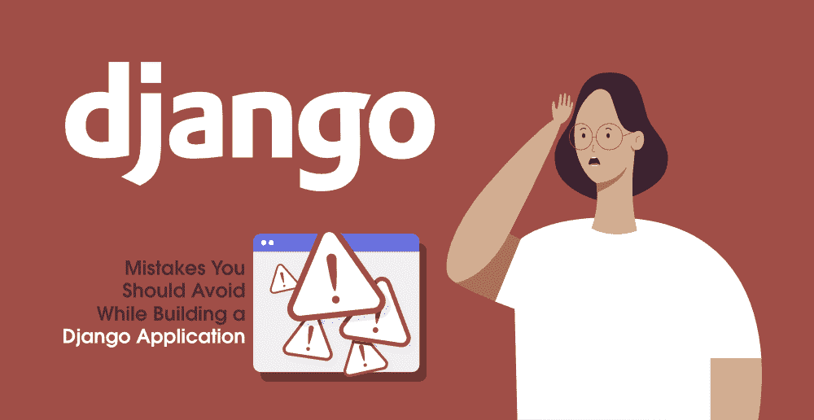

# 构建 Django 应用程序时应避免的 7 个错误

> 原文:[https://www . geeksforgeeks . org/7-建筑时应该避免的错误-a-django-application/](https://www.geeksforgeeks.org/7-mistakes-you-should-avoid-while-building-a-django-application/)

**Django……**我们都知道这个 Python 框架的流行。Django 已经成为开发人员构建 web 应用程序的首选。它是一个自由开源的 [**Python**](https://www.geeksforgeeks.org/python-programming-language/) 框架。Django 可以轻松解决很多常见的开发挑战。它允许您构建灵活且结构良好的 web 应用程序。

Django 的许多常见特性，如内置的管理面板、ORM(对象关系映射工具)、路由、模板化，让开发人员的任务变得更加容易。它们不需要花这么多时间从头开始实现这些东西。

[**【姜戈】**](https://www.geeksforgeeks.org/django-tutorial/) 最具杀伤力的功能之一就是内置的 Admin 面板。有了这个特性，您可以配置很多东西，比如访问控制列表、行级权限以及操作、过滤器、订单、小部件、表单、额外的网址助手等。

Django ORM 开箱即用地与所有主要数据库一起工作。它支持您可以在应用程序中使用的所有主要的 SQL 查询。Django 的模板引擎也非常非常灵活，同时功能强大。即使 Django 中有很多可用的特性，开发人员在构建应用程序时仍然会犯很多错误。在这个博客中，我们将讨论一些在构建 Django 应用程序时应该避免的常见错误。

### 1.将 Python 全局环境用于项目依赖关系

将全局环境用于项目依赖会产生依赖冲突。在 Python 中，不能同时使用多个包版本。如果不同的项目需要同一个包的不同的不兼容版本，就会产生问题。有许多选项可以隔离您的环境。最常见的方法如下…

*   virtualenv(虚拟环境)
*   virtualenvwrapper(虚拟包装器)
*   虚拟计算机
*   容器

### 2.避免在“**需求. txt”**文件中锁定项目依赖关系

当您从 Python 项目开始时，从一个带有“requirement.txt”文件的隔离环境开始。当您通过 pip/easy_install 安装软件包时，不要忘记将它们添加到您的“requirement.txt”文件中。稍后当您必须在服务器上部署项目时，对您来说会更容易。

不同版本的包提供不同的模块、功能或参数。如果你的依赖有任何微小的变化，那么它可以打破你的包。因此，在“requirement.txt”文件中确定依赖关系的具体版本非常重要。Python **中有非常不错的工具**画中画工具**。**借助其中可用的命令行工具，您可以轻松管理依赖关系。

这个工具会自动生成一个“requirment.txt”文件，该文件会锁定所有依赖项和整个依赖树。另外，保留依赖项文件的备份。在你的文件系统中保存一份拷贝，一个 Git 管理的文件夹，S3 文件夹，文件传输协议和 SFTP。

### 3.使用旧式 Python 函数代替基于类的视图

在 Python 中，由于它的复杂性，大多数时候开发人员都避免使用基于类的视图。在一段时间内，在应用程序的 views.py 文件中使用 Python 函数可能是一个好主意(例如:对于测试或实用程序视图)。

基于类的视图提供了一个实现常见 web 开发任务的抽象类。您可以获得使用结构化应用编程接口的优势以及面向对象编程的优势。您的代码变得更加清晰易读。您可以扩展视图的 CBV，也可以覆盖类属性或函数。

在您的项目中，您可以使用不同的混合，并且可以覆盖基本的 CBV 行为来构建视图上下文、在行级别检查授权、从项目结构自动构建模板路径。

### 4.用视图而不是模型编写应用程序逻辑

将逻辑写在视图中会使您的应用程序视图“胖”而模型“瘦”。避免这个错误，并且总是在你的模型中而不是视图中写逻辑。你可以把逻辑分解成小方法，然后把它们写入模型。您可以在几行代码内从多个来源多次使用它。

### 5.凌乱且不可管理的设置文件

很多时候，在实际项目中工作时，设置文件会增长到 600-700 多行代码。这个庞大而混乱的文件变得难以维护，尤其是当您的开发、生产和转移环境需要自定义配置时。您可以手动划分配置文件，也可以创建自定义加载器。

### 6.错误的应用程序结构和不正确的资源放置

每当您用 Django 构建一个应用程序时，它都会包含多个应用程序。这些应用程序负责完成特定的任务。基本上，这些应用都是 Python 包，至少包含 **__init__。py** 和**车型. py** 文件。在最新的 Django 版本中，您不再需要 Django 版本。__init__。py 在您的应用程序中就足够了。

您的 Django 应用程序构建在不同的 Python 模块上，例如模型、管理员、视图、URL、模型、表单、模板标签等。您可以将应用程序划分为可重用的应用程序逻辑。

始终为项目文件夹指定一个特定的名称，并将应用程序放入 project/apps/。之后，您可以将应用程序依赖项放入它们自己的子文件夹中。

### 7.DIRS 的静态文件和姜戈的静态根的混淆

在 Django 中静态文件主要包含 JavaScript、CSS、图像、字体等。在部署过程中，它们被收集到一个公共目录中。**python manage . py runserver**使用 STATICFILES _ FINDERS 设置搜索静态文件。如果出现故障，Django 会尝试使用 Django . contrib . static files . finders . appdirectoriefinder 来查找文件。这将查找项目中每个已安装应用程序的静态文件夹。您可以编写自带静态文件的可重用应用程序。

在姜戈使用静态管理命令**python manage . py collectstatic**，您可以通过STATIFILES _ FINDERS，您可以将文件从静态文件夹以及从 STATIFILES _ DIRS 复制到您在 STATIFILES _ ROOT 设置中指定的目录。

### 结论

我们在这篇文章中提到了七个错误，但是在 Django 中有很多事情，你需要注意。在 Django 构建项目时，遵循最佳实践在项目中编写代码。一切都很重要，从定义网址到创建视图或定义模型，再到完整的文件夹结构。一开始会很艰难，但随着你的进步，你会看到自己的进步。作为一个初学者犯这些错误是可以的，但是如果你一直关注好的 Django 项目，你肯定会精通它。