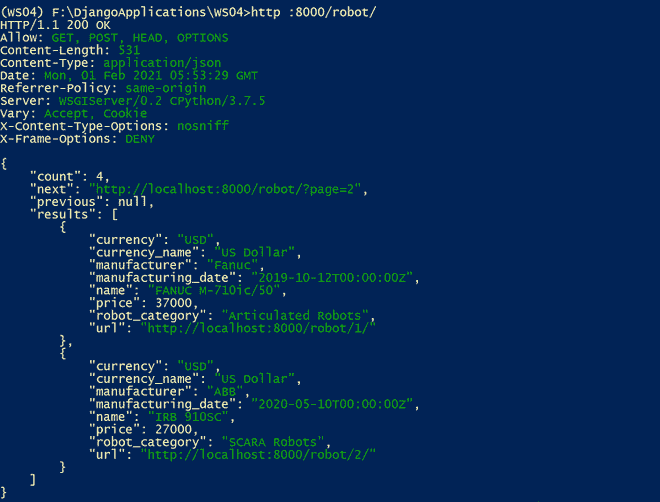
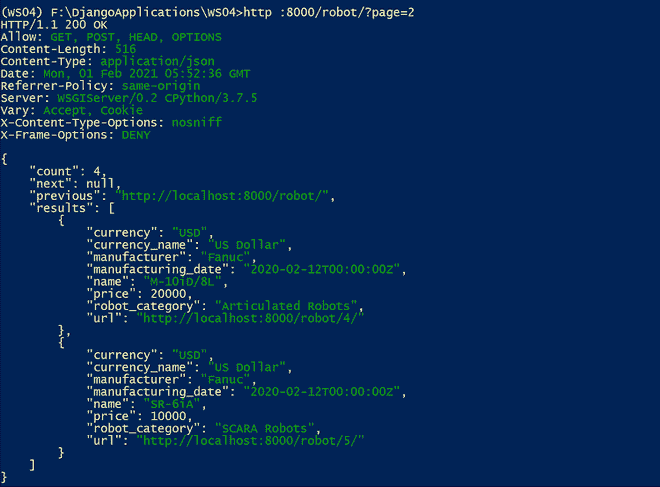
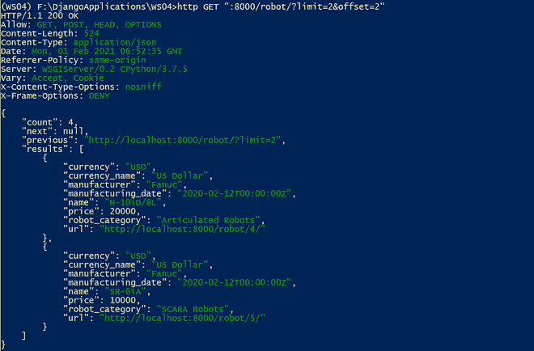
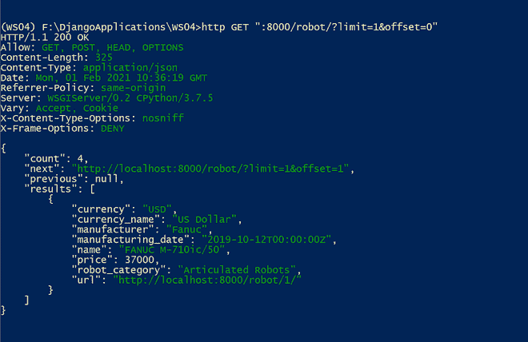
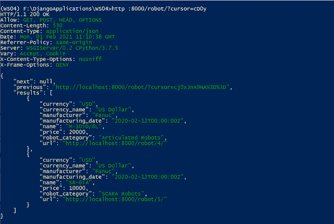

# 在 API 中添加分页–Django REST 框架

> 原文:[https://www . geesforgeks . org/add-paging-in-API-django-rest-framework/](https://www.geeksforgeeks.org/adding-pagination-in-apis-django-rest-framework/)

假设您的数据库中有大量的细节。您认为在发出 HTTP GET 请求时一次性检索所有内容是否明智？Django REST 框架分页特性的重要性来了。它有助于为每个 HTTP 请求将大型结果集拆分成单独的数据页。

因此，当我们发出 HTTP 请求时，我们必须为我们想要检索的特定页面指定详细信息，并且它将基于预定义的分页方案。除了以页面形式检索数据之外，它还在响应部分提供了有关数据总数、下一页和上一页的信息。

*   页码分页
*   限制分页
*   粗略的想象

> 注意:您可以参考文章中使用的模型、序列化程序和项目视图的[可浏览 API](https://www.geeksforgeeks.org/?p=563823) 部分

## 页码分页

页码分页样式接受请求查询参数中的单个页码。要全局启用这种分页样式，可以将*rest _ framework . PAGINATION . PAGE number paging*类设置为*DEFAULT _ paging _ CLASS*，也可以根据需要设置 *PAGE_SIZE* 。您可以打开*设置. py* 文件并添加以下配置设置。

## 蟒蛇 3

```
REST_FRAMEWORK = {
    'DEFAULT_PAGINATION_CLASS': 'rest_framework.pagination.PageNumberPagination',
    'PAGE_SIZE': 2,
}
```

您还可以通过重写 PageNumberPagination 类中包含的属性来修改分页样式。让我们看看可用的属性。

*   django _ paginator _ class–默认为 django . core . paginator . paginator。
*   页面大小–表示页面大小(数值)。如果设置，这将覆盖页面大小设置。默认为与页面大小设置键相同的值。
*   page _ query _ param–用于分页控件的查询参数的名称(字符串值)。
*   page _ size _ query _ param–它表示查询参数的名称(字符串值)，允许客户端根据每个请求设置页面大小。默认为无。
*   max _ page _ size–它表示允许的最大请求页面大小(数值)。仅当 page_size_query_param 也已设置时，此属性才有效。
*   last _ page _ strings–它与 page_query_param 一起用于请求集合中的最后一页。默认为('最后'，)
*   模板–在可浏览 API 中呈现分页控件时使用的模板的名称。

让我们在数据库中添加更多的机器人细节。HTTPie 命令包括:

> http POST:8000/robot/name = " M-10iD/8L " robot _ category = "铰接式机器人" currency="USD" price=20000 制造商= " Fanuc " manufacturing _ date = " 2020-02-12 00:00:00:00+00:00 "
> 
> http POST:8000/robot/name = " SR-6iA " robot _ category = " SCARA Robots " currency = " USD " price = 10000 制造商= " Fanuc " manufacturing _ date = " 2020-02-12 00:00:00+00:00 "

现在，让我们编写并发送一个 HTTP GET 请求，并分析分页结果。

> http :8000/robot/

输出

```
HTTP/1.1 200 OK
Allow: GET, POST, HEAD, OPTIONS
Content-Length: 531
Content-Type: application/json
Date: Mon, 01 Feb 2021 05:53:29 GMT
Referrer-Policy: same-origin
Server: WSGIServer/0.2 CPython/3.7.5
Vary: Accept, Cookie
X-Content-Type-Options: nosniff
X-Frame-Options: DENY

{
    "count": 4,
    "next": "http://localhost:8000/robot/?page=2",
    "previous": null,
    "results": [
        {
            "currency": "USD",
            "currency_name": "US Dollar",
            "manufacturer": "Fanuc",
            "manufacturing_date": "2019-10-12T00:00:00Z",
            "name": "FANUC M-710ic/50",
            "price": 37000,
            "robot_category": "Articulated Robots",
            "url": "http://localhost:8000/robot/1/"
        },
        {
            "currency": "USD",
            "currency_name": "US Dollar",
            "manufacturer": "ABB",
            "manufacturing_date": "2020-05-10T00:00:00Z",
            "name": "IRB 910SC",
            "price": 27000,
            "robot_category": "SCARA Robots",
            "url": "http://localhost:8000/robot/2/"
        }
    ]
}
```

分享命令提示符截图供大家参考。



您可以注意到响应看起来与之前的 HTTP GET 请求不同。该响应具有以下键:

*   计数:所有页面上的资源总数
*   下一页:链接到下一页
*   上一页:链接到上一页
*   结果:实例的 JSON 表示的数组。

让我们检索第 2 页的结果。HTTPie 命令是

> http :8000/robot/？页=2

输出

```
HTTP/1.1 200 OK
Allow: GET, POST, HEAD, OPTIONS
Content-Length: 516
Content-Type: application/json
Date: Mon, 01 Feb 2021 05:52:36 GMT
Referrer-Policy: same-origin
Server: WSGIServer/0.2 CPython/3.7.5
Vary: Accept, Cookie
X-Content-Type-Options: nosniff
X-Frame-Options: DENY

{
    "count": 4,
    "next": null,
    "previous": "http://localhost:8000/robot/",
    "results": [
        {
            "currency": "USD",
            "currency_name": "US Dollar",
            "manufacturer": "Fanuc",
            "manufacturing_date": "2020-02-12T00:00:00Z",
            "name": "M-10iD/8L",
            "price": 20000,
            "robot_category": "Articulated Robots",
            "url": "http://localhost:8000/robot/4/"
        },
        {
            "currency": "USD",
            "currency_name": "US Dollar",
            "manufacturer": "Fanuc",
            "manufacturing_date": "2020-02-12T00:00:00Z",
            "name": "SR-6iA",
            "price": 10000,
            "robot_category": "SCARA Robots",
            "url": "http://localhost:8000/robot/5/"
        }
    ]
}
```

共享命令提示符截图



## 限制分页

在 LimitOffsetPagination 样式中，客户端包括一个“限制”和一个“偏移”查询参数。该限制指示要返回的最大项目数，与 page_size 相同。偏移量指示查询 w.r.t 未起始项的起始位置。要全局启用限制分页分页样式，您可以将*rest _ framework . PAGINATION . Limitoffset PAGINATION*类设置为 *DEFAULT_PAGINATION_CLASS* 。配置如下:

## 蟒蛇 3

```
REST_FRAMEWORK = {
    'DEFAULT_PAGINATION_CLASS': 'rest_framework.pagination.LimitOffsetPagination',
    'PAGE_SIZE': 2,
}
```

您可以跳过设置*页面大小*。如果设置，那么客户端可以省略限制查询参数。

如果要修改分页样式，可以覆盖*limiteoffsetpaging*类的属性。

*   default _ limit–它指示(数值)限制。默认为与页面大小设置键相同的值。
*   limit _ query _ param–表示“限制”查询参数的名称。默认为“极限”。
*   offset _ query _ param–表示“偏移”查询参数的名称。默认为“偏移”。
*   max _ limit–它表示客户端可能请求的最大允许限制。默认为无。
*   模板–在可浏览应用编程接口中呈现分页控件时使用的模板名称

HTTPie 命令是

> http :8000/robot/

输出

```
HTTP/1.1 200 OK
Allow: GET, POST, HEAD, OPTIONS
Content-Length: 541
Content-Type: application/json
Date: Mon, 01 Feb 2021 06:47:42 GMT
Referrer-Policy: same-origin
Server: WSGIServer/0.2 CPython/3.7.5
Vary: Accept, Cookie
X-Content-Type-Options: nosniff
X-Frame-Options: DENY

{
    "count": 4,
    "next": "http://localhost:8000/robot/?limit=2&offset=2",
    "previous": null,
    "results": [
        {
            "currency": "USD",
            "currency_name": "US Dollar",
            "manufacturer": "Fanuc",
            "manufacturing_date": "2019-10-12T00:00:00Z",
            "name": "FANUC M-710ic/50",
            "price": 37000,
            "robot_category": "Articulated Robots",
            "url": "http://localhost:8000/robot/1/"
        },
        {
            "currency": "USD",
            "currency_name": "US Dollar",
            "manufacturer": "ABB",
            "manufacturing_date": "2020-05-10T00:00:00Z",
            "name": "IRB 910SC",
            "price": 27000,
            "robot_category": "SCARA Robots",
            "url": "http://localhost:8000/robot/2/"
        }
    ]
}
```

让我们基于上面输出的下一个字段值尝试另一个 HTTPie 命令。HTTPie 命令是

> http GET:" 8000/机器人/？极限=2 &偏移= 2 "

输出

```
HTTP/1.1 200 OK
Allow: GET, POST, HEAD, OPTIONS
Content-Length: 524
Content-Type: application/json
Date: Mon, 01 Feb 2021 06:52:35 GMT
Referrer-Policy: same-origin
Server: WSGIServer/0.2 CPython/3.7.5
Vary: Accept, Cookie
X-Content-Type-Options: nosniff
X-Frame-Options: DENY

{
    "count": 4,
    "next": null,
    "previous": "http://localhost:8000/robot/?limit=2",
    "results": [
        {
            "currency": "USD",
            "currency_name": "US Dollar",
            "manufacturer": "Fanuc",
            "manufacturing_date": "2020-02-12T00:00:00Z",
            "name": "M-10iD/8L",
            "price": 20000,
            "robot_category": "Articulated Robots",
            "url": "http://localhost:8000/robot/4/"
        },
        {
            "currency": "USD",
            "currency_name": "US Dollar",
            "manufacturer": "Fanuc",
            "manufacturing_date": "2020-02-12T00:00:00Z",
            "name": "SR-6iA",
            "price": 10000,
            "robot_category": "SCARA Robots",
            "url": "http://localhost:8000/robot/5/"
        }
    ]
}
```

分享命令提示符截图供您参考



让我们尝试极限=1，偏移=0。HTTPie 命令是:

> http GET:" 8000/机器人/？极限= 1 &偏移=0”

输出

```
HTTP/1.1 200 OK
Allow: GET, POST, HEAD, OPTIONS
Content-Length: 325
Content-Type: application/json
Date: Mon, 01 Feb 2021 10:36:19 GMT
Referrer-Policy: same-origin
Server: WSGIServer/0.2 CPython/3.7.5
Vary: Accept, Cookie
X-Content-Type-Options: nosniff
X-Frame-Options: DENY

{
    "count": 4,
    "next": "http://localhost:8000/robot/?limit=1&offset=1",
    "previous": null,
    "results": [
        {
            "currency": "USD",
            "currency_name": "US Dollar",
            "manufacturer": "Fanuc",
            "manufacturing_date": "2019-10-12T00:00:00Z",
            "name": "FANUC M-710ic/50",
            "price": 37000,
            "robot_category": "Articulated Robots",
            "url": "http://localhost:8000/robot/1/"
        }
    ]
}
```

共享命令提示符截图



## 粗略的想象

CursorPagination 提供了一个光标指示器来浏览结果集。它只提供正向或反向控制，不允许客户导航到任意位置。CursorPagination 样式假设模型实例上必须有一个已创建的时间戳字段，并且它按照“-created”对结果进行排序。要启用光标想象样式，您可以在*默认 _ 分页 _ 类*中提到 *rest_framework.pagination .光标想象*类。

## 蟒蛇 3

```
REST_FRAMEWORK = {
    'DEFAULT_PAGINATION_CLASS': 'rest_framework.pagination.CursorPagination',
    'PAGE_SIZE': 2,
}
```

让我们看一下我们可以在 CursorPagination 类中修改的属性集。它们如下:

*   页面大小–表示页面大小(数值)。默认为与页面大小设置键相同的值。
*   cursor _ query _ param–它指示“cursor”查询参数的名称(字符串值)。默认为“光标”。
*   排序–这应该是一个字符串或字符串列表，指示将对其应用基于光标的分页的字段。默认为-创建。也可以通过在视图上使用 OrderingFilter 来覆盖该值。
*   模板–在可浏览 API 中呈现分页控件时使用的模板的名称。

让我们来看看如何定制 CursorPagination 类。这里我们将覆盖排序属性。默认情况下，它将根据创建的时间戳进行排序。这里，我们将使用 id 字段而不是创建的字段进行排序。

让我们在 apps (robots)文件夹中创建一个名为 *custompagination.py* 的新文件，并添加下面的代码

## 蟒蛇 3

```
from rest_framework.pagination import CursorPagination
class CursorPaginationWithOrdering(CursorPagination):
    # order based on id
    ordering = 'id'
```

在这里，我们覆盖了 CursorPagination 类提供的排序属性。接下来，您可以在 DEFAULT _ PAGING _ CLASE 中提到定制的类，如下所示。

## 蟒蛇 3

```
REST_FRAMEWORK = {
    'DEFAULT_PAGINATION_CLASS': 'robots.custompagination.CursorPaginationWithOrdering',
    'PAGE_SIZE': 2,
}
```

我们来分析一下输出。您可以发送下面的 HTTP 命令。

> http :8000/robot/

输出

```
HTTP/1.1 200 OK
Allow: GET, POST, HEAD, OPTIONS
Content-Length: 526
Content-Type: application/json
Date: Mon, 01 Feb 2021 11:09:45 GMT
Referrer-Policy: same-origin
Server: WSGIServer/0.2 CPython/3.7.5
Vary: Accept, Cookie
X-Content-Type-Options: nosniff
X-Frame-Options: DENY

{
    "next": "http://localhost:8000/robot/?cursor=cD0y",
    "previous": null,
    "results": [
        {
            "currency": "USD",
            "currency_name": "US Dollar",
            "manufacturer": "Fanuc",
            "manufacturing_date": "2019-10-12T00:00:00Z",
            "name": "FANUC M-710ic/50",
            "price": 37000,
            "robot_category": "Articulated Robots",
            "url": "http://localhost:8000/robot/1/"
        },
        {
            "currency": "USD",
            "currency_name": "US Dollar",
            "manufacturer": "ABB",
            "manufacturing_date": "2020-05-10T00:00:00Z",
            "name": "IRB 910SC",
            "price": 27000,
            "robot_category": "SCARA Robots",
            "url": "http://localhost:8000/robot/2/"
        }
    ]
}
```

共享命令提示符截图


现在，让我们根据上面输出的下一个值(cursor=cD0y)编写一个 HTTP 请求。HTTPie 命令是:

> http :8000/robot/？游标=cD0y

输出

```
HTTP/1.1 200 OK
Allow: GET, POST, HEAD, OPTIONS
Content-Length: 530
Content-Type: application/json
Date: Mon, 01 Feb 2021 11:10:38 GMT
Referrer-Policy: same-origin
Server: WSGIServer/0.2 CPython/3.7.5
Vary: Accept, Cookie
X-Content-Type-Options: nosniff
X-Frame-Options: DENY

{
    "next": null,
    "previous": "http://localhost:8000/robot/?cursor=cj0xJnA9NA%3D%3D",
    "results": [
        {
            "currency": "USD",
            "currency_name": "US Dollar",
            "manufacturer": "Fanuc",
            "manufacturing_date": "2020-02-12T00:00:00Z",
            "name": "M-10iD/8L",
            "price": 20000,
            "robot_category": "Articulated Robots",
            "url": "http://localhost:8000/robot/4/"
        },
        {
            "currency": "USD",
            "currency_name": "US Dollar",
            "manufacturer": "Fanuc",
            "manufacturing_date": "2020-02-12T00:00:00Z",
            "name": "SR-6iA",
            "price": 10000,
            "robot_category": "SCARA Robots",
            "url": "http://localhost:8000/robot/5/"
        }
    ]
}
```

共享命令提示符截图

