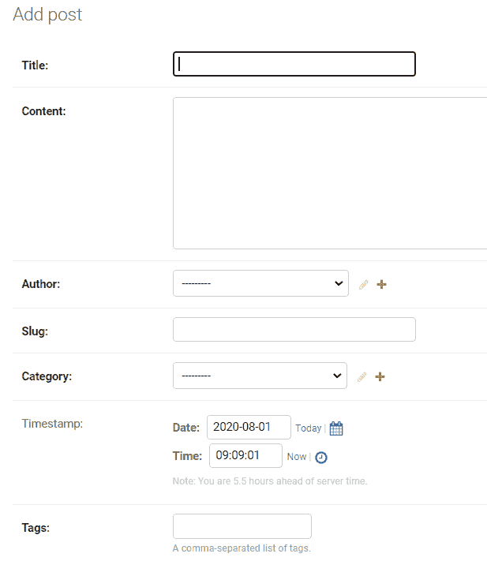
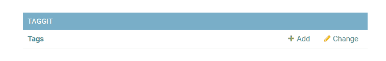
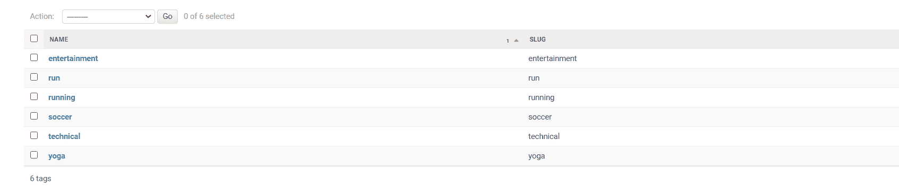

# 在 Django 项目中使用 Django-Taggit 添加标签

> 原文:[https://www . geesforgeks . org/add-tags-using-django-taggit-in-django-project/](https://www.geeksforgeeks.org/adding-tags-using-django-taggit-in-django-project/)

Django-Taggit 是一个 Django 应用程序，用来给博客、文章等添加标签。这使得我们很容易将标签功能添加到 django 项目中。
**设立姜戈项目**

*   **安装姜戈-塔吉特**

```py
pip install django-taggit
```

*   将其添加到主项目的设置. py 文件

## 蟒蛇 3

```py
INSTALLED_APPS = [
    'django.contrib.admin',
    'django.contrib.auth',
    'django.contrib.contenttypes',
    'django.contrib.sessions',
    'django.contrib.messages',
    'django.contrib.staticfiles',
    'django.contrib.humanize',
    'taggit'
]
```

*   **对 models.py 文件的更改**

在你的文章、博客、文章模式中添加 TaggableManager

## 蟒蛇 3

```py
from django.db import models
from django.utils.timezone import now
from taggit.managers import TaggableManager

class Post(models.Model):
    postid = models.AutoField(primary_key=True)
    title = models.CharField(max_length=255)
    content = models.TextField()
    author = models.CharField(max_length=100)
    postauthor = models.ForeignKey(User, on_delete=models.CASCADE)
    slug = models.SlugField(unique=True)
    category = models.CharField(max_length=200)
    timestamp = models.DateTimeField(default=now, blank=True)
    tags = TaggableManager()
```

**添加 TaggableManager 后，在终端**运行以下命令

*   python manage . py make migrations
    python manage . py migration

TaggableManager 将在后模式
中自动显示为一个字段



Taggit 模式也将在管理面板中自动显示为单独的模式



管理面板中的 Taggit 模式

**添加标签**

1)如果输入的标签不包含任何逗号或双引号，将作为
标签名称的空格分隔列表。

```py
geeks for geeks => "geeks", "for", "geeks"
```

2)如果输入的标签包含逗号或双引号，则:

```py

a) geeks, geeks for geeks            =>   "geeks", "geeks for geeks" 
b) "geeks, forgeeks" geek geeksfor   =>   "geeks, forgeeks", "geek", "geeksfor"
c) "geeks, forgeeks", geek geeksfor  =>   "geeks, forgeeks", "geeks geeksfor"
d) geeks "for" geeks                 =>   "geeks", "for", "geeks"
```

向帖子添加标签后，taggit 模式将看起来像:



所有与不同帖子相关联的标签都将出现在 taggit 下的标签模式中

点击特定的标签，会出现一个与该标签相关的所有帖子的列表。现在这个模型可以像其他模型一样用于项目