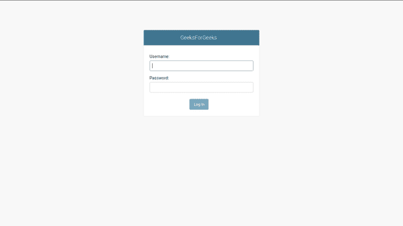
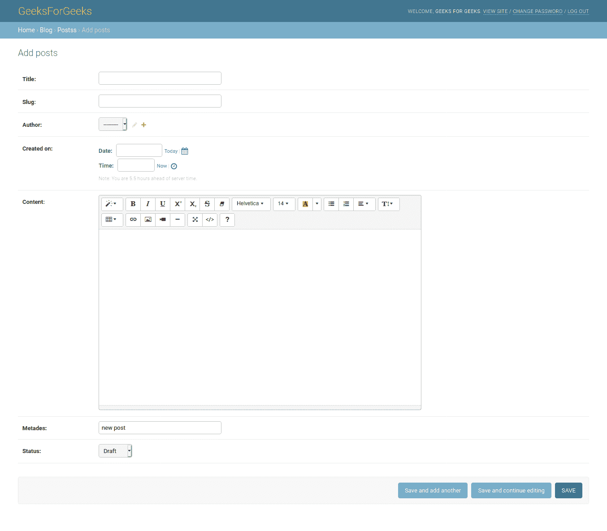

# 为姜戈项目添加所见即所得编辑器

> 原文:[https://www . geesforgeks . org/add-WYSIWYG-editor-to-django-project/](https://www.geeksforgeeks.org/adding-wysiwyg-editor-to-django-project/)

通常，为了有效地管理内容，我们使用所见即所得(WYSIWYG)编辑器，它将我们的内容存储在 html 中，也有助于上传图像、创建链接、列表，并且工作方式几乎类似于 WordPress 编辑器。本文是 Django 博客 CMS 项目的续篇。在这里查看–[与姜戈](https://www.geeksforgeeks.org/building-blog-cms-content-management-system-with-django/)一起构建博客内容管理系统

## 如何给 Django 项目添加所见即所得编辑器？

**1。安装总结说明–**

```
# installing wysiwyg editor
pip3 install django-summernote
```

**2。将编辑器添加到设置文件**中已安装的应用程序中

## 蟒蛇 3

```
INSTALLED_APPS = [
    'django.contrib.admin',
    'django.contrib.auth',
    'django.contrib.contenttypes',
    'django.contrib.sessions',
    'django.contrib.messages',
    'django.contrib.staticfiles',
    # adding in installed apps
    'django_summernote',

]
```

**3。迁移项目**

```
# migrate django summernote
python3 manage.py migrate
```

**4。自定义管理界面–**

现在我们将为应用程序定制管理界面。为此，请打开 admin.py 文件并添加以下代码

## 蟒蛇 3

```
# importing admin and posts model
from django.contrib import admin
from .models import posts
from django_summernote.admin import SummernoteModelAdmin

# creating admin class
class blogadmin(SummernoteModelAdmin):
    # displaying posts with title slug and created time
    list_display = ('title', 'slug', 'status', 'created_on')
    list_filter = ("status", )
    search_fields = ['title', 'content']
    # prepopulating slug from title
    prepopulated_fields = {'slug': ('title', )}
    summernote_fields = ('content', )

# registering admin class
admin.site.register(posts, blogadmin)
```

**5。为我们的编辑器添加媒体设置**

打开 python 设置文件并添加这些行

## 蟒蛇 3

```
# add it in settings.py
MEDIA_URL = '/media/'
MEDIA_ROOT = os.path.join(BASE_DIR, 'media/')

# allows to load iframe from same hostname
X_FRAME_OPTIONS = 'SAMEORIGIN'
```

编辑器在生产中工作得很好，但是对于开发服务器来说，由于静态文件的加载方式，它无法工作，因此为了使其工作，我们需要在 django 项目 urls.py 中添加一个条件

## 蟒蛇 3

```
# add condition in django urls file
if settings.DEBUG:
    urlpatterns += static(settings.MEDIA_URL, document_root = settings.MEDIA_ROOT)
```

**6。定制管理页面–**

Django 还提供了自定义管理页面的选项，我们将进行最小化的自定义，将 django 的默认名称更改为 GeeksForGeeks。转到 django 项目中的 urls.py 文件并添加这些行

## 蟒蛇 3

```
# customizing admin interface
admin.site.site_header = 'GeeksForGeeks'
admin.site.site_title = 'GeeksForGeeks'
admin.site.index_title = 'GeeksForGeeks Administration'

urlpatterns = [
......
 # urls handling WYSIWYG editor
    path('editor/', include('django_summernote.urls')),
......
]
```

现在运行服务器，并使用超级用户凭据登录到管理面板。你会在下图中看到类似的东西。因此，我们已经创建和定制了管理类，为我们的内容管理系统创建、管理和列出带有定制管理登录的帖子。

**7。输出截图–**



自定义管理员登录


列出帖子



帖子编辑