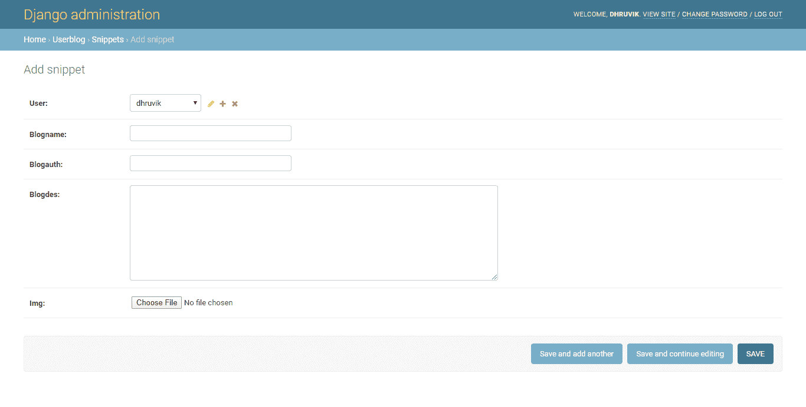

# 将用户与其在姜戈的上传(帖子)相关联

> 原文:[https://www . geesforgeks . org/associate-user-to-its-upload-post-in-django/](https://www.geeksforgeeks.org/associate-user-to-its-upload-post-in-django/)

Django 提供了 ForeignKey、ManytoManyField 的内置工具，用于将一个模型与另一个模型相关联。要将用户模型与帖子模型相关联，可以使用各种选项。本文围绕如何将用户与其帖子(帖子模型)相关联展开。本教程在 Django 中使用了外键的概念，最后，您将能够创建上传后的应用程序，以及包含用户过去所有上传内容的配置文件应用程序。

**先决条件–**

1.  [创建姜戈项目](https://www.geeksforgeeks.org/how-to-create-a-basic-project-using-mvt-in-django/)
2.  [创建可以注册登录和注销用户的应用程序](https://www.geeksforgeeks.org/how-to-create-an-app-in-django/)
3.  [在应用程序中进行迁移并添加数据库](https://www.geeksforgeeks.org/django-basic-app-model-makemigrations-and-migrate/)

我们已经为注册创建了一个用户应用程序，因此我们将创建一个名为 userblog(用户上传的博客)的新应用程序。为此，通过在 PowerShell 或终端中编写代码，在主项目文件中创建一个应用程序

```py
django-admin startapp userblog

```

现在这个应用程序在你的项目文件中是可用的，你应该首先将这个应用程序添加到项目中的 settings.py 文件中，并将这个应用程序添加到 **INSTALLED_APPS**

现在在您的项目中进行迁移，并将此应用程序添加到您的项目中

```py
python manage.py makemigrations
python manage.py migrate

```

现在我们必须在这个应用程序中使用模型，这样 Django 就可以为我们将要存储在数据库中的信息创建一个表，用户可以输入信息。我们必须在 userblog 应用程序的`models.py`文件中创建一个名为 Snippet 的类。我们将使用一个 ForeignKey 类，该类将保存用户的 id 值，并且它保存一对多的关系，因此您可以使用该类将用户与用户参与的任何其他活动相关联。

```py
from django.db import models
from django.conf import settings

User = settings.AUTH_USER_MODEL

# Create your models here.
class Snippet(models.Model):
    user = models.ForeignKey(User,
                        default = 1,
                        null = True, 
                        on_delete = models.SET_NULL
                        )
    blogname = models.CharField(max_length = 100)
    blogauth = models.CharField(max_length = 100)
    blogdes = models.TextField(max_length = 400)
    img = models.ImageField(upload_to ='pics')

    def __str__(self):
        return self.blogname
```

还创建一个名为`forms.py`的 python 文件，并为其创建一个模型表单，以输入来自用户的数据。

```py
from django import forms
from .models import Snippet

class SnippetForm(forms.ModelForm):
    class Meta:
        model = Snippet
        fields = ['blogname',
        'img',
        'blogauth',
        'blogdes'
        ]
```

我们需要迁移代码片段的类模型，以便 django 管理部门为后期上传创建一个数据库，并详细说明如何迁移代码片段类，您将在 Django 管理部门–

中看到这一点。这里的用户是一个外键，它将显示所有用户，它将存储用户最后一次上传的实例的密钥号。默认情况下，它被设置为超级用户
现在我们将转到 views.py 应用程序文件，并添加主代码，该代码将使用模型表单对象将信息存储在数据库中。

*   **我们的博客**–这将显示我们主页中的所有帖子
*   **snippet _ detail**–这将从用户那里获取数据，并将其与博客和用户相关联

```py
from django.shortcuts import render
from django.http import HttpResponse
from .forms import SnippetForm
from .models import Snippet
from django.contrib import messages
# Create your views here.
def usblog(request):
    snipps = Snippet.objects.all()
    return render(request, 'indexg.html', {'snipps' : snipps})

def snippet_detail(request):
    form = SnippetForm(request.POST or None, request.FILES or None)
    if request.method =='POST':

        if form.is_valid():

            obj = form.save(commit = False)
            obj.user = request.user;
            obj.save()
            form = SnippetForm()
            messages.success(request, "Successfully created")

    return render(request, 'form.html', {'form':form})
```

到目前为止，Django 管理已经创建了 Snippet 类的数据库，您可以通过访问 Django 管理来查看它。现在我们必须创建一个简单的`form.html`文件，它将包含一个表单，用户可以在其中输入我们在类中陈述的查询。这就是 Django 的美妙之处，因为我们已经在应用程序中使用了模型表单，Django 已经创建了表单的 HTML 代码，其中包含了我们需要的所有查询。因此，只需在模板文件(表单. html)中创建一个 HTML 文件。

```py
<!DOCTYPE html>
<html lang="en">

<head>
    <meta charset="UTF-8">
    <meta name="viewport" content="width=device-width, initial-scale=1.0">
    <meta http-equiv="X-UA-Compatible" content="ie=edge">
    <title>Your Blog</title>
</head>

<body>
    <form method="post" enctype="multipart/form-data">
        
        {{form.as_p}}
        <button type="submit">Submit</button>
    </form>
</body>

</html>
```

现在我们将需要一个主页，在那里我们将看到用户的所有帖子，因此创建另一个 HTML 文件 indexg.html，并导入我们在 views.py 文件中创建的函数对象。(仅放置 html 正文部分的图像，以显示 python 代码，您可以使用功能制作自己的索引)

```py
<body>
    <h1>Post play<h4>Only for geeks</h4>
    </h1>

    <div class="topnav">
        
        <a href="#">Hi {{user.username}}</a>
        <a href="accounts/logout">Logout</a>
        <a href="snippet_detail">Write post</a>
        
        <a href="accounts/register">Register</a>
        <a href="accounts/login">Login</a>
        
    </div>
    <p>
        

        
        <h2 class="font-size-regular"><a href="#">{{snips.blogname}}</a></h2>
        <h3>{{snips.user}}</h3>
        
        <p>{{snips.blogdes}}</p>
        
        <p>Register/Login to know more</p>
        

        

    </p>
    </div>
</body>
```

让我们转到我们的主 URL 文件，在那里我们将有一个帐户应用程序，现在将 userblog 应用程序设为默认，并添加您的应用程序的 URL。同样在你的用户博客应用程序中添加 urls.py，并添加 form.html 和主页(indexg.html)这两个函数的链接。
**主网址**

```py
from django.contrib import admin
from django.urls import path, include
from django.conf import settings
from django.conf.urls.static import static
urlpatterns = [
   path('', include('userblog.urls')),

    path('admin/', admin.site.urls),
    path('accounts/', include('accounts.urls'))

]
```

用户博客 URL–

```py
from django.urls import path

from . import views
urlpatterns = [

    path("snippet_detail", views.snippet_detail),
    path('', views.usblog, name ='usblog')
]
```

启动应用程序，将用户注册到您的应用程序中，然后发布帖子

```py
python manage.py runserver

```

您的浏览器不支持播放视频

github link─[github repo](https://github.com/DhruvikDonga/Django-user-defined-post)