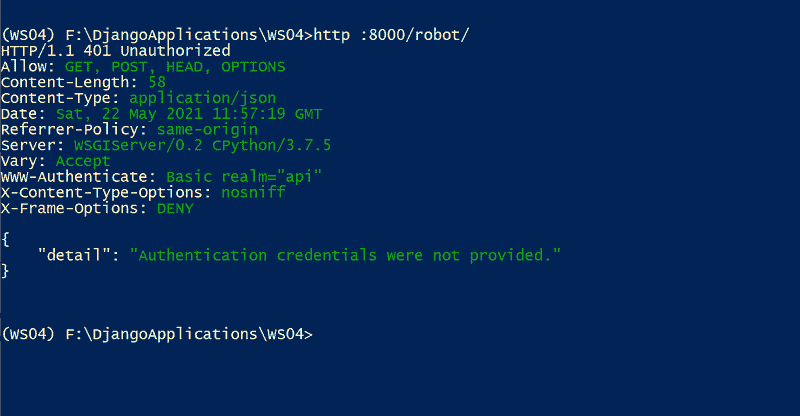
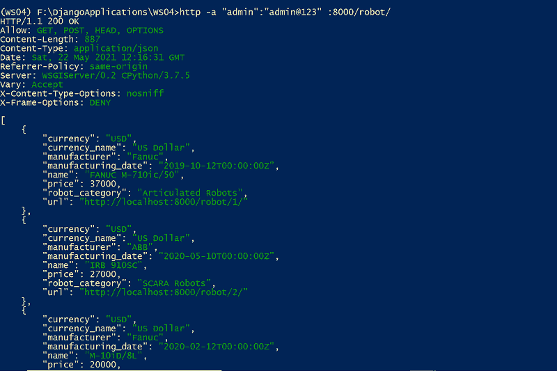
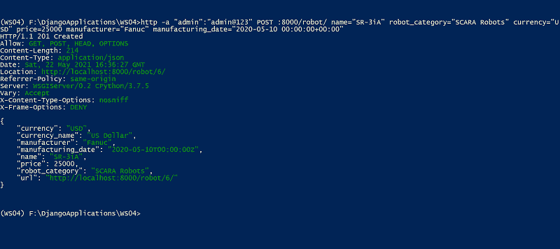

# 基本认证–姜戈 REST 框架

> 原文:[https://www . geesforgeks . org/basic-authentication-django-rest-framework/](https://www.geeksforgeeks.org/basic-authentication-django-rest-framework/)

身份验证是一种基于与传入请求相关联的凭据提供访问控制的机制。Django REST 框架提供了几种身份验证方案。在本节中，让我们看看 Django rest 框架中的基本身份验证，即根据用户的用户名和密码进行身份验证。

Django REST 框架中的基本认证使用 HTTP 基本认证。它通常适用于测试。REST 框架将尝试对基本身份验证类进行身份验证，并将返回值设置为 request.user 和 request.auth。如果身份验证成功，基本身份验证将提供以下凭据。

*   request.user 将是一个 Django 用户实例。
*   request.auth 将为 None。

如果没有，request.user 的值将设置为 django . contrib . auth . models . anonymousser 的实例，request.auth 将设置为 None。要使用基本身份验证方案，我们需要将其设置为默认身份验证方案。您可以全局设置它，也可以基于每个视图设置身份验证方案。

## 全局设置身份验证方案

您可以使用 DEFAULT _ AUTHORITY _ CLASES 设置全局设置身份验证。

## 蟒蛇 3

```py
REST_FRAMEWORK = {
    'DEFAULT_AUTHENTICATION_CLASSES': [
        'rest_framework.authentication.BasicAuthentication',
    ]
}
```

## 基于每个视图设置身份验证方案

基于每个视图设置身份验证方案在基于函数的视图和基于类的视图中有所不同。

### 基于函数的视图

我们可以使用@ authentication _ classes 和@ permission _ classes 装饰器在使用@api_view 装饰器的基于函数的视图中设置身份验证方案。示例代码如下:

## 蟒蛇 3

```py
@api_view(['GET'])
@authentication_classes([BasicAuthentication])
@permission_classes([IsAuthenticated])
def function_based_view(request, format=None):
    content = {

        # `django.contrib.auth.User` instance
        'user': str(request.user),

        # None
        'auth': str(request.auth),
    }
    return Response(content)
```

### 基于类的视图

通过使用 APIView 类，我们可以在基于类的视图中设置身份验证方案。示例代码如下:

## 蟒蛇 3

```py
from rest_framework.authentication import SessionAuthentication, BasicAuthentication
from rest_framework.permissions import IsAuthenticated
from rest_framework.response import Response
from rest_framework.views import APIView

class ClassBasedView(APIView):
    authentication_classes = [BasicAuthentication]
    permission_classes = [IsAuthenticated]

    def get(self, request, format=None):
        content = {

            # `django.contrib.auth.User` instance
            'user': str(request.user),

            # None
            'auth': str(request.auth),
        }
        return Response(content)
```

**注意:**这里，我们将使用最简单的权限样式，允许任何经过身份验证的用户访问，拒绝任何未经身份验证的用户访问。这对应于 REST 框架中的“IsAuthenticated”类。如果未设置为“IsAuthenticated”类，它将使用默认类“AllowAny”，该类允许不受限制的访问。

## 包括对 Restful 网络服务的基本认证

让我们全局设置基本身份验证方案。您可以打开 restful web 服务的 settings.py 文件并添加下面的代码。

## 蟒蛇 3

```
REST_FRAMEWORK = {
    'DEFAULT_AUTHENTICATION_CLASSES'🙁
        'rest_framework.authentication.BasicAuthentication',
        )
}
```py

**注意:**你可以参考[文章中使用的模型、序列化程序和项目视图的可浏览 API 部分](https://www.geeksforgeeks.org/browsable-api-in-django-rest-framework/)

在这里，我们全局设置了基本身份验证方案，因此我们不需要为每个视图设置它。但是我们需要设置权限类，因为默认情况下，权限类被设置为 AllowAny，这允许不受限制的访问。为了使用 IsAuthenticated 类，我们需要从 rest_framework.permissions 导入它。

```
from rest_framework.permissions import IsAuthenticated
```py

现在，让我们将 RobotDetail 和 RobotList 类的权限类设置为“已验证”。代码如下:

## 蟒蛇 3

```
class RobotDetail(generics.RetrieveUpdateDestroyAPIView):
    permission_classes = [IsAuthenticated]
    queryset = Robot.objects.all()
    serializer_class = RobotSerializer
    name = 'robot-detail'

class RobotList(generics.ListCreateAPIView):
    permission_classes = [IsAuthenticated]
    queryset = Robot.objects.all()
    serializer_class = RobotSerializer
    name = 'robot-list'
```py

让我们尝试在不提供任何凭据的情况下检索机器人。HTTPie 命令是

```
http :8000/robot/
```

**输出**



现在我们将创建一个超级用户，并提供检索机器人的凭据。可以遵循[如何在姜戈创建超级用户？](https://www.geeksforgeeks.org/how-to-create-superuser-in-django/)创建超级用户。

让我们使用带有凭证的 HTTPie 命令来检索机器人。

> http-a " admin ":" admin @ 123 ":8000/robot/

**输出**



让我们尝试一个创建新机器人条目的 HTTPie 命令。

> http-a " admin ":" admin @ 123 " POST:8000/robot/name = " SR-3iA " robot _ category = " SCARA Robots " currency = " USD " price = 25000 制造商= " Fanuc " manufacturing _ date = " 2020-05-10 00:00:00+00:00 "

**输出**



**注意:**如果您在生产中使用基本身份验证，您应该确保您的应用编程接口仅适用于 HTTPS，并始终重新请求凭据。如果使用 mod_wsgi 部署到 Apache，则需要显式配置 mod_wsgi，通过将 WSGIPassAuthorization 设置为“开”，将所需的头传递给应用程序。