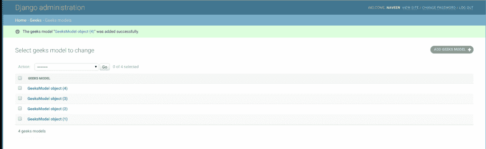

# BigAutoField – Django Models

> 哎哎哎:1230【https://www . geeksforgeeks . org/bigautofield-django-models/

BigAutoField 是一个 64 位整数，很像 AutoField，只不过保证适合从 **1** 到 **9223372036854775807** 的数字。可以使用以下语法创建一个大自动字段，

```py
id = models.BigAutoField(primary_key=True, **options)
```

这是一个自动递增的主键，就像自动字段一样。

## 姜戈模型大自动场解释

使用示例说明大自动场。考虑一个名为 geeksforgeeks 的项目，它有一个名为 geeks 的应用程序。

> 请参考以下文章，查看如何在 Django 中创建项目和应用程序。
> 
> *   [如何利用姜戈的 MVT 创建基础项目？](https://www.geeksforgeeks.org/how-to-create-a-basic-project-using-mvt-in-django/)
> *   [如何在姜戈创建 App？](https://www.geeksforgeeks.org/how-to-create-an-app-in-django/)

将以下代码输入**极客** app 的 models.py 文件。

## 蟒蛇 3

```py
from django.db import models
from django.db.models import Model
# Create your models here.

class GeeksModel(Model):
    big_id = models.BigAutoField(primary_key = True)
```

将极客应用程序添加到 INSTALLED_APPS 中

## 蟒蛇 3

```py
# Application definition

INSTALLED_APPS = [
    'django.contrib.admin',
    'django.contrib.auth',
    'django.contrib.contenttypes',
    'django.contrib.sessions',
    'django.contrib.messages',
    'django.contrib.staticfiles',
    'geeks',
]
```

当我们从终端运行 makemigrations 命令时，

```py
Python manage.py makemigrations
```

将在 geeks 目录中创建一个名为 migrations 的新文件夹，文件名为 0001_initial.py

## 蟒蛇 3

```py
# Generated by Django 2.2.5 on 2019-09-25 06:00

from django.db import migrations, models

class Migration(migrations.Migration):

    initial = True

    dependencies = [
    ]

    operations = [
        migrations.CreateModel(
            name ='GeeksModel',
            fields =[
                ('big_id',
                  models.BigAutoField(auto_created = True,
                  primary_key = True,
                  serialize = False,
                  verbose_name ='ID'
                )),
            ],
        ),
    ]
```

因此，当您在项目上运行 makemigrations 时，会创建一个 big_id **BigAutoField，它会在模型**的每个实例上自动递增。它是为名为 GeeksModel 的模型创建的表的主键。

> **可能的错误**
> 由于一个 Django 模型最多只能有一个自动字段，因此必须在第一次迁移时使用 primary_key=True 属性创建 BigAutoField，否则会引发多个错误。

> "评估错误:一个模型不能有多个自动字段."

> 如果出现此错误，请尝试删除最近的迁移，并将 primary_key=True 添加到字段中。再次运行迁移来解决问题。

如果我们从管理服务器创建这个空模型的对象。我们可以在创建的每个实例上看到 id 字段自动递增。



## 字段选项

字段选项是为每个字段提供的参数，用于对特定字段应用某些约束或赋予特定特征。例如，将参数 primary_key=True 添加到 BigAutoField 将使其成为关系数据库中该表的主键。
这里是一个大自动场可以使用的选项和属性。

<figure class="table">

| 字段选项 | 描述 |
| --- | --- |
| [零](https://www.geeksforgeeks.org/nulltrue-django-built-in-field-validation/) | 如果**为真**，姜戈会在数据库中将空值存储为**空值**。默认为**假**。 |
| [空白](https://www.geeksforgeeks.org/blanktrue-django-built-in-field-validation/) | 如果**为真**，则该字段允许为空。默认为**假**。 |
| db_index | 如果为真，将为此字段创建数据库索引。 |
| db_tablespace(数据库表空间) | 如果此字段已编制索引，则用于此字段索引的数据库表空间的名称。默认值是项目的 DEFAULT_INDEX_TABLESPACE 设置(如果设置的话)，或者是模型的 db_tablespace(如果有的话)。如果后端不支持索引的表空间，则忽略该选项。 |
| 数据库 _ 列 | 用于此字段的数据库列的名称。如果没有给出，Django 将使用字段的名称。
 |
| [默认](https://www.geeksforgeeks.org/default-django-built-in-field-validation/) | 该字段的默认值。这可以是一个值或一个可调用对象。如果可调用，它将在每次创建新对象时被调用。
 |
| [帮助 _ 文字](https://www.geeksforgeeks.org/help_text-django-built-in-field-validation/) | 要与表单小部件一起显示的额外“帮助”文本。即使您的字段没有在表单上使用，它对文档也很有用。
 |
| [主键](https://www.geeksforgeeks.org/primary_key-django-built-in-field-validation/) | 如果为真，则该字段是模型的主键。 |
| [可编辑](https://www.geeksforgeeks.org/editablefalse-django-built-in-field-validation/) | 如果**为假**，该字段将不会显示在管理或任何其他模型表单中。在模型验证期间也会跳过它们。默认为**真**。
 |
| [错误信息](https://www.geeksforgeeks.org/error_messages-django-built-in-field-validation/) | error_messages 参数允许您覆盖该字段将引发的默认消息。传入一个字典，其关键字与您想要覆盖的错误消息相匹配。
 |
| [帮助 _ 文字](https://www.geeksforgeeks.org/help_text-django-built-in-field-validation/) | 要与表单小部件一起显示的额外“帮助”文本。即使您的字段没有在表单上使用，它对文档也很有用。
 |
| [verbose_name](https://www.geeksforgeeks.org/verbose_name-django-built-in-field-validation/) | 该字段的可读名称。如果没有给出详细名称，Django 将使用字段的属性名称自动创建它，将下划线转换为空格。
 |
| [验证器](https://www.geeksforgeeks.org/custom-field-validations-in-django-models/) | 为此字段运行的验证程序列表。更多信息参见[验证器文档](https://docs.djangoproject.com/en/2.2/ref/validators/)。
 |
| [独特](https://www.geeksforgeeks.org/uniquetrue-django-built-in-field-validation/) | 如果为真，则该字段在整个表中必须是唯一的。
 |

</figure>