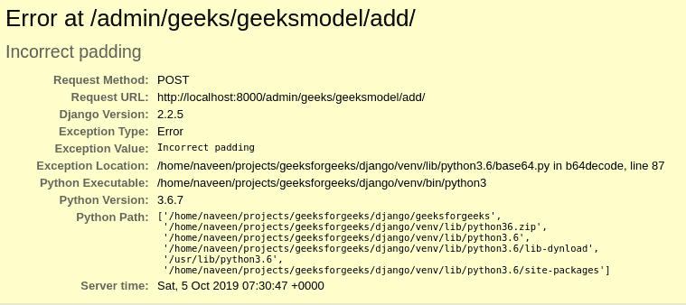

# binary field–Django 车型

> 原文:[https://www.geeksforgeeks.org/binaryfield-django-models/](https://www.geeksforgeeks.org/binaryfield-django-models/)

BinaryField 是存储**原始二进制数据**的特殊字段。它可以被分配[字节](https://www.geeksforgeeks.org/python-bytes-method/)、[字节](https://www.geeksforgeeks.org/python-bytearray-function/)或[内存视图](https://www.geeksforgeeks.org/memoryview-in-python/)。默认情况下，BinaryField 将**可编辑**设置为 **False** ，即不能包含在模型表单中。由于 BinaryField 存储原始数据，或者用其他术语来说，存储 python 对象，因此不能手动输入，需要通过视图或 django shell 进行分配。这就是**可编辑为假**的意思，就是不能通过任何形式编辑。

**语法**

```py
field_name = models.BinaryField(**options)
```

## Django 模型 BinaryField 解释

使用示例说明二进制字段。考虑一个名为 geeksforgeeks 的项目，它有一个名为 geeks 的应用程序。

> 请参考以下文章，查看如何在 Django 中创建项目和应用程序。
> 
> *   [如何利用姜戈的 MVT 创建基础项目？](https://www.geeksforgeeks.org/how-to-create-a-basic-project-using-mvt-in-django/)
> *   [如何在姜戈创建 App？](https://www.geeksforgeeks.org/how-to-create-an-app-in-django/)

将以下代码输入**极客** app 的 models.py 文件。

## 蟒蛇 3

```py
from django.db import models
from django.db.models import Model
# Create your models here.

class GeeksModel(Model):
    geeks_field = models.BinaryField()
```

将极客应用程序添加到 INSTALLED_APPS 中

## 蟒蛇 3

```py
# Application definition

INSTALLED_APPS = [
    'django.contrib.admin',
    'django.contrib.auth',
    'django.contrib.contenttypes',
    'django.contrib.sessions',
    'django.contrib.messages',
    'django.contrib.staticfiles',
    'geeks',
]
```

当我们从终端运行 makemigrations 命令时，

```py
Python manage.py makemigrations
```

将在 geeks 目录中创建一个名为 migrations 的新文件夹，文件名为 0001_initial.py

## 蟒蛇 3

```py
# Generated by Django 2.2.5 on 2019-09-25 06:00

from django.db import migrations, models

class Migration(migrations.Migration):

    initial = True

    dependencies = [
    ]

    operations = [
        migrations.CreateModel(
            name ='GeeksModel',
            fields =[
                ('id',
                  models.AutoField(auto_created = True,
                  primary_key = True,
                  serialize = False,
                  verbose_name ='ID'
                )),
                ('geeks_field', models.BinaryField()),
            ],
        ),
    ]
```

因此，当您在项目上运行 makemigrations 时，会创建一个 geeks _ field**biginterfield**。它是存储原始二进制数据的字段。

## 如何使用 BinaryField？

任何类型的数据都可以转换成字节，包括整数、字符串、图像等。让我们尝试将一个字符串保存到 BinaryField 中。可以使用通用字节函数将字符串转换为字节。该函数在内部指向 CPython 库，该库隐式调用编码函数将字符串转换为指定的编码。

## 蟒蛇 3

```py
# importing the model
# from geeks app
from geeks.models import GeeksModel

# creating a string
test_string = "GFG is best"

# creating a bytes object
res = bytes(test_string, 'utf-8')

# creating a instance of
# GeeksModel
geek_object = GeeksModel.objects.create(geeks_field = res)
geek_object.save()
```

现在让我们在管理服务器中检查它。我们已经创建了一个极客模型的实例


**可能的错误**
如指定的，BinaryField 是一个不可编辑的字段，如果您使用 editable=True 手动尝试使其可编辑，它将创建意外的错误。它应该在一个函数中创建，以便可以为其分配对象。



## 字段选项

字段选项是为每个字段提供的参数，用于对特定字段应用某些约束或赋予特定特征。例如，将参数 null = True 添加到 BinaryField 将使它能够在关系数据库中存储该表的空值。

以下是 BinaryField 可以使用的选项和属性。

<figure class="table">

| 字段选项 | 描述 |
| --- | --- |
| [零](https://www.geeksforgeeks.org/nulltrue-django-built-in-field-validation/) | 如果**为真**，姜戈会在数据库中将空值存储为**空值**。默认为**假**。 |
| [空白](https://www.geeksforgeeks.org/blanktrue-django-built-in-field-validation/) | 如果**为真**，则该字段允许为空。默认为**假**。 |
| 数据库 _ 列 | 用于此字段的数据库列的名称。如果没有给出，Django 将使用字段的名称。
 |
| [默认](https://www.geeksforgeeks.org/default-django-built-in-field-validation/) | 该字段的默认值。这可以是一个值或一个可调用对象。如果可调用，它将在每次创建新对象时被调用。
 |
| [帮助 _ 文字](https://www.geeksforgeeks.org/help_text-django-built-in-field-validation/) | 要与表单小部件一起显示的额外“帮助”文本。即使您的字段没有在表单上使用，它对文档也很有用。
 |
| [主键](https://www.geeksforgeeks.org/primary_key-django-built-in-field-validation/) | 如果为真，则该字段是模型的主键。 |
| [可编辑](https://www.geeksforgeeks.org/editablefalse-django-built-in-field-validation/) | 如果**为假**，该字段将不会显示在管理或任何其他模型表单中。在模型验证期间也会跳过它们。默认为**真**。
 |
| [错误信息](https://www.geeksforgeeks.org/error_messages-django-built-in-field-validation/) | error_messages 参数允许您覆盖该字段将引发的默认消息。传入一个字典，其关键字与您想要覆盖的错误消息相匹配。
 |
| [帮助 _ 文字](https://www.geeksforgeeks.org/help_text-django-built-in-field-validation/) | 要与表单小部件一起显示的额外“帮助”文本。即使您的字段没有在表单上使用，它对文档也很有用。
 |
| [verbose_name](https://www.geeksforgeeks.org/verbose_name-django-built-in-field-validation/) | 该字段的可读名称。如果没有给出详细名称，Django 将使用字段的属性名称自动创建它，将下划线转换为空格。
 |
| [验证器](https://www.geeksforgeeks.org/custom-field-validations-in-django-models/) | 为此字段运行的验证程序列表。更多信息参见[验证器文档](https://docs.djangoproject.com/en/2.2/ref/validators/)。
 |
| [独特](https://www.geeksforgeeks.org/uniquetrue-django-built-in-field-validation/) | 如果为真，则该字段在整个表中必须是唯一的。
 |

</figure>