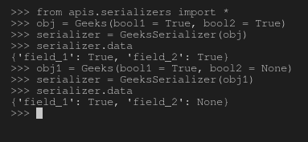

# 序列化程序中的布尔字段–姜戈 REST 框架

> 原文:[https://www . geesforgeks . org/boolean-field-in-serializer-django-rest-framework/](https://www.geeksforgeeks.org/boolean-fields-in-serializers-django-rest-framework/)

在 Django REST 框架中，序列化的概念就是将数据库数据转换成 javascript 可以使用的数据类型。每个序列化程序都带有一些将要被处理的字段(条目)。例如，如果您有一个名为 Employee 的类，其字段为 Employee_id、Employee_name、is_admin 等。然后，您将需要自动字段、字符字段和 BooleanField 来通过 Django 存储和操作数据。类似地，序列化程序也以相同的原理工作，并且具有用于创建序列化程序的字段。
本文围绕 Django REST 框架中序列化器中的布尔字段展开。布尔值有两个主要字段——BooleanField 和 NullBooleanField。

#### BooleanField

用于包装**真**或**假**值的布尔字段。其工作原理与[BooleanField-Django 车型](https://www.geeksforgeeks.org/booleanfield-django-models/)相同。默认情况下，序列化程序。默认情况下创建的 BooleanField 实例为 False。
**语法–**

```py
field_name = serializers.BooleanField() 
```

#### NullBooleanField

接受**真**、**假**和**空**值的布尔字段。其工作原理与[NullBooleanField–Django 模型](https://www.geeksforgeeks.org/nullbooleanfield-django-forms/)相同。默认情况下，序列化程序。默认情况下，创建的 NullBooleanField 实例为无。
**语法–**

```py
field_name = serializers.NullBooleanField()
```

#### 如何在序列化程序中使用布尔字段？

为了解释布尔字段的用法，让我们从–[开始使用相同的项目设置如何使用 Django Rest 框架创建一个基本的 API？](https://geeksforgeeks.org/how-to-create-a-basic-api-using-django-rest-framework/)。
现在您的项目中有了一个名为 serializer 的文件，让我们创建一个以 BooleanField 和 NullBooleanField 为字段的序列化程序。

## 蟒蛇 3

```py
#import serializer from rest_framework
from rest_framework import serializers

class Geeks(object):
    def __init__(self, bool1, bool2):
        self.field_1 = bool1
        self.field_2 = bool2

# create a serializer
class GeeksSerializer(serializers.Serializer):
    # initialize fields
    field_1 = serializers.BooleanField()
    field_2 = serializers.NullBooleanField()
```

现在让我们创建一些对象，并尝试序列化它们，检查它们是否真的在工作，运行–

```py
Python manage.py shell
```

现在，在 shell 中运行以下 python 命令

```py
# import everything from serializers
>>> from apis.serializers import *

# create a object of type Geeks
>>> obj = Geeks(bool1 = True, bool2 = True)

# serialize the object
>>> serializer = GeeksSerializer(obj)

# print serialized data
>>> serializer.data
{'field_1': True, 'field_2': True}

# another example
>>> obj1 = Geeks(bool1 = True, bool2 = None)
>>> serializer = GeeksSerializer(obj1)
>>> serializer.data
{'field_1': True, 'field_2': None}
```

这是终端上所有这些操作的输出–



## 序列化程序字段中的核心参数

。数学表{边框折叠:折叠；宽度:100%；} .数学表 td {边框:1px 实心# 5fb962 文本对齐:向左！重要；填充:8px} .数学表 th {边框:1px 实心# 5fb962 填充:8px} .数学表 tr>th{背景色:# c6ebd9 垂直对齐:中间；} .数学表 tr:第 n 个子(奇数){背景色:# ffffff}

<figure class="table">

| 争吵 | 描述 |
| --- | --- |
| [只读](https://www.geeksforgeeks.org/core-arguments-in-serializer-fields-django-rest-framework/#read_only) | 将该值设置为 True 以确保在序列化表示时使用该字段，但在反序列化期间创建或更新实例时不使用该字段 |
| [只写 _ 条](https://www.geeksforgeeks.org/core-arguments-in-serializer-fields-django-rest-framework/#write_only) | 将此设置为“真”，以确保该字段可以在更新或创建实例时使用，但在序列化表示时不包括在内。 |
| [必需](https://www.geeksforgeeks.org/core-arguments-in-serializer-fields-django-rest-framework/#required) | 将此设置为 False 还允许在序列化实例时从输出中省略对象属性或字典键。 |
| [默认](https://www.geeksforgeeks.org/core-arguments-in-serializer-fields-django-rest-framework/#default) | 如果设置，这将给出默认值，如果未提供输入值，该默认值将用于该字段。 |
| [允许 _ 空](https://www.geeksforgeeks.org/core-arguments-in-serializer-fields-django-rest-framework/#allow_null) | 通常情况下，如果将“无”传递给序列化程序字段，将会引发错误。如果“无”应被视为有效值，则将此关键字参数设置为“真”。 |
| [来源](https://www.geeksforgeeks.org/core-arguments-in-serializer-fields-django-rest-framework/#source) | 将用于填充字段的属性的名称。 |
| [验证器](https://www.geeksforgeeks.org/core-arguments-in-serializer-fields-django-rest-framework/#validators) | 应该应用于输入字段输入的验证函数列表，这些函数要么引发验证错误，要么简单地返回。 |
| [错误信息](https://www.geeksforgeeks.org/core-arguments-in-serializer-fields-django-rest-framework/#error_messages) | 错误信息的错误代码字典。 |
| 标签 | 一个短文本字符串，可用作 HTML 表单字段或其他描述性元素中的字段名称。 |
| [帮助 _ 文字](https://www.geeksforgeeks.org/core-arguments-in-serializer-fields-django-rest-framework/#help_text) | 一个文本字符串，可用作 HTML 表单字段或其他描述性元素中字段的描述。 |
| [初始](https://www.geeksforgeeks.org/core-arguments-in-serializer-fields-django-rest-framework/#initial) | 应该用于预先填充 HTML 表单字段值的值。 |

</figure>