# Django REST 框架中的可浏览 API

> 原文:[https://www . geesforgeks . org/browsable-API-in-django-rest-framework/](https://www.geeksforgeeks.org/browsable-api-in-django-rest-framework/)

Django REST 框架中的可浏览 API 特性为不同的资源生成 HTML 输出。它方便了通过任何网络浏览器与 RESTful 网络服务的交互。要启用此功能，我们应该在请求头中为内容类型键指定文本/html。它帮助我们使用网络浏览器来浏览应用编程接口，并可以发出不同的 HTTP 请求。在本节中，我们将使用 Django REST API 框架中的可浏览 API 特性。

> *查看如何设置 Django Rest 框架并创建 API 访问–*[*<u>如何使用 Django RESt 框架创建基本 API？</u>*](https://geeksforgeeks.org/how-to-create-a-basic-api-using-django-rest-framework/)

### 创建一个简单的项目来演示可浏览的 API–

让我们创建应用程序机器人所需的模型、序列化程序和视图。

### 创建模型

在姜戈，模型是以面向对象的方式处理数据库的类。每个模型类引用一个数据库表，模型类中的每个属性引用一个数据库列。在这里，我们将创建以下模型:

*   机器人类别(机器人类别)
*   制造商(制造商详细信息)
*   自动机制详细资讯

机器人类别模型需要:

*   机器人类别名称

制造商型号要求:

*   制造商名称

机器人模型需要:

*   Robot name(自动机名称)
*   根类别模型的外键
*   制造商模型的外键
*   货币
*   价格
*   制造日期

让我们看看我们的机器人 Restful web 服务中的 HTTP 动词，范围语义。

<figure class="table">

| HTTP 动词 | 范围 | 语义学 | 统一资源定位器 |
| --- | --- | --- | --- |
| 得到 | 机器人类别 | 检索机器人类别 | http://localhost:8000/robocategory/{ id }/ |
| 得到 | 机器人类别集合 | 检索集合中的所有机器人类别 | http://localhost:8000/robocategory/ |
| 邮政 | 机器人类别集合 | 在集合中创建新的机器人类别 | http://localhost:8000/robocategory/{ id }/ |
| 放 | 机器人类别 | 更新机器人类别 | http://localhost:8000/robocategory/{ id }/ |
| 删除 | 机器人类别 | 删除机器人类别 | http://localhost:8000/robocategory/{ id }/ |
| 得到 | 制造商 | 检索制造商 | http://localhost:8000/制造商/{id}/ |
| 得到 | 制造商集合 | 检索集合中的所有制造商 | http://localhost:8000/制造商/ |
| 邮政 | 制造商集合 | 在集合中创建制造商 | http://localhost:8000/制造商/{id}/ |
| 放 | 制造商 | 更新制造商 | http://localhost:8000/制造商/{id}/ |
| 删除 | 制造商 | 删除制造商 | http://localhost:8000/制造商/{id}/ |
| 得到 | 机器人 | 找回机器人 | http://localhost:8000/robot/{ id }/ |
| 得到 | 机器人集锦 | 检索集合中的所有机器人 | http://localhost:8000/robot/ |
| 邮政 | 机器人集锦 | 在集合中创建机器人 | http://localhost:8000/robot/{ id }/ |
| 放 | 机器人 | 更新机器人 | http://localhost:8000/robot/{ id }/ |
| 删除 | 机器人 | 删除机器人 | http://localhost:8000/robot/{ id }/ |

</figure>

让我们为机器人类别、制造商、机器人及其关系创建模型。您可以在 models.py 文件中添加以下代码。

## 蟒蛇 3

```py
from django.db import models

class RobotCategory(models.Model):
    name = models.CharField(max_length=150, unique=True)

    class Meta:
        ordering = ('name',)

    def __str__(self):
        return self.name

class Manufacturer(models.Model):
    name = models.CharField(max_length=150, unique=True)

    class Meta:
        ordering = ('name',)

    def __str__(self):
        return self.name

class Robot(models.Model):
    CURRENCY_CHOICES = (
        ('INR', 'Indian Rupee'),
        ('USD', 'US Dollar'),
        ('EUR', 'Euro'),
    )

    name = models.CharField(max_length=150, unique=True)
    robot_category = models.ForeignKey(
        RobotCategory,
        related_name='robots',
        on_delete=models.CASCADE)
    manufacturer = models.ForeignKey(
        Manufacturer,
        related_name='robots',
        on_delete=models.CASCADE)
    currency = models.CharField(
        max_length=3,
        choices= CURRENCY_CHOICES,
        default='INR')
    price = models.IntegerField()
    manufacturing_date = models.DateTimeField()

    class Meta:
        ordering = ('name',)

    def __str__(self):
        return self.name
```

这里我们有三个类，它们是 django.db.models.Model 类的子类:

*   根类别
*   制造商
*   机器人

机器人类与机器人类别模型和制造商模型有多对一的关系。这种关系是通过使用 django.db.models.ForeignKey 类实现的。代码如下:

```py
    robot_category = models.ForeignKey(
        RobotCategory,
        related_name='robots',
        on_delete=models.CASCADE)
    manufacturer = models.ForeignKey(
        Manufacturer,
        related_name='robots',
        on_delete=models.CASCADE)
```

related_name 参数创建一个反向关系。在这里，related_name 中的值“robots”创建了从 RobotCategory 到 Robot 和从制造商到 Robot 的反向关系。这便于获取属于机器人类别的所有机器人，并且还基于制造商。

接下来，您可以执行迁移过程并应用所有生成的迁移。您可以使用以下命令

> python manage.py makemigrations
> 
> python manage.py 迁移

### 创建序列化程序

现在，我们需要序列化机器人类别、制造商和机器人实例。在这里，我们将使用超链接模型序列化程序来处理模型关系。可以查看 [DRF 串行器关系](https://write.geeksforgeeks.org/post/2451330)主题详细了解。

## 蟒蛇 3

```py
from rest_framework import serializers
from robots.models import RobotCategory, Manufacturer, Robot

class RobotCategorySerializer(serializers.HyperlinkedModelSerializer):
    robots = serializers.HyperlinkedRelatedField(
        many=True,
        read_only=True,
        view_name='robot-detail')

    class Meta:
        model = RobotCategory
        fields = '__all__'

class ManufacturerSerializer(serializers.HyperlinkedModelSerializer):
    robots = serializers.HyperlinkedRelatedField(
        many=True,
        read_only=True,
        view_name='robot-detail')

    class Meta:
        model = Manufacturer
        fields = '__all__'

class RobotSerializer(serializers.HyperlinkedModelSerializer):
    robot_category = serializers.SlugRelatedField(
        queryset=RobotCategory.objects.all(), slug_field='name')
    manufacturer = serializers.SlugRelatedField(
        queryset=Manufacturer.objects.all(), slug_field='name')
    currency = serializers.ChoiceField(
        choices=Robot.CURRENCY_CHOICES)
    currency_name = serializers.CharField(
        source='get_currency_display',
        read_only=True)

    class Meta:
        model = Robot
        fields = '__all__'
```

RobotCategorySerializer 和 ManufacturerSerializer 类是 HyperlinkedModelSerializer 类的子类，反向关系(RobotCategory 到 Robot 和 Manufacturer 到 Robot)使用 HyperlinkedRelatedField 表示，其中许多只读属性设置为 True。视图名称—机器人详细信息—允许可浏览的应用编程接口功能为用户提供点击工具，以呈现超链接。

RobotSerializer 类也是 HyperlinkedModelSerializer 类的子类。RobotSerializer 类声明了两个属性——robot _ category 和 manufacturer，这两个属性保存了序列化程序的一个实例。

### 创建视图

让我们利用 Django REST 框架提供的基于类的通用视图来处理 HTTP 请求并提供适当的 HTTP 响应。您可以查看[基于 DRF 类的视图](https://write.geeksforgeeks.org/post/2456527)了解详细解释。

## 蟒蛇 3

```py
from django.shortcuts import render

from rest_framework import generics
from rest_framework.response import Response
from rest_framework.reverse import reverse

from robots.models import RobotCategory, Manufacturer, Robot
from robots.serializers import RobotCategorySerializer, \
     ManufacturerSerializer, RobotSerializer

class ApiRoot(generics.GenericAPIView):
    name = 'api-root'
    def get(self, request, *args, **kwargs):
        return Response({
            'robot-categories': reverse(RobotCategoryList.name, request=request),
            'manufacturers': reverse(ManufacturerList.name, request=request),
            'robots': reverse(RobotList.name, request=request)
            })    

class RobotCategoryList(generics.ListCreateAPIView):
    queryset = RobotCategory.objects.all()
    serializer_class = RobotCategorySerializer
    name = 'robotcategory-list'

class RobotCategoryDetail(generics.RetrieveUpdateDestroyAPIView):
    queryset = RobotCategory.objects.all()
    serializer_class = RobotCategorySerializer
    name = 'robotcategory-detail'

class ManufacturerList(generics.ListCreateAPIView):
    queryset = Manufacturer.objects.all()
    serializer_class = ManufacturerSerializer
    name= 'manufacturer-list'

class ManufacturerDetail(generics.RetrieveUpdateDestroyAPIView):
    queryset = Manufacturer.objects.all()
    serializer_class = ManufacturerSerializer
    name = 'manufacturer-detail'

class RobotList(generics.ListCreateAPIView):
    queryset = Robot.objects.all()
    serializer_class = RobotSerializer
    name = 'robot-list'

class RobotDetail(generics.RetrieveUpdateDestroyAPIView):
    queryset = Robot.objects.all()
    serializer_class = RobotSerializer
    name = 'robot-detail'
```

在这里，我们的视图类从 rest_framework.generics 导入，我们利用了两个基于泛型类的视图——ListCreateAPIView 和 RetrieveUpdateDestroyAPIView。

你可以注意到一个 ApiRoot 类，它是*泛型的子类。*为我们的 web 服务的根创建一个端点。它通过可浏览的应用编程接口功能方便了资源的浏览。

```py
class ApiRoot(generics.GenericAPIView):
    name = 'api-root'
    def get(self, request, *args, **kwargs):
        return Response({
            'robot-categories': reverse(RobotCategoryList.name, request=request),
            'manufacturers': reverse(ManufacturerList.name, request=request),
            'robots': reverse(RobotList.name, request=request)
            })    
```

get 方法返回一个 Response 对象(作为字符串的键/值对)，该对象具有视图及其 URL 的描述性名称。

## 正在设置 URL Conf

转到 apps (robots)文件夹，创建一个名为 urls.py 文件的新文件。您可以添加以下代码:

## 蟒蛇 3

```py
from django.urls import path
from robots import views

urlpatterns = [
    path('robocategory/',
         views.RobotCategoryList.as_view(),
         name='robotcategory-list'),
    path('robocategory/<int:pk>/',
         views.RobotCategoryDetail.as_view(),
         name='robotcategory-detail'),
    path('manufacturer/',
         views.ManufacturerList.as_view(),
         name='manufacturer-list'),
    path('manufacturer/<int:pk>/',
         views.ManufacturerDetail.as_view(),
         name='manufacturer-detail'),
    path('robot/',
         views.RobotList.as_view(),
         name='robot-list'),
    path('robot/<int:pk>/',
         views.RobotDetail.as_view(),
         name='robot-detail'),
    path('',
        views.ApiRoot.as_view(),
        name=views.ApiRoot.name)
]
```

它定义了请求中必须匹配的 URL 模式，以便为 views.py 文件中定义的基于类的视图执行特定的方法。现在我们必须设置根 URL 配置。您可以添加以下代码:

## 蟒蛇 3

```py
from django.contrib import admin
from django.urls import path, include

urlpatterns = [
    path('', include('robots.urls')),
]
```

### 如何使用可浏览的应用编程接口向应用编程接口发出请求？

让我们编写并发送 HTTP 请求，以在响应中生成文本/html 内容。RESTFul 网络服务使用 BrowsableAPIRenderer 类来生成 HTML 内容。接受文本/html 的 HTTPie 命令如下:

> http -v :8000/robot/“接受:文本/html”

分享命令提示符截图供您参考

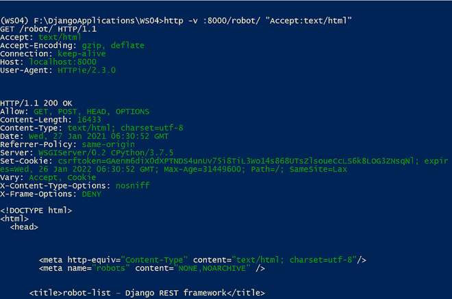

在使用可浏览的应用编程接口之前，让我们使用 HTTPie 命令为机器人类别、制造商和机器人创建一个新条目。该命令如下:

> http POST:8000/robocategory/name = "铰接式机器人"
> 
> http POST:8000/制造商/名称=“Fanuc”
> 
> http POST:8000/robot/name =“FANUC M-710 IC/50”robot _ category =“铰接式机器人”制造商=“Fanuc”货币=“USD”价格=37000 制造 _ 日期=“2019-10-12 00:00:00+00:00”

### 获取 HTTP 请求

现在，让我们使用浏览器浏览“机器人”Restful 网络服务。您可以使用下面的网址。

> http://localhost:8000/

分享浏览器截图供大家参考

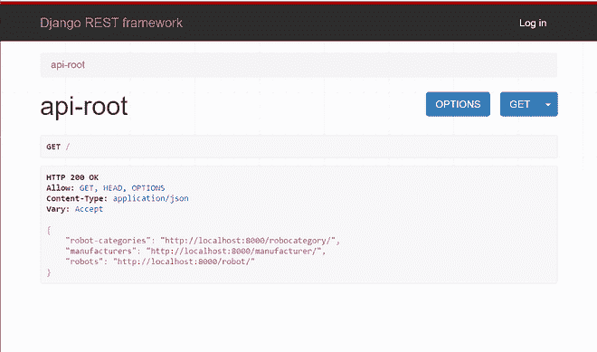

您可以单击对应于机器人类别、制造商和机器人的链接，并检查数据。共享显示机器人结果的浏览器截图(http://localhost:8000/robot/)

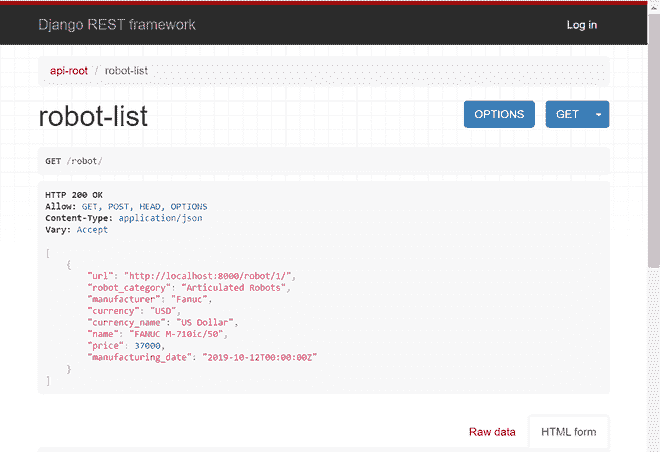

### 发布 HTTP 请求

接下来，让我们创建一个新的机器人类别。您可以浏览以下链接并向下滚动。

> http://localhost:8000/robocategory/

分享浏览器截图供参考

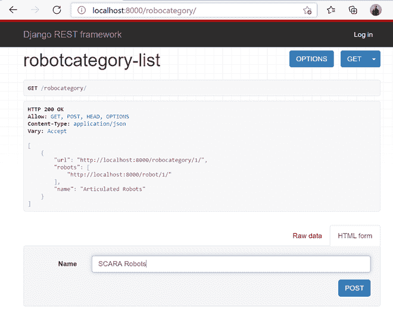

您可以键入新机器人类别的名称，然后单击开机自检按钮。这里，它以 HTML 形式显示。如果选择原始数据，请选择媒体类型作为应用程序/json，将新的机器人类别名称填入名称字段，然后单击开机自检按钮。分享截图供大家参考。

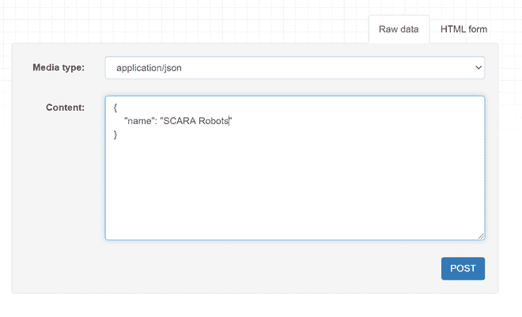

分享输出截图


让我们创建一个新的制造商，你可以浏览下面的网址

> http://localhost:8000/制造商/

分享浏览器截图


您可以键入制造商名称(ABB)，然后单击开机自检按钮。浏览器显示如下所示的输出

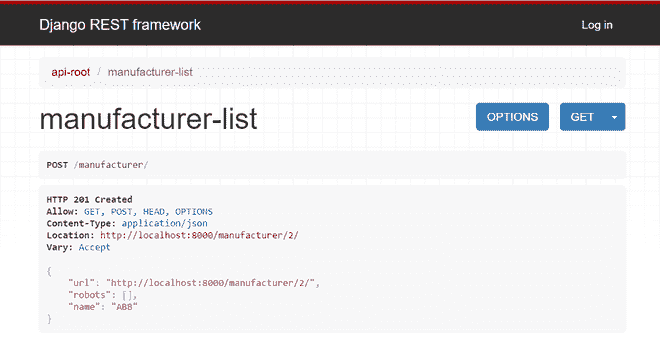

最后，让我们为机器人创建一个新条目。您可以浏览以下网址并向下滚动。

> http://localhost:8000/robot/

让我们填充数据。分享浏览器截图供参考

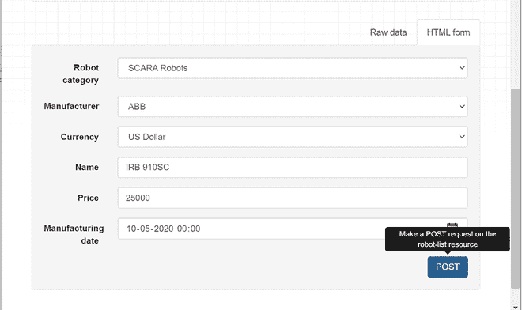

在这里，您可以注意到机器人类别、制造商和货币是下拉字段。填充条目后，您可以单击开机自检按钮。在显示的输出截图下方分享。

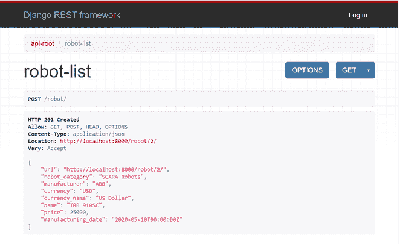

### 放 HTTP 请求

让我们编辑 pk 值为 2 的机器人的价格。您可以浏览以下网址并向下滚动。

> http://localhost:8000/robot/2/

分享浏览器截图。您可以将价格更改为 27000，然后单击 PUT 按钮。

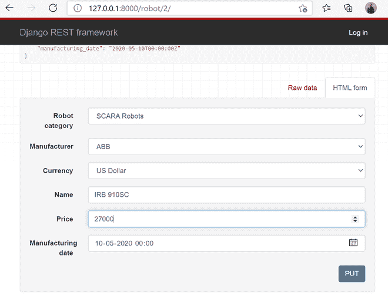

分享输出的截图。

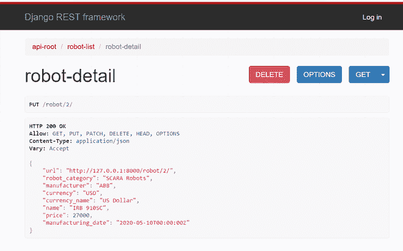

### 删除 HTTP 请求

您可以创建一个新的测试条目，并使用 pk 值浏览 URL。

> http://localhost:8000/robot/2/

您可以注意到一个删除按钮。分享以下浏览器截图:

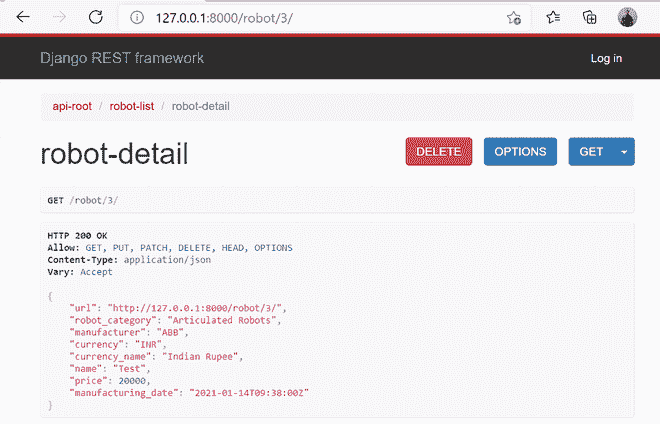

单击“删除”按钮后，浏览器会进行确认。您可以在确认窗口中单击删除按钮。分享下面的截图。

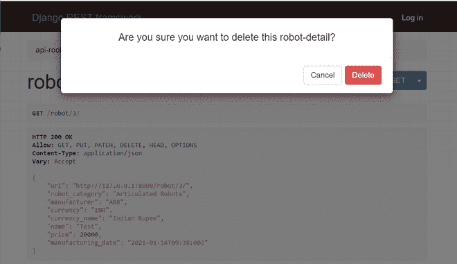

如果删除成功，将显示以下输出。

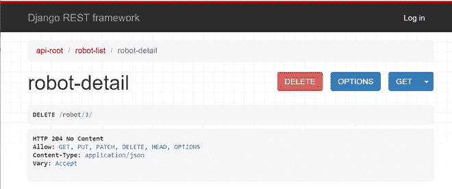

## 让我们结束吧

从这一节中，我们了解了如何利用 Django REST API 框架中的可浏览 API 特性。我们编写并发送了生成文本/html 内容作为响应的 HTTP 请求，并在网络浏览器中分析了响应。