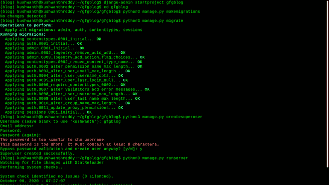
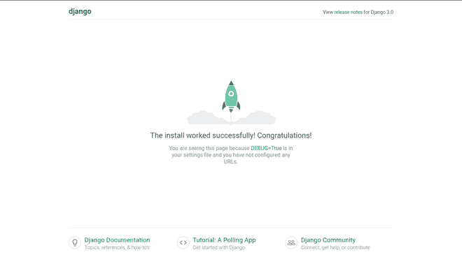
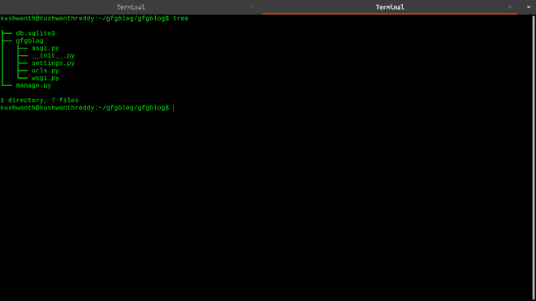

# 与 Django 建立博客 CMS(内容管理系统)

> 原文:[https://www . geesforgeks . org/building-blog-CMS-content-management-system-with-django/](https://www.geeksforgeeks.org/building-blog-cms-content-management-system-with-django/)

Django 是一个基于 python 的 web 应用程序框架，有助于构建各种 web 应用程序。Django 还包括一个可扩展的 Django-Admin 界面，Default SQLIte3 数据库，该数据库也可扩展到 PostgreSQL、MySQL 数据库，以及少数其他用于构建高效 web 应用程序的组件。

### 安装和设置姜戈

为我们的博客创建一个目录，安装并激活虚拟环境。然后使用以下命令安装 Django

```py
# creating directory for our project
mkdir gfgblog && cd gfgblog

# installing virtual environment
pip install virtualenv
python3 -m venv env

# activating virtual environment
source env/bin/activate

# installing django
pip install django
```

由于现在我们已经安装了 Django，我们现在将创建一个 Django 项目，它将建立一个基本的 Django 应用程序

```py
django-admin startproject gfgblog
cd gfgblog
```

在我们的 gfgblog Django 应用程序中，我们将拥有这些文件

*   **__init__。py**–空文件
*   **URL . py**–用于路由我们的姜戈项目
*   **设置。py**–拥有我们姜戈项目的所有设置
*   **asgi.py** ，wsgi–在部署我们的应用时很有帮助

我们在 Django 网络应用目录中。现在，我们将为我们的数据库进行一些迁移，该数据库将是 SQLite3，它将设置一些默认表来运行我们数据库中的应用程序。然后我们将为我们的应用程序创建一个超级用户。

```py
# migrating tables
python3 manage.py makemigrations
python3 manage.py migrate

# create and enter the details for superuser
python3 manage.py createsuperuser
```



创建、迁移 django-app

现在运行 Django 开发服务器，并在本地主机中打开端口 8000

```py
# running python development server
python3 manage.py runserver
```



默认 django 页面

现在停止服务器，进入我们的 gfgblog Django app 目录中的 gfgblog 目录，并使用您的代码编辑器打开 urls.py 文件。你可以从下图中找到我们的 gfgblog 目录树



django app 目录树结构

### 在姜戈创建博客应用程序–

现在我们将为它创建实际的博客应用程序和数据库。转到 gfgblog 项目目录。你可以看到我们的 SQLite3 数据库，gfgblog Django app。现在在这个目录中创建一个名为 blog 的新应用程序。下面的命令将为我们创建一个新的应用程序。

```py
# creating an app named blog
python3 manage.py startapp blog
```

新的应用程序目录有 5 个默认文件

*   **__init__。py**–一个空文件
*   **管理副本**–用于管理管理界面
*   **apps . py**–用于管理应用配置
*   **models . py**–用于管理应用程序的数据库模型
*   **测试。py**–用于测试应用程序
*   **view . py**–用于管理应用程序的行为和逻辑

由于我们已经创建了应用程序，现在我们必须告诉 django 应用程序，我们的项目中有一个新的应用程序。为此，请转到 gfgblog 目录中的 settings.py 并打开 settings.py 文件。转到设置文件的“已安装的应用程序”部分，添加我们在案例中创建的应用程序的名称，即它的博客

## 蟒蛇 3

```py
INSTALLED_APPS = [
    'django.contrib.admin',
    'django.contrib.auth',
    'django.contrib.contenttypes',
    'django.contrib.sessions',
    'django.contrib.messages',
    'django.contrib.staticfiles',
      'blog',
]
```