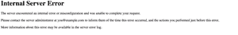
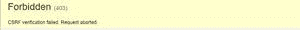
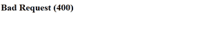

# 姜戈内置错误视图

> 原文:[https://www . geesforgeks . org/内置错误视图-in-django/](https://www.geeksforgeeks.org/built-in-error-views-in-django/)

每当人们试图访问一个网站上不存在的链接时，它会给出一个 404 错误，即找不到该页面。同样，错误代码也更多，如 500、403 等。Django 有一些默认函数来处理 HTTP 错误。让我们一个一个地探索它们。

## 姜戈内置错误视图–

### 404 视图(找不到页面)–

通常，当请求的网址在服务器上不可用时，此视图用于呈现基本的 404 模板。默认情况下会出现这种情况，Django 会引发**Django . views . defaults . page _ not _ found()**视图并呈现 default404 错误模板。您可以通过在模板文件夹中添加自定义 404.html 页面来自定义它。


### **500 视图(服务器错误)–**

当服务器崩溃或没有任何响应时，使用此视图。在这种情况下，Django 具有默认功能**Django . views . defaults . server _ error()**来呈现该视图的服务器错误。您也可以通过在模板文件夹中添加您的 500.html 页面来自定义它。



### **403 视图(禁止)–**

当用户无权查看特定页面，但他/她请求查看该页面时。在这种情况下，403 视图开始发挥作用。它说页面是被禁止的，不会向用户显示页面。为此，Django 具有**Django . views . defaults . permission _ denied()**功能来渲染禁止的模板。它维护您的隐私，只有被允许的用户才能访问某些页面。您也可以通过在模板文件夹中添加您的 403.html 页面来自定义它。

假设你有一个电子商务网站，你只希望认证商家列出产品。买家和普通用户不能列出他们的产品。您可以在 Django 中添加这样的功能:

```py
from django.core.exceptions import PermissionDenied

def upload(request, pk):
    if not request.user.is_merchant:
        raise PermissionDenied

    # your code here.....

```



### 400 视图(错误请求):

当有人试图访问您网站的机密页面时，Django 会使用 400 视图或坏请求视图，这可能会导致您的网站被黑客攻击或泄露机密数据。所以，你不想让任何人访问那个页面。Django 有**django . views . defaults . bad _ request()**为任何类型的**可疑操作提升 400 个视图。**这样可以防止你的网站被坏人攻击。



## 在 Django 中自定义内置错误视图–

现在，让我们看看如何定制这些错误视图。首先你需要进入设置。复制并设置调试=假。

```py
DEBUG = False
ALLOWED_HOSTS =  ['localhost', '127.0.0.1']

```

在项目中创建一个文件夹，给它命名，这里我给这个文件夹命名为“**模板**”。现在转到 settings.py 并设置模板目录。

```py
TEMPLATE_DIR = os.path.join(BASE_DIR, 'templates')

```

现在，在模板目录中，您可以创建 html 文件“404.html”、“500.html”、“403.html”、“400.html”等。创建这些页面后，展示你的 HTML 技能，并自己定制页面。将您的应用程序名称添加到 settings.py 中。

```py
INSTALLED_APPS = [
'django.contrib.admin',
'django.contrib.auth',
'django.contrib.contenttypes',
'django.contrib.sessions',
'django.contrib.messages',
'django.contrib.staticfiles',
'jquery',
'geeks'
]

```

将处理程序方法添加到**URL . py**

```py
handler404 = 'myappname.views.error_404'
handler500 = 'myappname.views.error_500'
handler403 = 'myappname.views.error_403'
handler400 = 'myappname.views.error_400'

```

现在设置逻辑以在**视图中显示这些页面**

```py
from django.shortcuts import render

def error_404(request, exception):

        return render(request,'404.html')

def error_500(request,  exception):
        return render(request,'500.html', data)

def error_403(request, exception):

        return render(request,'403.html')

def error_400(request,  exception):
        return render(request,'400.html', data)    

```

现在，您已经准备好运行服务器并查看您创建的这些错误处理页面。

```py
To run server: python manage.py runserver

```