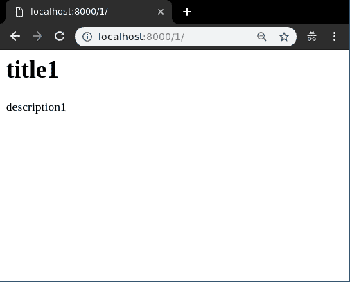
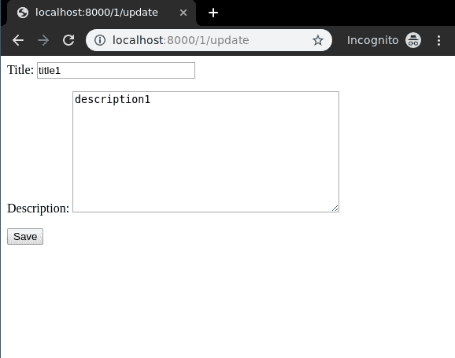
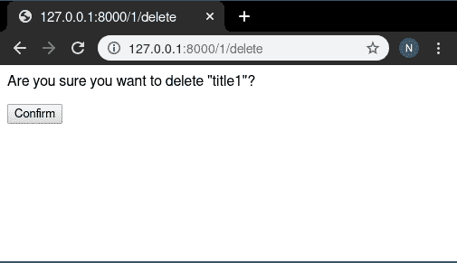

# 基于类的通用视图姜戈(创建、检索、更新、删除)

> 原文:[https://www . geesforgeks . org/class-based-generic-view-django-create-retrieve-update-delete/](https://www.geeksforgeeks.org/class-based-generic-views-django-create-retrieve-update-delete/)

Django 是一个基于 Python 的网络框架，允许您快速创建网络应用程序。它有内置的管理界面，这使得它很容易工作。它通常被称为**电池内置框架**，因为它为每个功能提供了内置设施。基于类的通用视图是一组高级内置视图，用于实现选择性视图策略，如创建、检索、更新、删除。基于类的视图通过分离视图的 GET、POST 请求简化了使用。它们不会取代基于函数的视图，但与基于函数的视图相比有一定的差异和优势:

*   与特定 HTTP 方法(GET、POST 等)相关的代码的组织。)可以通过单独的方法来解决，而不是条件分支。
*   面向对象的技术，如 mixins(多重继承)可以用来将代码分解成可重用的组件。

本文围绕在 Django 中完成**类视图的实现(创建、检索、更新、删除)。让我们讨论一下 CRUD 的实际含义，**


[**【创建视图】**](#createview)–在数据库的表格中创建或添加新条目。
[**检索视图**](#retrieveview)–以列表形式读取、检索、搜索或查看现有条目([**【ListView】**](#listview))或详细检索特定条目([**【DetailView】**](#detailview))
[**更新视图**](#updateview)–更新或编辑数据库中表格中的现有条目
[**删除视图**](#deleteview)–删除、停用

## 基于类的视图

使用示例说明如何创建和使用 CRUD 视图。考虑一个名为 geeksforgeeks 的项目，它有一个名为 geeks 的应用程序。

> 请参考以下文章，查看如何在 Django 中创建项目和应用程序。
> 
> *   [如何利用姜戈的 MVT 创建基础项目？](https://www.geeksforgeeks.org/how-to-create-a-basic-project-using-mvt-in-django/)
> *   [如何在姜戈创建 App？](https://www.geeksforgeeks.org/how-to-create-an-app-in-django/)

在你有一个项目和一个应用程序后，让我们创建一个模型，我们将通过我们的视图创建实例。极客/模特。py，

## 蟒蛇 3

```
# import the standard Django Model
# from built-in library
from django.db import models

# declare a new model with a name "GeeksModel"
class GeeksModel(models.Model):

    # fields of the model
    title = models.CharField(max_length = 200)
    description = models.TextField()

    # renames the instances of the model
    # with their title name
    def __str__(self):
        return self.title
```

创建这个模型后，我们需要运行两个命令来为其创建数据库。

```
Python manage.py makemigrations
Python manage.py migrate
```

现在我们将为此模型创建一个 Django 模型表单。有关模型表单–[姜戈模型表单–](https://geeksforgeeks.org/django-modelform-create-form-from-models/)从模型创建表单的更多信息，请参考本文。在 geeks 文件夹中创建一个 forms.py 文件，

## 蟒蛇 3

```
from django import forms
from .models import GeeksModel

# creating a form
class GeeksForm(forms.ModelForm):

    # create meta class
    class Meta:
        # specify model to be used
        model = GeeksModel

        # specify fields to be used
        fields = [
            "title",
            "description",
        ]
```

### 使用基于类的视图

本质上，基于类的视图允许您用不同的类实例方法来响应不同的 HTTP 请求方法，而不是在单个视图函数中有条件地分支代码。

因此，在视图函数中处理 HTTP GET 的代码看起来类似于:

## 蟒蛇 3

```
from django.http import HttpResponse

def my_view(request):
    if request.method == 'GET':
        # <view logic>
        return HttpResponse('result')
```

在基于类的视图中，这将变成:

## 蟒蛇 3

```
from django.http import HttpResponse
from django.views import View

class MyView(View):
    def get(self, request):
        # <view logic>
        return HttpResponse('result')
```

类似地，在 urls.py 中，需要使用 as_view()方法来区分基于类的视图和基于函数的视图。

## 蟒蛇 3

```
# urls.py
from django.urls import path
from myapp.views import MyView

urlpatterns = [

    path('about/', MyView.as_view()),

]
```

### 创建视图

创建视图是指在数据库中创建表实例的视图(逻辑)。我们已经在创建视图-基于函数的视图姜戈中讨论了创建视图的基础。基于类的视图自动设置从 A 到 z 的所有内容。只需指定要为哪个模型和字段创建创建视图。然后基于类的 CreateView 会自动尝试在 app_name/modelname_form.html 中找到一个模板，在我们这里是极客/模板/极客/极客 model_form.html，让我们创建基于类的视图。极客/观点。py，

## 蟒蛇 3

```
from django.views.generic.edit import CreateView
from .models import GeeksModel

class GeeksCreate(CreateView):

    # specify the model for create view
    model = GeeksModel

    # specify the fields to be displayed

    fields = ['title', 'description']
```

现在创建一个 url 路径来映射视图。在极客/URL . py 中，

## 蟒蛇 3

```
from django.urls import path

# importing views from views..py
from .views import GeeksCreate
urlpatterns = [
    path('', GeeksCreate.as_view() ),
]
```

在 templates/geeks model _ form . html 中创建一个模板，

## 超文本标记语言

```
<form method="POST" enctype="multipart/form-data">

    <!-- Security token -->
    

    <!-- Using the formset -->
    {{ form.as_p }}

    <input type="submit" value="Submit">
</form>
```

我们来看看[上有什么 http://localhost:8000/](http://localhost:8000/)


要检查基于类的创建视图的完整实现，请访问[创建视图-基于类的视图姜戈](https://www.geeksforgeeks.org/createview-class-based-views-django/)。

### 检索视图

#### 列表视图

列表视图是指显示数据库中一个表的多个实例的视图(逻辑)。我们已经在[列表视图-基于函数的视图姜戈](https://www.geeksforgeeks.org/list-view-function-based-views-django/)中讨论了列表视图的基础。基于类的视图会自动设置从 A 到 z 的所有内容。只需要指定为哪个模型创建列表视图，然后基于类的列表视图会自动尝试在 app_name/modelname_list.html 中找到一个模板。在我们的例子中，它是极客/模板/极客/极客模型 _list.html。让我们创建我们的基于类的视图。极客/观点。py，

## 蟒蛇 3

```
from django.views.generic.list import ListView
from .models import GeeksModel

class GeeksList(ListView):

    # specify the model for list view
    model = GeeksModel
```

现在创建一个 url 路径来映射视图。在极客/URL . py 中，

## 蟒蛇 3

```
from django.urls import path

# importing views from views..py
from .views import GeeksList
urlpatterns = [
    path('', GeeksList.as_view()),
]
```

在 templates/geeks model _ list . html 中创建一个模板，

## 超文本标记语言

```
<ul>
    <!-- Iterate over object_list -->
    
    <!-- Display Objects -->
    <li>{{ object.title }}</li>
    <li>{{ object.description }}</li>

    <hr/>
    <!-- If object_list is empty  -->
    
    <li>No objects yet.</li>
    
</ul>
```

我们来看看[上有什么 http://localhost:8000/](http://localhost:8000/)


要检查基于类的列表视图的完整实现，请访问[列表视图–基于类的视图姜戈](https://www.geeksforgeeks.org/listview-class-based-views-django/)

#### 详细视图

详细视图是指显示数据库中某个表实例的视图(逻辑)。我们已经在[详细视图-基于功能的视图姜戈](https://www.geeksforgeeks.org/detail-view-function-based-views-django/)中讨论了详细视图的基础。基于类的视图会自动设置从 A 到 z 的所有内容。只需要指定为哪个模型创建 DetailView，然后基于类的 DetailView 会自动尝试在 app_name/modelname_detail.html 中找到一个模板。在我们的例子中，它是极客/模板/极客/极客模型 _detail.html。让我们创建我们的基于类的视图。极客/观点。py，

## 蟒蛇 3

```
from django.views.generic.detail import DetailView

from .models import GeeksModel

class GeeksDetailView(DetailView):
    # specify the model to use
    model = GeeksModel
```

现在创建一个 url 路径来映射视图。在极客/URL . py 中，

## 蟒蛇 3

```
from django.urls import path

# importing views from views..py
from .views import GeeksDetailView
urlpatterns = [
    # <pk> is identification for id field,
    # slug can also be used
    path('<pk>/', GeeksDetailView.as_view()),
]
```

在 templates/geeks model _ detail . html 中创建一个模板，

## 超文本标记语言

```
<h1>{{ object.title }}</h1>

<p>{{ object.description }}</p>
```

我们来看看[上有什么 http://localhost:8000/1/](http://localhost:8000/1)



要检查基于类的详细视图的完整实现，请访问[详细视图-基于类的视图姜戈](https://www.geeksforgeeks.org/detailview-class-based-views-django/)

### 更新视图

UpdateView 指的是用一些额外的细节从数据库中更新表的特定实例的视图(逻辑)。它用于更新数据库中的条目，例如，更新 geeksforgeeks 上的一篇文章。我们已经在[更新视图–基于函数的视图姜戈](https://www.geeksforgeeks.org/update-view-function-based-views-django/)中讨论了更新视图的基础。基于类的视图会自动设置从 A 到 z 的所有内容。只需要指定为哪个模型创建更新视图，然后基于类的更新视图会自动尝试在 app_name/modelname_form.html 中找到一个模板。在我们的例子中，它是极客/模板/极客/极客模型 _form.html。让我们创建我们的基于类的视图。极客/观点。py，

## 蟒蛇 3

```
# import generic UpdateView
from django.views.generic.edit import UpdateView

# Relative import of GeeksModel
from .models import GeeksModel

class GeeksUpdateView(UpdateView):
    # specify the model you want to use
    model = GeeksModel

    # specify the fields
    fields = [
        "title",
        "description"
    ]

    # can specify success url
    # url to redirect after successfully
    # updating details
    success_url ="/"
```

现在创建一个 url 路径来映射视图。在极客/URL . py 中，

## 蟒蛇 3

```
from django.urls import path

# importing views from views..py
from .views import GeeksUpdateView
urlpatterns = [
    # <pk> is identification for id field,
    # <slug> can also be used
    path('<pk>/update', GeeksUpdateView.as_view()),
]
```

在 templates/geeks model _ form . html 中创建一个模板，

## 超文本标记语言

```
<form method="post">
    
    {{ form.as_p }}
    <input type="submit" value="Save">
</form>
```

我们来看看[上有什么 http://localhost:8000/1/update/](http://localhost:8000/1/update)



要检查基于类的更新视图的完整实现，请访问[更新视图–基于类的视图姜戈](https://www.geeksforgeeks.org/updateview-class-based-views-django/)。

### 删除审阅

删除视图是指从数据库中删除表的特定实例的视图(逻辑)。它用于删除数据库中的条目，例如，删除 geeksforgeeks 上的一篇文章。我们已经在[删除视图–基于函数的视图姜戈](https://www.geeksforgeeks.org/delete-view-function-based-views-django/)中讨论了删除视图的基础。基于类的视图自动设置从 A 到 z 的所有内容。只需要指定为哪个模型创建删除视图，然后基于类的删除视图将自动尝试在 app _ name/model name _confirm_delete.html 中找到一个模板。在我们的例子中，它是极客/模板/极客/极客模型 _ confirm _ delete . html。让我们创建基于类的视图。极客/观点。py，

## 蟒蛇 3

```
# import generic UpdateView
from django.views.generic.edit import DeleteView

# Relative import of GeeksModel
from .models import GeeksModel

class GeeksDeleteView(DeleteView):
    # specify the model you want to use
    model = GeeksModel

    # can specify success url
    # url to redirect after successfully
    # deleting object
    success_url ="/"
```

现在创建一个 url 路径来映射视图。在极客/URL . py 中，

## 蟒蛇 3

```
from django.urls import path

# importing views from views..py
from .views import GeeksDeleteView
urlpatterns = [
    # <pk> is identification for id field,
    # slug can also be used
    path('<pk>/delete/', GeeksDeleteView.as_view()),
]
```

在 templates/geeks/geeks model _ confirm _ delete . html 中创建一个模板，

## 超文本标记语言

```
<form method="post">

<p>Are you sure you want to delete "{{ object }}"?</p>

    <input type="submit" value="Confirm">
</form>
```

我们来看看[上有什么 http://localhost:8000/1/delete](http://localhost:8000/1/delete)



要检查基于类的删除视图的完整实现，请访问[删除视图–基于类的视图姜戈](https://www.geeksforgeeks.org/deleteview-class-based-views-django/)

### FormView(形状视图)

表单视图是指显示和验证姜戈表单的视图(逻辑)。例如，在 geeksforgeeks 上注册用户的表单。基于类的视图自动设置从 A 到 z 的所有内容。只需指定为哪个表单创建表单视图和模板名称，基于类的表单视图将自动呈现该表单。让我们创建基于类的视图。极客/观点。py，

## 蟒蛇 3

```
# import generic FormView
from django.views.generic.edit import FormView

# Relative import of GeeksForm
from .forms import GeeksForm

class GeeksFormView(FormView):
    # specify the Form you want to use
    form_class = GeeksForm

    # specify name of template
    template_name = "geeks / geeksmodel_form.html"

    # can specify success url
    # url to redirect after successfully
    # updating details
    success_url ="/thanks/"
```

在极客/极客模型 _form.html 中为此视图创建一个模板，

## 超文本标记语言

```
<form method="post">
    
    {{ form.as_p }}
    <input type="submit" value="Save">
</form>
```

在 geeks/urls.py 中将一个 url 映射到此视图，

## 蟒蛇 3

```
from django.urls import path

# importing views from views..py
from .views import GeeksFormView
urlpatterns = [
    path('', GeeksFormView.as_view()),
]
```

现在访问 [http://127.0.0.1:8000/](http://127.0.0.1:8000/) ，


要检查基于类的表单视图的完整实现，请访问[表单视图–基于类的视图姜戈](https://www.geeksforgeeks.org/formview-class-based-views-django/)