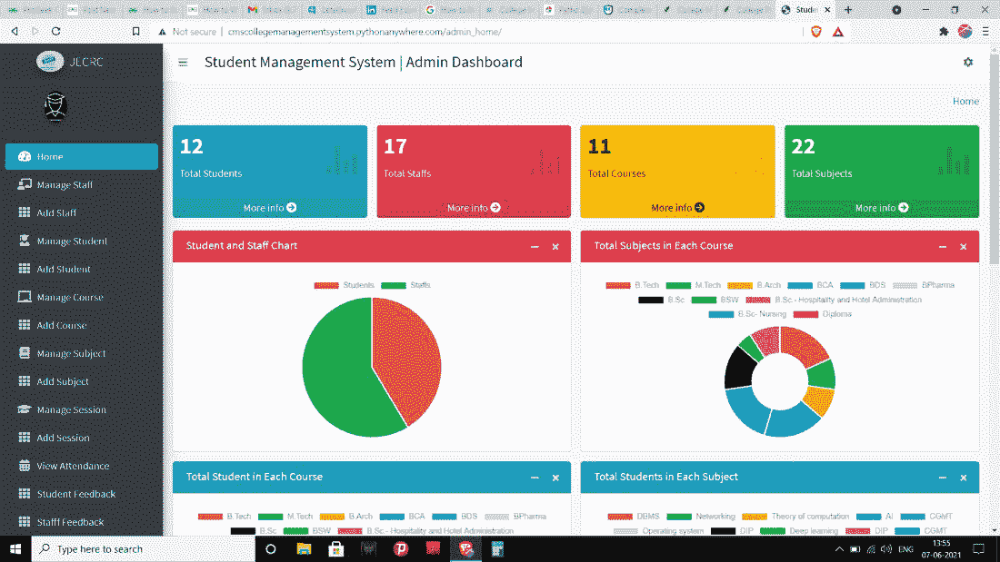
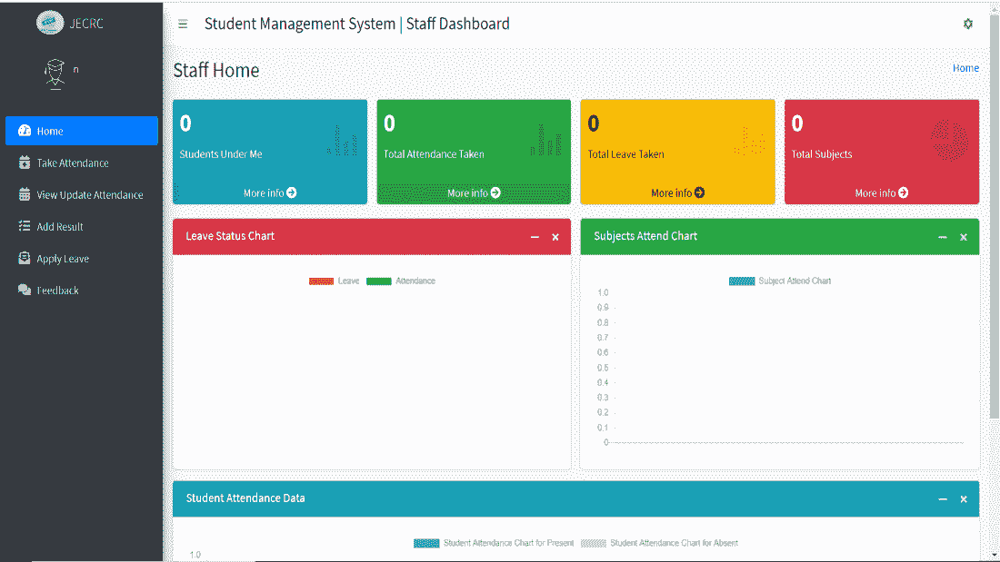
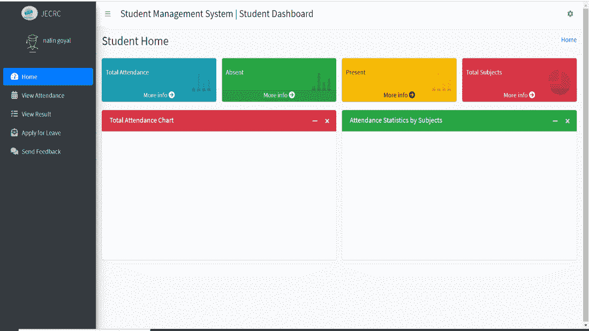
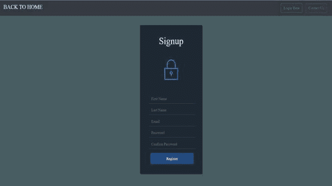
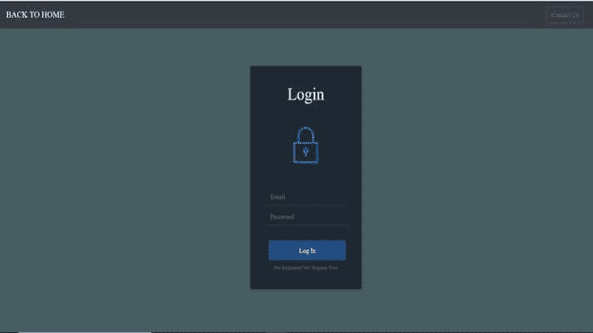

# 使用 Django-Python 项目的学院管理系统

> 原文:[https://www . geesforgeks . org/college-management-system-use-django-python-project/](https://www.geeksforgeeks.org/college-management-system-using-django-python-project/)

在本文中，我们将使用 *Django* 构建学院管理系统，并将使用 *dbsqlite* 数据库。在 covid 时代，当教育已经完全数字化时，就需要一个可以连接教师、学生和 HOD 的系统，这就是建立这个项目的动机。

这个项目允许团长、工作人员和学生自己注册。这个项目有三个接口。

### 1.部门主管:

下图为学院部门负责人界面:



HOD 接口

### 2.对于员工:

下图为学院员工界面:



员工界面

### 3.对于学生:

下图为学院学生界面:



学生界面

### **项目使用的工具和技术:**

1.  超文本标记语言
2.  半铸钢ˌ钢性铸铁(Cast Semi-Steel)
3.  java 描述语言
4.  JQUERY
5.  引导程序
6.  DJANGO

**构建项目所需的技能:**

*   HTML、CSS、JavaScript 和 Django 的基础知识。

### **分步实施**

按照以下步骤实施讨论的项目:

**第一步:**安装 Django。

**第二步:**创建一个名称为*的文件夹**College _ Management _ System**T5】用 VS Code 打开。*

**步骤 3:** 打开终端，使用下面的命令创建一个新项目“CMS_project”。

```py
django-admin startproject CMS_project
```

**第四步:**进入 *CMS* 文件夹，创建 app“*CMS _ app*”。

```py
python manage.py startapp CMS_app
```

**第五步:**转到*CMS _ project->settings . py->INSTALLED _ APPS*添加我们的 app *CMS_app* 。

**第六步:**转到 *CMS_project* 的 urls.py，在 ***urlpatterns*** 中添加以下路径。

```py
path('', include('student_management_app.urls'))
```

**第七步:**现在进入 *CMS_app 的 views.py 中将要使用的[视图](https://www.geeksforgeeks.org/views-in-django-python/)。*

## 蟒蛇 3

```py
from django.shortcuts import render, HttpResponse, redirect, HttpResponseRedirect
from django.contrib.auth import logout, authenticate, login
from .models import CustomUser, Staffs, Students, AdminHOD
from django.contrib import messages

def home(request):
    return render(request, 'home.html')

def contact(request):
    return render(request, 'contact.html')

def loginUser(request):
    return render(request, 'login_page.html')

def doLogin(request):

    print("here")
    email_id = request.GET.get('email')
    password = request.GET.get('password')
    # user_type = request.GET.get('user_type')
    print(email_id)
    print(password)
    print(request.user)
    if not (email_id and password):
        messages.error(request, "Please provide all the details!!")
        return render(request, 'login_page.html')

    user = CustomUser.objects.filter(email=email_id, password=password).last()
    if not user:
        messages.error(request, 'Invalid Login Credentials!!')
        return render(request, 'login_page.html')

    login(request, user)
    print("user is")
    # request.user gives us the the username
    #i.e for ng.student@jecrc.com , it gives ng
    print(request.user)
    print(user.user_type)

    if user.user_type == CustomUser.STUDENT:
        return redirect('student_home/')
    elif user.user_type == CustomUser.STAFF:
        return redirect('staff_home/')
    elif user.user_type == CustomUser.HOD:
        return redirect('admin_home/')

    return render(request, 'home.html')

def registration(request):
    return render(request, 'registration.html')

def doRegistration(request):
    first_name = request.GET.get('first_name')
    last_name = request.GET.get('last_name')
    email_id = request.GET.get('email')
    password = request.GET.get('password')
    confirm_password = request.GET.get('confirmPassword')

    print(email_id)
    print(password)
    print(confirm_password)
    print(first_name)
    print(last_name)
    if not (email_id and password and confirm_password):
        messages.error(request, 'Please provide all the details!!')
        return render(request, 'registration.html')

    if password != confirm_password:
        messages.error(request, 'Both passwords should match!!')
        return render(request, 'registration.html')

    is_user_exists = CustomUser.objects.filter(email=email_id).exists()

    if is_user_exists:
        messages.error(
            request, 'User with this email id already exists. Please proceed to login!!')
        return render(request, 'registration.html')

    user_type = get_user_type_from_email(email_id)

    if user_type is None:
        messages.error(
            request, "Please use valid format for the email id: '<username>.<staff|student|hod>@<college_domain>'")
        return render(request, 'registration.html')

    username = email_id.split('@')[0].split('.')[0]

    if CustomUser.objects.filter(username=username).exists():
        messages.error(
            request, 'User with this username already exists. Please use different username')
        return render(request, 'registration.html')

    user = CustomUser()
    user.username = username
    user.email = email_id
    user.password = password
    user.user_type = user_type
    user.first_name = first_name
    user.last_name = last_name
    user.save()

    if user_type == CustomUser.STAFF:
        Staffs.objects.create(admin=user)
    elif user_type == CustomUser.STUDENT:
        Students.objects.create(admin=user)
    elif user_type == CustomUser.HOD:
        AdminHOD.objects.create(admin=user)
    return render(request, 'login_page.html')

def logout_user(request):
    logout(request)
    return HttpResponseRedirect('/')

def get_user_type_from_email(email_id):
    """
    Returns CustomUser.user_type corresponding to the given email address
    email_id should be in following format:
    '<username>.<staff|student|hod>@<college_domain>'
    eg.: 'abhishek.staff@jecrc.com'
    """

    try:
        email_id = email_id.split('@')[0]
        email_user_type = email_id.split('.')[1]
        return CustomUser.EMAIL_TO_USER_TYPE_MAP[email_user_type]
    except:
        return None
```

**第八步:**转到 *CMS_app* 的网址. py，添加以下网址。

## 蟒蛇 3

```py
from django.contrib import admin
from django.urls import path, include
from . import views
from .import HodViews, StaffViews, StudentViews

urlpatterns = [
    path('admin/', admin.site.urls),
    path('', views.home, name="home"),
    path('contact', views.contact, name="contact"),
    path('logi', views.loginUser, name="login"),
    path('logout_user', views.logout_user, name="logout_user"),
    path('registration', views.registration, name="registration"),
    path('doLogin', views.doLogin, name="doLogin"),
    path('doRegistration', views.doRegistration, name="doRegistration"),

    # URLS for Student
    path('student_home/', StudentViews.student_home, name="student_home"),
    path('student_view_attendance/', StudentViews.student_view_attendance, name="student_view_attendance"),
    path('student_view_attendance_post/', StudentViews.student_view_attendance_post, name="student_view_attendance_post"),
    path('student_apply_leave/', StudentViews.student_apply_leave, name="student_apply_leave"),
    path('student_apply_leave_save/', StudentViews.student_apply_leave_save, name="student_apply_leave_save"),
    path('student_feedback/', StudentViews.student_feedback, name="student_feedback"),
    path('student_feedback_save/', StudentViews.student_feedback_save, name="student_feedback_save"),
    path('student_profile/', StudentViews.student_profile, name="student_profile"),
    path('student_profile_update/', StudentViews.student_profile_update, name="student_profile_update"),
    path('student_view_result/', StudentViews.student_view_result, name="student_view_result"),

    # URLS for Staff
    path('staff_home/', StaffViews.staff_home, name="staff_home"),
    path('staff_take_attendance/', StaffViews.staff_take_attendance, name="staff_take_attendance"),
    path('get_students/', StaffViews.get_students, name="get_students"),
    path('save_attendance_data/', StaffViews.save_attendance_data, name="save_attendance_data"),
    path('staff_update_attendance/', StaffViews.staff_update_attendance, name="staff_update_attendance"),
    path('get_attendance_dates/', StaffViews.get_attendance_dates, name="get_attendance_dates"),
    path('get_attendance_student/', StaffViews.get_attendance_student, name="get_attendance_student"),
    path('update_attendance_data/', StaffViews.update_attendance_data, name="update_attendance_data"),
    path('staff_apply_leave/', StaffViews.staff_apply_leave, name="staff_apply_leave"),
    path('staff_apply_leave_save/', StaffViews.staff_apply_leave_save, name="staff_apply_leave_save"),
    path('staff_feedback/', StaffViews.staff_feedback, name="staff_feedback"),
    path('staff_feedback_save/', StaffViews.staff_feedback_save, name="staff_feedback_save"),
    path('staff_profile/', StaffViews.staff_profile, name="staff_profile"),
    path('staff_profile_update/', StaffViews.staff_profile_update, name="staff_profile_update"),
    path('staff_add_result/', StaffViews.staff_add_result, name="staff_add_result"),
    path('staff_add_result_save/', StaffViews.staff_add_result_save, name="staff_add_result_save"),

    # URL for Admin
    path('admin_home/', HodViews.admin_home, name="admin_home"),
    path('add_staff/', HodViews.add_staff, name="add_staff"),
    path('add_staff_save/', HodViews.add_staff_save, name="add_staff_save"),
    path('manage_staff/', HodViews.manage_staff, name="manage_staff"),
    path('edit_staff/<staff_id>/', HodViews.edit_staff, name="edit_staff"),
    path('edit_staff_save/', HodViews.edit_staff_save, name="edit_staff_save"),
    path('delete_staff/<staff_id>/', HodViews.delete_staff, name="delete_staff"),
    path('add_course/', HodViews.add_course, name="add_course"),
    path('add_course_save/', HodViews.add_course_save, name="add_course_save"),
    path('manage_course/', HodViews.manage_course, name="manage_course"),
    path('edit_course/<course_id>/', HodViews.edit_course, name="edit_course"),
    path('edit_course_save/', HodViews.edit_course_save, name="edit_course_save"),
    path('delete_course/<course_id>/', HodViews.delete_course, name="delete_course"),
    path('manage_session/', HodViews.manage_session, name="manage_session"),
    path('add_session/', HodViews.add_session, name="add_session"),
    path('add_session_save/', HodViews.add_session_save, name="add_session_save"),
    path('edit_session/<session_id>', HodViews.edit_session, name="edit_session"),
    path('edit_session_save/', HodViews.edit_session_save, name="edit_session_save"),
    path('delete_session/<session_id>/', HodViews.delete_session, name="delete_session"),
    path('add_student/', HodViews.add_student, name="add_student"),
    path('add_student_save/', HodViews.add_student_save, name="add_student_save"),
    path('edit_student/<student_id>', HodViews.edit_student, name="edit_student"),
    path('edit_student_save/', HodViews.edit_student_save, name="edit_student_save"),
    path('manage_student/', HodViews.manage_student, name="manage_student"),
    path('delete_student/<student_id>/', HodViews.delete_student, name="delete_student"),
    path('add_subject/', HodViews.add_subject, name="add_subject"),
    path('add_subject_save/', HodViews.add_subject_save, name="add_subject_save"),
    path('manage_subject/', HodViews.manage_subject, name="manage_subject"),
    path('edit_subject/<subject_id>/', HodViews.edit_subject, name="edit_subject"),
    path('edit_subject_save/', HodViews.edit_subject_save, name="edit_subject_save"),
    path('delete_subject/<subject_id>/', HodViews.delete_subject, name="delete_subject"),
    path('check_email_exist/', HodViews.check_email_exist, name="check_email_exist"),
    path('check_username_exist/', HodViews.check_username_exist, name="check_username_exist"),
    path('student_feedback_message/', HodViews.student_feedback_message, name="student_feedback_message"),
    path('student_feedback_message_reply/', HodViews.student_feedback_message_reply, name="student_feedback_message_reply"),
    path('staff_feedback_message/', HodViews.staff_feedback_message, name="staff_feedback_message"),
    path('staff_feedback_message_reply/', HodViews.staff_feedback_message_reply, name="staff_feedback_message_reply"),
    path('student_leave_view/', HodViews.student_leave_view, name="student_leave_view"),
    path('student_leave_approve/<leave_id>/', HodViews.student_leave_approve, name="student_leave_approve"),
    path('student_leave_reject/<leave_id>/', HodViews.student_leave_reject, name="student_leave_reject"),
    path('staff_leave_view/', HodViews.staff_leave_view, name="staff_leave_view"),
    path('staff_leave_approve/<leave_id>/', HodViews.staff_leave_approve, name="staff_leave_approve"),
    path('staff_leave_reject/<leave_id>/', HodViews.staff_leave_reject, name="staff_leave_reject"),
    path('admin_view_attendance/', HodViews.admin_view_attendance, name="admin_view_attendance"),
    path('admin_get_attendance_dates/', HodViews.admin_get_attendance_dates, name="admin_get_attendance_dates"),
    path('admin_get_attendance_student/', HodViews.admin_get_attendance_student, name="admin_get_attendance_student"),
    path('admin_profile/', HodViews.admin_profile, name="admin_profile"),
    path('admin_profile_update/', HodViews.admin_profile_update, name="admin_profile_update"),

]
```

**步骤 9:** 现在创建一个文件 StudentsViews.py。它包含在学生界面上使用的视图。

## 蟒蛇 3

```py
from django.shortcuts import render, redirect
from django.http import HttpResponse, HttpResponseRedirect
from django.contrib import messages
from django.core.files.storage import FileSystemStorage
from django.urls import reverse
import datetime
from .models import CustomUser, Staffs, Courses, Subjects, Students, Attendance, AttendanceReport, LeaveReportStudent, FeedBackStudent, StudentResult

def student_home(request):
  student_obj = Students.objects.get(admin=request.user.id)
  total_attendance =   AttendanceReport.objects.filter(student_id=student_obj).count()
  attendance_present = AttendanceReport.objects.filter(student_id=student_obj,
                                                       status=True).count()
  attendance_absent =  AttendanceReport.objects.filter(student_id=student_obj,
                                                       status=False).count()
  course_obj = Courses.objects.get(id=student_obj.course_id.id)
  total_subjects = Subjects.objects.filter(course_id=course_obj).count()
  subject_name = []
  data_present = []
  data_absent = []
  subject_data = Subjects.objects.filter(course_id=student_obj.course_id)
  for subject in subject_data:
    attendance = Attendance.objects.filter(subject_id=subject.id)
    attendance_present_count = AttendanceReport.objects.filter(attendance_id__in=attendance,
                                                               status=True,
                                                               student_id=student_obj.id).count()
    attendance_absent_count = AttendanceReport.objects.filter(attendance_id__in=attendance,
                                                              status=False,
                                                              student_id=student_obj.id).count()
    subject_name.append(subject.subject_name)
    data_present.append(attendance_present_count)
    data_absent.append(attendance_absent_count)

    context={
        "total_attendance": total_attendance,
        "attendance_present": attendance_present,
        "attendance_absent": attendance_absent,
        "total_subjects": total_subjects,
        "subject_name": subject_name,
        "data_present": data_present,
        "data_absent": data_absent
    }
    return render(request, "student_template/student_home_template.html")

def student_view_attendance(request):

    # Getting Logged in Student Data
    student = Students.objects.get(admin=request.user.id)

    # Getting Course Enrolled of LoggedIn Student
    course = student.course_id

    # Getting the Subjects of Course Enrolled
    subjects = Subjects.objects.filter(course_id=course)
    context = {
        "subjects": subjects
    }
    return render(request, "student_template/student_view_attendance.html", context)

def student_view_attendance_post(request):
    if request.method != "POST":
        messages.error(request, "Invalid Method")
        return redirect('student_view_attendance')
    else:
        # Getting all the Input Data
        subject_id = request.POST.get('subject')
        start_date = request.POST.get('start_date')
        end_date = request.POST.get('end_date')

        # Parsing the date data into Python object
        start_date_parse = datetime.datetime.strptime(start_date, '%Y-%m-%d').date()
        end_date_parse = datetime.datetime.strptime(end_date, '%Y-%m-%d').date()

        # Getting all the Subject Data based on Selected Subject
        subject_obj = Subjects.objects.get(id=subject_id)

        # Getting Logged In User Data
        user_obj = CustomUser.objects.get(id=request.user.id)

        # Getting Student Data Based on Logged in Data
        stud_obj = Students.objects.get(admin=user_obj)

        # Now Accessing Attendance Data based on the Range of Date
        # Selected and Subject Selected
        attendance = Attendance.objects.filter(attendance_date__range=(start_date_parse,
                                                                       end_date_parse),
                                               subject_id=subject_obj)
        # Getting Attendance Report based on the attendance
        # details obtained above
        attendance_reports = AttendanceReport.objects.filter(attendance_id__in=attendance,
                                                             student_id=stud_obj)

        context = {
            "subject_obj": subject_obj,
            "attendance_reports": attendance_reports
        }

        return render(request, 'student_template/student_attendance_data.html', context)

def student_apply_leave(request):
    student_obj = Students.objects.get(admin=request.user.id)
    leave_data = LeaveReportStudent.objects.filter(student_id=student_obj)
    context = {
        "leave_data": leave_data
    }
    return render(request, 'student_template/student_apply_leave.html', context)

def student_apply_leave_save(request):
    if request.method != "POST":
        messages.error(request, "Invalid Method")
        return redirect('student_apply_leave')
    else:
        leave_date = request.POST.get('leave_date')
        leave_message = request.POST.get('leave_message')

        student_obj = Students.objects.get(admin=request.user.id)
        try:
            leave_report = LeaveReportStudent(student_id=student_obj,
                                              leave_date=leave_date,
                                              leave_message=leave_message,
                                              leave_status=0)
            leave_report.save()
            messages.success(request, "Applied for Leave.")
            return redirect('student_apply_leave')
        except:
            messages.error(request, "Failed to Apply Leave")
            return redirect('student_apply_leave')

def student_feedback(request):
    student_obj = Students.objects.get(admin=request.user.id)
    feedback_data = FeedBackStudent.objects.filter(student_id=student_obj)
    context = {
        "feedback_data": feedback_data
    }
    return render(request, 'student_template/student_feedback.html', context)

def student_feedback_save(request):
    if request.method != "POST":
        messages.error(request, "Invalid Method.")
        return redirect('student_feedback')
    else:
        feedback = request.POST.get('feedback_message')
        student_obj = Students.objects.get(admin=request.user.id)

        try:
            add_feedback = FeedBackStudent(student_id=student_obj,
                                           feedback=feedback,
                                           feedback_reply="")
            add_feedback.save()
            messages.success(request, "Feedback Sent.")
            return redirect('student_feedback')
        except:
            messages.error(request, "Failed to Send Feedback.")
            return redirect('student_feedback')

def student_profile(request):
    user = CustomUser.objects.get(id=request.user.id)
    student = Students.objects.get(admin=user)

    context={
        "user": user,
        "student": student
    }
    return render(request, 'student_template/student_profile.html', context)

def student_profile_update(request):
    if request.method != "POST":
        messages.error(request, "Invalid Method!")
        return redirect('student_profile')
    else:
        first_name = request.POST.get('first_name')
        last_name = request.POST.get('last_name')
        password = request.POST.get('password')
        address = request.POST.get('address')

        try:
            customuser = CustomUser.objects.get(id=request.user.id)
            customuser.first_name = first_name
            customuser.last_name = last_name
            if password != None and password != "":
                customuser.set_password(password)
            customuser.save()

            student = Students.objects.get(admin=customuser.id)
            student.address = address
            student.save()

            messages.success(request, "Profile Updated Successfully")
            return redirect('student_profile')
        except:
            messages.error(request, "Failed to Update Profile")
            return redirect('student_profile')

def student_view_result(request):
    student = Students.objects.get(admin=request.user.id)
    student_result = StudentResult.objects.filter(student_id=student.id)
    context = {
        "student_result": student_result,
    }
    return render(request, "student_template/student_view_result.html", context)
```

**第 10 步:**现在添加 ***五线谱**。*包含五线谱界面的视图。

## 蟒蛇 3

```py
from django.shortcuts import render, redirect
from django.http import HttpResponse, HttpResponseRedirect, JsonResponse
from django.contrib import messages
from django.core.files.storage import FileSystemStorage
from django.urls import reverse
from django.views.decorators.csrf import csrf_exempt
from django.core import serializers
import json

from .models import CustomUser, Staffs, Courses, Subjects, Students, SessionYearModel, Attendance, AttendanceReport, LeaveReportStaff, FeedBackStaffs, StudentResult

def staff_home(request):

    # Fetching All Students under Staff
    print(request.user.id)
    subjects = Subjects.objects.filter(staff_id=request.user.id)
    print(subjects)
    course_id_list = []
    for subject in subjects:
        course = Courses.objects.get(id=subject.course_id.id)
        course_id_list.append(course.id)

    final_course = []
    # Removing Duplicate Course Id
    for course_id in course_id_list:
        if course_id not in final_course:
            final_course.append(course_id)

    print(final_course)
    students_count = Students.objects.filter(course_id__in=final_course).count()
    subject_count = subjects.count()
    print(subject_count)
    print(students_count)

    # Fetch All Attendance Count
    attendance_count = Attendance.objects.filter(subject_id__in=subjects).count()

    # Fetch All Approve Leave
    # print(request.user)
    print(request.user.user_type)
    staff = Staffs.objects.get(admin=request.user.id)
    leave_count = LeaveReportStaff.objects.filter(staff_id=staff.id,
                                                  leave_status=1).count()

    # Fetch Attendance Data by Subjects
    subject_list = []
    attendance_list = []
    for subject in subjects:
        attendance_count1 = Attendance.objects.filter(subject_id=subject.id).count()
        subject_list.append(subject.subject_name)
        attendance_list.append(attendance_count1)

    students_attendance = Students.objects.filter(course_id__in=final_course)
    student_list = []
    student_list_attendance_present = []
    student_list_attendance_absent = []
    for student in students_attendance:
        attendance_present_count = AttendanceReport.objects.filter(status=True,
                                                                   student_id=student.id).count()
        attendance_absent_count = AttendanceReport.objects.filter(status=False,
                                                                  student_id=student.id).count()
        student_list.append(student.admin.first_name+" "+ student.admin.last_name)
        student_list_attendance_present.append(attendance_present_count)
        student_list_attendance_absent.append(attendance_absent_count)

    context={
        "students_count": students_count,
        "attendance_count": attendance_count,
        "leave_count": leave_count,
        "subject_count": subject_count,
        "subject_list": subject_list,
        "attendance_list": attendance_list,
        "student_list": student_list,
        "attendance_present_list": student_list_attendance_present,
        "attendance_absent_list": student_list_attendance_absent
    }
    return render(request, "staff_template/staff_home_template.html", context)

def staff_take_attendance(request):
    subjects = Subjects.objects.filter(staff_id=request.user.id)
    session_years = SessionYearModel.objects.all()
    context = {
        "subjects": subjects,
        "session_years": session_years
    }
    return render(request, "staff_template/take_attendance_template.html", context)

def staff_apply_leave(request):
    print(request.user.id)
    staff_obj = Staffs.objects.get(admin=request.user.id)
    leave_data = LeaveReportStaff.objects.filter(staff_id=staff_obj)
    context = {
        "leave_data": leave_data
    }
    return render(request, "staff_template/staff_apply_leave_template.html", context)

def staff_apply_leave_save(request):
    if request.method != "POST":
        messages.error(request, "Invalid Method")
        return redirect('staff_apply_leave')
    else:
        leave_date = request.POST.get('leave_date')
        leave_message = request.POST.get('leave_message')

        staff_obj = Staffs.objects.get(admin=request.user.id)
        try:
            leave_report = LeaveReportStaff(staff_id=staff_obj,
                                            leave_date=leave_date,
                                            leave_message=leave_message,
                                            leave_status=0)
            leave_report.save()
            messages.success(request, "Applied for Leave.")
            return redirect('staff_apply_leave')
        except:
            messages.error(request, "Failed to Apply Leave")
            return redirect('staff_apply_leave')

def staff_feedback(request):
  return render(request, "staff_template/staff_feedback_template.html")

def staff_feedback_save(request):
    if request.method != "POST":
        messages.error(request, "Invalid Method.")
        return redirect('staff_feedback')
    else:
        feedback = request.POST.get('feedback_message')
        staff_obj = Staffs.objects.get(admin=request.user.id)

        try:
            add_feedback = FeedBackStaffs(staff_id=staff_obj,
                                          feedback=feedback,
                                          feedback_reply="")
            add_feedback.save()
            messages.success(request, "Feedback Sent.")
            return redirect('staff_feedback')
        except:
            messages.error(request, "Failed to Send Feedback.")
            return redirect('staff_feedback')

@csrf_exempt
def get_students(request):

    subject_id = request.POST.get("subject")
    session_year = request.POST.get("session_year")

    # Students enroll to Course, Course has Subjects
    # Getting all data from subject model based on subject_id
    subject_model = Subjects.objects.get(id=subject_id)

    session_model = SessionYearModel.objects.get(id=session_year)

    students = Students.objects.filter(course_id=subject_model.course_id,
                                       session_year_id=session_model)

    # Only Passing Student Id and Student Name Only
    list_data = []

    for student in students:
        data_small={"id":student.admin.id,
                    "name":student.admin.first_name+" "+student.admin.last_name}
        list_data.append(data_small)

    return JsonResponse(json.dumps(list_data), content_type="application/json", safe=False)

@csrf_exempt
def save_attendance_data(request):

    # Get Values from Staf Take Attendance form via AJAX (JavaScript)
    # Use getlist to access HTML Array/List Input Data
    student_ids = request.POST.get("student_ids")
    subject_id = request.POST.get("subject_id")
    attendance_date = request.POST.get("attendance_date")
    session_year_id = request.POST.get("session_year_id")

    subject_model = Subjects.objects.get(id=subject_id)
    session_year_model = SessionYearModel.objects.get(id=session_year_id)

    json_student = json.loads(student_ids)

    try:
        # First Attendance Data is Saved on Attendance Model
        attendance = Attendance(subject_id=subject_model,
                                attendance_date=attendance_date,
                                session_year_id=session_year_model)
        attendance.save()

        for stud in json_student:
            # Attendance of Individual Student saved on AttendanceReport Model
            student = Students.objects.get(admin=stud['id'])
            attendance_report = AttendanceReport(student_id=student,
                                                 attendance_id=attendance,
                                                 status=stud['status'])
            attendance_report.save()
        return HttpResponse("OK")
    except:
        return HttpResponse("Error")

def staff_update_attendance(request):
    subjects = Subjects.objects.filter(staff_id=request.user.id)
    session_years = SessionYearModel.objects.all()
    context = {
        "subjects": subjects,
        "session_years": session_years
    }
    return render(request, "staff_template/update_attendance_template.html", context)

@csrf_exempt
def get_attendance_dates(request):

    # Getting Values from Ajax POST 'Fetch Student'
    subject_id = request.POST.get("subject")
    session_year = request.POST.get("session_year_id")

    # Students enroll to Course, Course has Subjects
    # Getting all data from subject model based on subject_id
    subject_model = Subjects.objects.get(id=subject_id)

    session_model = SessionYearModel.objects.get(id=session_year)
    attendance = Attendance.objects.filter(subject_id=subject_model,
                                           session_year_id=session_model)

    # Only Passing Student Id and Student Name Only
    list_data = []

    for attendance_single in attendance:
        data_small={"id":attendance_single.id,
                    "attendance_date":str(attendance_single.attendance_date),
                    "session_year_id":attendance_single.session_year_id.id}
        list_data.append(data_small)

    return JsonResponse(json.dumps(list_data),
                        content_type="application/json", safe=False)

@csrf_exempt
def get_attendance_student(request):

    # Getting Values from Ajax POST 'Fetch Student'
    attendance_date = request.POST.get('attendance_date')
    attendance = Attendance.objects.get(id=attendance_date)

    attendance_data = AttendanceReport.objects.filter(attendance_id=attendance)
    # Only Passing Student Id and Student Name Only
    list_data = []

    for student in attendance_data:
        data_small={"id":student.student_id.admin.id,
                    "name":student.student_id.admin.first_name+" "+student.student_id.admin.last_name, "status":student.status}
        list_data.append(data_small)

    return JsonResponse(json.dumps(list_data),
                        content_type="application/json",
                        safe=False)

@csrf_exempt
def update_attendance_data(request):
    student_ids = request.POST.get("student_ids")

    attendance_date = request.POST.get("attendance_date")
    attendance = Attendance.objects.get(id=attendance_date)

    json_student = json.loads(student_ids)

    try:

        for stud in json_student:

            # Attendance of Individual Student saved on AttendanceReport Model
            student = Students.objects.get(admin=stud['id'])

            attendance_report = AttendanceReport.objects.get(student_id=student,
                                                             attendance_id=attendance)
            attendance_report.status=stud['status']

            attendance_report.save()
        return HttpResponse("OK")
    except:
        return HttpResponse("Error")

def staff_profile(request):
    user = CustomUser.objects.get(id=request.user.id)
    staff = Staffs.objects.get(admin=user)

    context={
        "user": user,
        "staff": staff
    }
    return render(request, 'staff_template/staff_profile.html', context)

def staff_profile_update(request):
    if request.method != "POST":
        messages.error(request, "Invalid Method!")
        return redirect('staff_profile')
    else:
        first_name = request.POST.get('first_name')
        last_name = request.POST.get('last_name')
        password = request.POST.get('password')
        address = request.POST.get('address')

        try:
            customuser = CustomUser.objects.get(id=request.user.id)
            customuser.first_name = first_name
            customuser.last_name = last_name
            if password != None and password != "":
                customuser.set_password(password)
            customuser.save()

            staff = Staffs.objects.get(admin=customuser.id)
            staff.address = address
            staff.save()

            messages.success(request, "Profile Updated Successfully")
            return redirect('staff_profile')
        except:
            messages.error(request, "Failed to Update Profile")
            return redirect('staff_profile')

def staff_add_result(request):
    subjects = Subjects.objects.filter(staff_id=request.user.id)
    session_years = SessionYearModel.objects.all()
    context = {
        "subjects": subjects,
        "session_years": session_years,
    }
    return render(request, "staff_template/add_result_template.html", context)

def staff_add_result_save(request):
    if request.method != "POST":
        messages.error(request, "Invalid Method")
        return redirect('staff_add_result')
    else:
        student_admin_id = request.POST.get('student_list')
        assignment_marks = request.POST.get('assignment_marks')
        exam_marks = request.POST.get('exam_marks')
        subject_id = request.POST.get('subject')

        student_obj = Students.objects.get(admin=student_admin_id)
        subject_obj = Subjects.objects.get(id=subject_id)

        try:
            # Check if Students Result Already Exists or not
            check_exist = StudentResult.objects.filter(subject_id=subject_obj,
                                                       student_id=student_obj).exists()
            if check_exist:
                result = StudentResult.objects.get(subject_id=subject_obj,
                                                   student_id=student_obj)
                result.subject_assignment_marks = assignment_marks
                result.subject_exam_marks = exam_marks
                result.save()
                messages.success(request, "Result Updated Successfully!")
                return redirect('staff_add_result')
            else:
                result = StudentResult(student_id=student_obj,
                                       subject_id=subject_obj,
                                       subject_exam_marks=exam_marks,
                                       subject_assignment_marks=assignment_marks)
                result.save()
                messages.success(request, "Result Added Successfully!")
                return redirect('staff_add_result')
        except:
            messages.error(request, "Failed to Add Result!")
            return redirect('staff_add_result')
```

**第 11 步:**现在添加 HODViews.py，它包含 HOD 界面的视图。

## 蟒蛇 3

```py
from django.shortcuts import render, redirect
from django.http import HttpResponse, HttpResponseRedirect, JsonResponse
from django.contrib import messages
from django.core.files.storage import FileSystemStorage
from django.urls import reverse
from django.views.decorators.csrf import csrf_exempt
import json

from .forms import AddStudentForm, EditStudentForm

from .models import CustomUser, Staffs, Courses, Subjects, Students, SessionYearModel, FeedBackStudent, FeedBackStaffs, LeaveReportStudent, LeaveReportStaff, Attendance, AttendanceReport

def admin_home(request):

    all_student_count = Students.objects.all().count()
    subject_count = Subjects.objects.all().count()
    course_count = Courses.objects.all().count()
    staff_count = Staffs.objects.all().count()
    course_all = Courses.objects.all()
    course_name_list = []
    subject_count_list = []
    student_count_list_in_course = []

    for course in course_all:
        subjects = Subjects.objects.filter(course_id=course.id).count()
        students = Students.objects.filter(course_id=course.id).count()
        course_name_list.append(course.course_name)
        subject_count_list.append(subjects)
        student_count_list_in_course.append(students)

    subject_all = Subjects.objects.all()
    subject_list = []
    student_count_list_in_subject = []
    for subject in subject_all:
        course = Courses.objects.get(id=subject.course_id.id)
        student_count = Students.objects.filter(course_id=course.id).count()
        subject_list.append(subject.subject_name)
        student_count_list_in_subject.append(student_count)

    # For Saffs
    staff_attendance_present_list=[]
    staff_attendance_leave_list=[]
    staff_name_list=[]

    staffs = Staffs.objects.all()
    for staff in staffs:
        subject_ids = Subjects.objects.filter(staff_id=staff.admin.id)
        attendance = Attendance.objects.filter(subject_id__in=subject_ids).count()
        leaves = LeaveReportStaff.objects.filter(staff_id=staff.id,
                                                 leave_status=1).count()
        staff_attendance_present_list.append(attendance)
        staff_attendance_leave_list.append(leaves)
        staff_name_list.append(staff.admin.first_name)

    # For Students
    student_attendance_present_list=[]
    student_attendance_leave_list=[]
    student_name_list=[]

    students = Students.objects.all()
    for student in students:
        attendance = AttendanceReport.objects.filter(student_id=student.id,
                                                     status=True).count()
        absent = AttendanceReport.objects.filter(student_id=student.id,
                                                 status=False).count()
        leaves = LeaveReportStudent.objects.filter(student_id=student.id,
                                                   leave_status=1).count()
        student_attendance_present_list.append(attendance)
        student_attendance_leave_list.append(leaves+absent)
        student_name_list.append(student.admin.first_name)

    context={
        "all_student_count": all_student_count,
        "subject_count": subject_count,
        "course_count": course_count,
        "staff_count": staff_count,
        "course_name_list": course_name_list,
        "subject_count_list": subject_count_list,
        "student_count_list_in_course": student_count_list_in_course,
        "subject_list": subject_list,
        "student_count_list_in_subject": student_count_list_in_subject,
        "staff_attendance_present_list": staff_attendance_present_list,
        "staff_attendance_leave_list": staff_attendance_leave_list,
        "staff_name_list": staff_name_list,
        "student_attendance_present_list": student_attendance_present_list,
        "student_attendance_leave_list": student_attendance_leave_list,
        "student_name_list": student_name_list,
    }
    return render(request, "hod_template/home_content.html", context)

def add_staff(request):
    return render(request, "hod_template/add_staff_template.html")

def add_staff_save(request):
    if request.method != "POST":
        messages.error(request, "Invalid Method ")
        return redirect('add_staff')
    else:
        first_name = request.POST.get('first_name')
        last_name = request.POST.get('last_name')
        username = request.POST.get('username')
        email = request.POST.get('email')
        password = request.POST.get('password')
        address = request.POST.get('address')

        try:
            user = CustomUser.objects.create_user(username=username,
                                                  password=password,
                                                  email=email,
                                                  first_name=first_name,
                                                  last_name=last_name,
                                                  user_type=2)
            user.staffs.address = address
            user.save()
            messages.success(request, "Staff Added Successfully!")
            return redirect('add_staff')
        except:
            messages.error(request, "Failed to Add Staff!")
            return redirect('add_staff')

def manage_staff(request):
    staffs = Staffs.objects.all()
    context = {
        "staffs": staffs
    }
    return render(request, "hod_template/manage_staff_template.html", context)

def edit_staff(request, staff_id):
    staff = Staffs.objects.get(admin=staff_id)

    context = {
        "staff": staff,
        "id": staff_id
    }
    return render(request, "hod_template/edit_staff_template.html", context)

def edit_staff_save(request):
    if request.method != "POST":
        return HttpResponse("<h2>Method Not Allowed</h2>")
    else:
        staff_id = request.POST.get('staff_id')
        username = request.POST.get('username')
        email = request.POST.get('email')
        first_name = request.POST.get('first_name')
        last_name = request.POST.get('last_name')
        address = request.POST.get('address')

        try:
            # INSERTING into Customuser Model
            user = CustomUser.objects.get(id=staff_id)
            user.first_name = first_name
            user.last_name = last_name
            user.email = email
            user.username = username
            user.save()

            # INSERTING into Staff Model
            staff_model = Staffs.objects.get(admin=staff_id)
            staff_model.address = address
            staff_model.save()

            messages.success(request, "Staff Updated Successfully.")
            return redirect('/edit_staff/'+staff_id)

        except:
            messages.error(request, "Failed to Update Staff.")
            return redirect('/edit_staff/'+staff_id)

def delete_staff(request, staff_id):
    staff = Staffs.objects.get(admin=staff_id)
    try:
        staff.delete()
        messages.success(request, "Staff Deleted Successfully.")
        return redirect('manage_staff')
    except:
        messages.error(request, "Failed to Delete Staff.")
        return redirect('manage_staff')

def add_course(request):
    return render(request, "hod_template/add_course_template.html")

def add_course_save(request):
    if request.method != "POST":
        messages.error(request, "Invalid Method!")
        return redirect('add_course')
    else:
        course = request.POST.get('course')
        try:
            course_model = Courses(course_name=course)
            course_model.save()
            messages.success(request, "Course Added Successfully!")
            return redirect('add_course')
        except:
            messages.error(request, "Failed to Add Course!")
            return redirect('add_course')

def manage_course(request):
    courses = Courses.objects.all()
    context = {
        "courses": courses
    }
    return render(request, 'hod_template/manage_course_template.html', context)

def edit_course(request, course_id):
    course = Courses.objects.get(id=course_id)
    context = {
        "course": course,
        "id": course_id
    }
    return render(request, 'hod_template/edit_course_template.html', context)

def edit_course_save(request):
    if request.method != "POST":
        HttpResponse("Invalid Method")
    else:
        course_id = request.POST.get('course_id')
        course_name = request.POST.get('course')

        try:
            course = Courses.objects.get(id=course_id)
            course.course_name = course_name
            course.save()

            messages.success(request, "Course Updated Successfully.")
            return redirect('/edit_course/'+course_id)

        except:
            messages.error(request, "Failed to Update Course.")
            return redirect('/edit_course/'+course_id)

def delete_course(request, course_id):
    course = Courses.objects.get(id=course_id)
    try:
        course.delete()
        messages.success(request, "Course Deleted Successfully.")
        return redirect('manage_course')
    except:
        messages.error(request, "Failed to Delete Course.")
        return redirect('manage_course')

def manage_session(request):
    session_years = SessionYearModel.objects.all()
    context = {
        "session_years": session_years
    }
    return render(request, "hod_template/manage_session_template.html", context)

def add_session(request):
    return render(request, "hod_template/add_session_template.html")

def add_session_save(request):
    if request.method != "POST":
        messages.error(request, "Invalid Method")
        return redirect('add_course')
    else:
        session_start_year = request.POST.get('session_start_year')
        session_end_year = request.POST.get('session_end_year')

        try:
            sessionyear = SessionYearModel(session_start_year=session_start_year,
                                           session_end_year=session_end_year)
            sessionyear.save()
            messages.success(request, "Session Year added Successfully!")
            return redirect("add_session")
        except:
            messages.error(request, "Failed to Add Session Year")
            return redirect("add_session")

def edit_session(request, session_id):
    session_year = SessionYearModel.objects.get(id=session_id)
    context = {
        "session_year": session_year
    }
    return render(request, "hod_template/edit_session_template.html", context)

def edit_session_save(request):
    if request.method != "POST":
        messages.error(request, "Invalid Method!")
        return redirect('manage_session')
    else:
        session_id = request.POST.get('session_id')
        session_start_year = request.POST.get('session_start_year')
        session_end_year = request.POST.get('session_end_year')

        try:
            session_year = SessionYearModel.objects.get(id=session_id)
            session_year.session_start_year = session_start_year
            session_year.session_end_year = session_end_year
            session_year.save()

            messages.success(request, "Session Year Updated Successfully.")
            return redirect('/edit_session/'+session_id)
        except:
            messages.error(request, "Failed to Update Session Year.")
            return redirect('/edit_session/'+session_id)

def delete_session(request, session_id):
    session = SessionYearModel.objects.get(id=session_id)
    try:
        session.delete()
        messages.success(request, "Session Deleted Successfully.")
        return redirect('manage_session')
    except:
        messages.error(request, "Failed to Delete Session.")
        return redirect('manage_session')

def add_student(request):
    form = AddStudentForm()
    context = {
        "form": form
    }
    return render(request, 'hod_template/add_student_template.html', context)

def add_student_save(request):
    if request.method != "POST":
        messages.error(request, "Invalid Method")
        return redirect('add_student')
    else:
        form = AddStudentForm(request.POST, request.FILES)

        if form.is_valid():
            first_name = form.cleaned_data['first_name']
            last_name = form.cleaned_data['last_name']
            username = form.cleaned_data['username']
            email = form.cleaned_data['email']
            password = form.cleaned_data['password']
            address = form.cleaned_data['address']
            session_year_id = form.cleaned_data['session_year_id']
            course_id = form.cleaned_data['course_id']
            gender = form.cleaned_data['gender']

            if len(request.FILES) != 0:
                profile_pic = request.FILES['profile_pic']
                fs = FileSystemStorage()
                filename = fs.save(profile_pic.name, profile_pic)
                profile_pic_url = fs.url(filename)
            else:
                profile_pic_url = None

            try:
                user = CustomUser.objects.create_user(username=username,
                                                      password=password,
                                                      email=email,
                                                      first_name=first_name,
                                                      last_name=last_name,
                                                      user_type=3)
                user.students.address = address

                course_obj = Courses.objects.get(id=course_id)
                user.students.course_id = course_obj

                session_year_obj = SessionYearModel.objects.get(id=session_year_id)
                user.students.session_year_id = session_year_obj

                user.students.gender = gender
                user.students.profile_pic = profile_pic_url
                user.save()
                messages.success(request, "Student Added Successfully!")
                return redirect('add_student')
            except:
                messages.error(request, "Failed to Add Student!")
                return redirect('add_student')
        else:
            return redirect('add_student')

def manage_student(request):
    students = Students.objects.all()
    context = {
        "students": students
    }
    return render(request, 'hod_template/manage_student_template.html', context)

def edit_student(request, student_id):

    # Adding Student ID into Session Variable
    request.session['student_id'] = student_id

    student = Students.objects.get(admin=student_id)
    form = EditStudentForm()

    # Filling the form with Data from Database
    form.fields['email'].initial = student.admin.email
    form.fields['username'].initial = student.admin.username
    form.fields['first_name'].initial = student.admin.first_name
    form.fields['last_name'].initial = student.admin.last_name
    form.fields['address'].initial = student.address
    form.fields['course_id'].initial = student.course_id.id
    form.fields['gender'].initial = student.gender
    form.fields['session_year_id'].initial = student.session_year_id.id

    context = {
        "id": student_id,
        "username": student.admin.username,
        "form": form
    }
    return render(request, "hod_template/edit_student_template.html", context)

def edit_student_save(request):
    if request.method != "POST":
        return HttpResponse("Invalid Method!")
    else:
        student_id = request.session.get('student_id')
        if student_id == None:
            return redirect('/manage_student')

        form = EditStudentForm(request.POST, request.FILES)
        if form.is_valid():
            email = form.cleaned_data['email']
            username = form.cleaned_data['username']
            first_name = form.cleaned_data['first_name']
            last_name = form.cleaned_data['last_name']
            address = form.cleaned_data['address']
            course_id = form.cleaned_data['course_id']
            gender = form.cleaned_data['gender']
            session_year_id = form.cleaned_data['session_year_id']

            # Getting Profile Pic first
            # First Check whether the file is selected or not
            # Upload only if file is selected
            if len(request.FILES) != 0:
                profile_pic = request.FILES['profile_pic']
                fs = FileSystemStorage()
                filename = fs.save(profile_pic.name, profile_pic)
                profile_pic_url = fs.url(filename)
            else:
                profile_pic_url = None

            try:
                # First Update into Custom User Model
                user = CustomUser.objects.get(id=student_id)
                user.first_name = first_name
                user.last_name = last_name
                user.email = email
                user.username = username
                user.save()

                # Then Update Students Table
                student_model = Students.objects.get(admin=student_id)
                student_model.address = address

                course = Courses.objects.get(id=course_id)
                student_model.course_id = course

                session_year_obj = SessionYearModel.objects.get(id=session_year_id)
                student_model.session_year_id = session_year_obj

                student_model.gender = gender
                if profile_pic_url != None:
                    student_model.profile_pic = profile_pic_url
                student_model.save()
                # Delete student_id SESSION after the data is updated
                del request.session['student_id']

                messages.success(request, "Student Updated Successfully!")
                return redirect('/edit_student/'+student_id)
            except:
                messages.success(request, "Failed to Uupdate Student.")
                return redirect('/edit_student/'+student_id)
        else:
            return redirect('/edit_student/'+student_id)

def delete_student(request, student_id):
    student = Students.objects.get(admin=student_id)
    try:
        student.delete()
        messages.success(request, "Student Deleted Successfully.")
        return redirect('manage_student')
    except:
        messages.error(request, "Failed to Delete Student.")
        return redirect('manage_student')

def add_subject(request):
    courses = Courses.objects.all()
    staffs = CustomUser.objects.filter(user_type='2')
    context = {
        "courses": courses,
        "staffs": staffs
    }
    return render(request, 'hod_template/add_subject_template.html', context)

def add_subject_save(request):
    if request.method != "POST":
        messages.error(request, "Method Not Allowed!")
        return redirect('add_subject')
    else:
        subject_name = request.POST.get('subject')

        course_id = request.POST.get('course')
        course = Courses.objects.get(id=course_id)

        staff_id = request.POST.get('staff')
        staff = CustomUser.objects.get(id=staff_id)

        try:
            subject = Subjects(subject_name=subject_name,
                               course_id=course,
                               staff_id=staff)
            subject.save()
            messages.success(request, "Subject Added Successfully!")
            return redirect('add_subject')
        except:
            messages.error(request, "Failed to Add Subject!")
            return redirect('add_subject')

def manage_subject(request):
    subjects = Subjects.objects.all()
    context = {
        "subjects": subjects
    }
    return render(request, 'hod_template/manage_subject_template.html', context)

def edit_subject(request, subject_id):
    subject = Subjects.objects.get(id=subject_id)
    courses = Courses.objects.all()
    staffs = CustomUser.objects.filter(user_type='2')
    context = {
        "subject": subject,
        "courses": courses,
        "staffs": staffs,
        "id": subject_id
    }
    return render(request, 'hod_template/edit_subject_template.html', context)

def edit_subject_save(request):
    if request.method != "POST":
        HttpResponse("Invalid Method.")
    else:
        subject_id = request.POST.get('subject_id')
        subject_name = request.POST.get('subject')
        course_id = request.POST.get('course')
        staff_id = request.POST.get('staff')

        try:
            subject = Subjects.objects.get(id=subject_id)
            subject.subject_name = subject_name

            course = Courses.objects.get(id=course_id)
            subject.course_id = course

            staff = CustomUser.objects.get(id=staff_id)
            subject.staff_id = staff

            subject.save()

            messages.success(request, "Subject Updated Successfully.")

            return HttpResponseRedirect(reverse("edit_subject",
                                                kwargs={"subject_id":subject_id}))

        except:
            messages.error(request, "Failed to Update Subject.")
            return HttpResponseRedirect(reverse("edit_subject",
                                                kwargs={"subject_id":subject_id}))

def delete_subject(request, subject_id):
    subject = Subjects.objects.get(id=subject_id)
    try:
        subject.delete()
        messages.success(request, "Subject Deleted Successfully.")
        return redirect('manage_subject')
    except:
        messages.error(request, "Failed to Delete Subject.")
        return redirect('manage_subject')

@csrf_exempt
def check_email_exist(request):
    email = request.POST.get("email")
    user_obj = CustomUser.objects.filter(email=email).exists()
    if user_obj:
        return HttpResponse(True)
    else:
        return HttpResponse(False)

@csrf_exempt
def check_username_exist(request):
    username = request.POST.get("username")
    user_obj = CustomUser.objects.filter(username=username).exists()
    if user_obj:
        return HttpResponse(True)
    else:
        return HttpResponse(False)

def student_feedback_message(request):
    feedbacks = FeedBackStudent.objects.all()
    context = {
        "feedbacks": feedbacks
    }
    return render(request, 'hod_template/student_feedback_template.html', context)

@csrf_exempt
def student_feedback_message_reply(request):
    feedback_id = request.POST.get('id')
    feedback_reply = request.POST.get('reply')

    try:
        feedback = FeedBackStudent.objects.get(id=feedback_id)
        feedback.feedback_reply = feedback_reply
        feedback.save()
        return HttpResponse("True")

    except:
        return HttpResponse("False")

def staff_feedback_message(request):
    feedbacks = FeedBackStaffs.objects.all()
    context = {
        "feedbacks": feedbacks
    }
    return render(request, 'hod_template/staff_feedback_template.html', context)

@csrf_exempt
def staff_feedback_message_reply(request):
    feedback_id = request.POST.get('id')
    feedback_reply = request.POST.get('reply')

    try:
        feedback = FeedBackStaffs.objects.get(id=feedback_id)
        feedback.feedback_reply = feedback_reply
        feedback.save()
        return HttpResponse("True")

    except:
        return HttpResponse("False")

def student_leave_view(request):
    leaves = LeaveReportStudent.objects.all()
    context = {
        "leaves": leaves
    }
    return render(request, 'hod_template/student_leave_view.html', context)

def student_leave_approve(request, leave_id):
    leave = LeaveReportStudent.objects.get(id=leave_id)
    leave.leave_status = 1
    leave.save()
    return redirect('student_leave_view')

def student_leave_reject(request, leave_id):
    leave = LeaveReportStudent.objects.get(id=leave_id)
    leave.leave_status = 2
    leave.save()
    return redirect('student_leave_view')

def staff_leave_view(request):
    leaves = LeaveReportStaff.objects.all()
    context = {
        "leaves": leaves
    }
    return render(request, 'hod_template/staff_leave_view.html', context)

def staff_leave_approve(request, leave_id):
    leave = LeaveReportStaff.objects.get(id=leave_id)
    leave.leave_status = 1
    leave.save()
    return redirect('staff_leave_view')

def staff_leave_reject(request, leave_id):
    leave = LeaveReportStaff.objects.get(id=leave_id)
    leave.leave_status = 2
    leave.save()
    return redirect('staff_leave_view')

def admin_view_attendance(request):
    subjects = Subjects.objects.all()
    session_years = SessionYearModel.objects.all()
    context = {
        "subjects": subjects,
        "session_years": session_years
    }
    return render(request, "hod_template/admin_view_attendance.html", context)

@csrf_exempt
def admin_get_attendance_dates(request):

    subject_id = request.POST.get("subject")
    session_year = request.POST.get("session_year_id")

    # Students enroll to Course, Course has Subjects
    # Getting all data from subject model based on subject_id
    subject_model = Subjects.objects.get(id=subject_id)

    session_model = SessionYearModel.objects.get(id=session_year)
    attendance = Attendance.objects.filter(subject_id=subject_model,
                                           session_year_id=session_model)

    # Only Passing Student Id and Student Name Only
    list_data = []

    for attendance_single in attendance:
        data_small={"id":attendance_single.id,
                    "attendance_date":str(attendance_single.attendance_date),
                    "session_year_id":attendance_single.session_year_id.id}
        list_data.append(data_small)

    return JsonResponse(json.dumps(list_data),
                        content_type="application/json",
                        safe=False)

@csrf_exempt
def admin_get_attendance_student(request):

    # Getting Values from Ajax POST 'Fetch Student'
    attendance_date = request.POST.get('attendance_date')
    attendance = Attendance.objects.get(id=attendance_date)

    attendance_data = AttendanceReport.objects.filter(attendance_id=attendance)
    # Only Passing Student Id and Student Name Only
    list_data = []

    for student in attendance_data:
        data_small={"id":student.student_id.admin.id,
                    "name":student.student_id.admin.first_name+" "+student.student_id.admin.last_name,
                    "status":student.status}
        list_data.append(data_small)

    return JsonResponse(json.dumps(list_data), content_type="application/json", safe=False)

def admin_profile(request):
    user = CustomUser.objects.get(id=request.user.id)

    context={
        "user": user
    }
    return render(request, 'hod_template/admin_profile.html', context)

def admin_profile_update(request):
    if request.method != "POST":
        messages.error(request, "Invalid Method!")
        return redirect('admin_profile')
    else:
        first_name = request.POST.get('first_name')
        last_name = request.POST.get('last_name')
        password = request.POST.get('password')

        try:
            customuser = CustomUser.objects.get(id=request.user.id)
            customuser.first_name = first_name
            customuser.last_name = last_name
            if password != None and password != "":
                customuser.set_password(password)
            customuser.save()
            messages.success(request, "Profile Updated Successfully")
            return redirect('admin_profile')
        except:
            messages.error(request, "Failed to Update Profile")
            return redirect('admin_profile')

def staff_profile(request):
    pass

def student_profile(requtest):
    pass
```

**步骤 12:** 现在将 models.py 添加到我们的项目中。它存储了将在我们的项目中使用的所有模型。

## 蟒蛇 3

```py
from django.contrib.auth.models import AbstractUser
from django.db import models
from django.db.models.signals import post_save
from django.dispatch import receiver

class SessionYearModel(models.Model):
    id = models.AutoField(primary_key=True)
    session_start_year = models.DateField()
    session_end_year = models.DateField()
    objects = models.Manager()

# Overriding the Default Django Auth
# User and adding One More Field (user_type)
class CustomUser(AbstractUser):
    HOD = '1'
    STAFF = '2'
    STUDENT = '3'

    EMAIL_TO_USER_TYPE_MAP = {
        'hod': HOD,
        'staff': STAFF,
        'student': STUDENT
    }

    user_type_data = ((HOD, "HOD"), (STAFF, "Staff"), (STUDENT, "Student"))
    user_type = models.CharField(default=1, choices=user_type_data, max_length=10)

class AdminHOD(models.Model):
    id = models.AutoField(primary_key=True)
    admin = models.OneToOneField(CustomUser, on_delete = models.CASCADE)
    created_at = models.DateTimeField(auto_now_add=True)
    updated_at = models.DateTimeField(auto_now=True)
    objects = models.Manager()

class Staffs(models.Model):
    id = models.AutoField(primary_key=True)
    admin = models.OneToOneField(CustomUser, on_delete = models.CASCADE)
    address = models.TextField()
    created_at = models.DateTimeField(auto_now_add=True)
    updated_at = models.DateTimeField(auto_now=True)
    objects = models.Manager()

class Courses(models.Model):
    id = models.AutoField(primary_key=True)
    course_name = models.CharField(max_length=255)
    created_at = models.DateTimeField(auto_now_add=True)
    updated_at = models.DateTimeField(auto_now=True)
    objects = models.Manager()

class Subjects(models.Model):
    id =models.AutoField(primary_key=True)
    subject_name = models.CharField(max_length=255)

    # need to give default course
    course_id = models.ForeignKey(Courses, on_delete=models.CASCADE, default=1)
    staff_id = models.ForeignKey(CustomUser, on_delete=models.CASCADE)
    created_at = models.DateTimeField(auto_now_add=True)
    updated_at = models.DateTimeField(auto_now=True)
    objects = models.Manager()

class Students(models.Model):
    id = models.AutoField(primary_key=True)
    admin = models.OneToOneField(CustomUser, on_delete = models.CASCADE)
    gender = models.CharField(max_length=50)
    profile_pic = models.FileField()
    address = models.TextField()
    course_id = models.ForeignKey(Courses, on_delete=models.DO_NOTHING, default=1)
    session_year_id = models.ForeignKey(SessionYearModel, null=True,
                                        on_delete=models.CASCADE)
    created_at = models.DateTimeField(auto_now_add=True)
    updated_at = models.DateTimeField(auto_now=True)
    objects = models.Manager()

class Attendance(models.Model):

    # Subject Attendance
    id = models.AutoField(primary_key=True)
    subject_id = models.ForeignKey(Subjects, on_delete=models.DO_NOTHING)
    attendance_date = models.DateField()
    session_year_id = models.ForeignKey(SessionYearModel, on_delete=models.CASCADE)
    created_at = models.DateTimeField(auto_now_add=True)
    updated_at = models.DateTimeField(auto_now=True)
    objects = models.Manager()

class AttendanceReport(models.Model):
    # Individual Student Attendance
    id = models.AutoField(primary_key=True)
    student_id = models.ForeignKey(Students, on_delete=models.DO_NOTHING)
    attendance_id = models.ForeignKey(Attendance, on_delete=models.CASCADE)
    status = models.BooleanField(default=False)
    created_at = models.DateTimeField(auto_now_add=True)
    updated_at = models.DateTimeField(auto_now=True)
    objects = models.Manager()

class LeaveReportStudent(models.Model):
    id = models.AutoField(primary_key=True)
    student_id = models.ForeignKey(Students, on_delete=models.CASCADE)
    leave_date = models.CharField(max_length=255)
    leave_message = models.TextField()
    leave_status = models.IntegerField(default=0)
    created_at = models.DateTimeField(auto_now_add=True)
    updated_at = models.DateTimeField(auto_now=True)
    objects = models.Manager()

class LeaveReportStaff(models.Model):
    id = models.AutoField(primary_key=True)
    staff_id = models.ForeignKey(Staffs, on_delete=models.CASCADE)
    leave_date = models.CharField(max_length=255)
    leave_message = models.TextField()
    leave_status = models.IntegerField(default=0)
    created_at = models.DateTimeField(auto_now_add=True)
    updated_at = models.DateTimeField(auto_now=True)
    objects = models.Manager()

class FeedBackStudent(models.Model):
    id = models.AutoField(primary_key=True)
    student_id = models.ForeignKey(Students, on_delete=models.CASCADE)
    feedback = models.TextField()
    feedback_reply = models.TextField()
    created_at = models.DateTimeField(auto_now_add=True)
    updated_at = models.DateTimeField(auto_now=True)
    objects = models.Manager()

class FeedBackStaffs(models.Model):
    id = models.AutoField(primary_key=True)
    staff_id = models.ForeignKey(Staffs, on_delete=models.CASCADE)
    feedback = models.TextField()
    feedback_reply = models.TextField()
    created_at = models.DateTimeField(auto_now_add=True)
    updated_at = models.DateTimeField(auto_now=True)
    objects = models.Manager()

class NotificationStudent(models.Model):
    id = models.AutoField(primary_key=True)
    student_id = models.ForeignKey(Students, on_delete=models.CASCADE)
    message = models.TextField()
    created_at = models.DateTimeField(auto_now_add=True)
    updated_at = models.DateTimeField(auto_now=True)
    objects = models.Manager()

class NotificationStaffs(models.Model):
    id = models.AutoField(primary_key=True)
    stafff_id = models.ForeignKey(Staffs, on_delete=models.CASCADE)
    message = models.TextField()
    created_at = models.DateTimeField(auto_now_add=True)
    updated_at = models.DateTimeField(auto_now=True)
    objects = models.Manager()

class StudentResult(models.Model):
    id = models.AutoField(primary_key=True)
    student_id = models.ForeignKey(Students, on_delete=models.CASCADE)
    subject_id = models.ForeignKey(Subjects, on_delete=models.CASCADE, default=1)
    subject_exam_marks = models.FloatField(default=0)
    subject_assignment_marks = models.FloatField(default=0)
    created_at = models.DateTimeField(auto_now_add=True)
    updated_at = models.DateTimeField(auto_now=True)
    objects = models.Manager()

#Creating Django Signals
@receiver(post_save, sender=CustomUser)

# Now Creating a Function which will
# automatically insert data in HOD, Staff or Student
def create_user_profile(sender, instance, created, **kwargs):
    # if Created is true (Means Data Inserted)
    if created:

        # Check the user_type and insert the data in respective tables
        if instance.user_type == 1:
            AdminHOD.objects.create(admin=instance)
        if instance.user_type == 2:
            Staffs.objects.create(admin=instance)
        if instance.user_type == 3:
            Students.objects.create(admin=instance,
                                    course_id=Courses.objects.get(id=1),
                                    session_year_id=SessionYearModel.objects.get(id=1),
                                    address="",
                                    profile_pic="",
                                    gender="")

@receiver(post_save, sender=CustomUser)
def save_user_profile(sender, instance, **kwargs):
    if instance.user_type == 1:
        instance.adminhod.save()
    if instance.user_type == 2:
        instance.staffs.save()
    if instance.user_type == 3:
        instance.students.save()
```

**步骤 13:** 现在创建表单。py

## 蟒蛇 3

```py
from django import forms
from .models import Courses, SessionYearModel

class DateInput(forms.DateInput):
    input_type = "date"

class AddStudentForm(forms.Form):
    email = forms.EmailField(label="Email",
                             max_length=50,
                             widget=forms.EmailInput(attrs={"class":"form-control"}))
    password = forms.CharField(label="Password",
                               max_length=50,
                               widget=forms.PasswordInput(attrs={"class":"form-control"}))
    first_name = forms.CharField(label="First Name",
                                 max_length=50,
                                 widget=forms.TextInput(attrs={"class":"form-control"}))
    last_name = forms.CharField(label="Last Name",
                                max_length=50,
                                widget=forms.TextInput(attrs={"class":"form-control"}))
    username = forms.CharField(label="Username",
                               max_length=50,
                               widget=forms.TextInput(attrs={"class":"form-control"}))
    address = forms.CharField(label="Address",
                              max_length=50,
                              widget=forms.TextInput(attrs={"class":"form-control"}))

    #For Displaying Courses
    try:
        courses = Courses.objects.all()
        course_list = []
        for course in courses:
            single_course = (course.id, course.course_name)
            course_list.append(single_course)
    except:
        print("here")
        course_list = []

    #For Displaying Session Years
    try:
        session_years = SessionYearModel.objects.all()
        session_year_list = []
        for session_year in session_years:
            single_session_year = (session_year.id, str(session_year.session_start_year)+" to "+str(session_year.session_end_year))
            session_year_list.append(single_session_year)

    except:
        session_year_list = []

    gender_list = (
        ('Male','Male'),
        ('Female','Female')
    )

    course_id = forms.ChoiceField(label="Course",
                                  choices=course_list,
                                  widget=forms.Select(attrs={"class":"form-control"}))
    gender = forms.ChoiceField(label="Gender",
                               choices=gender_list,
                               widget=forms.Select(attrs={"class":"form-control"}))
    session_year_id = forms.ChoiceField(label="Session Year",
                                        choices=session_year_list,
                                        widget=forms.Select(attrs={"class":"form-control"}))
    profile_pic = forms.FileField(label="Profile Pic",
                                  required=False,
                                  widget=forms.FileInput(attrs={"class":"form-control"}))

class EditStudentForm(forms.Form):
    email = forms.EmailField(label="Email",
                             max_length=50,
                             widget=forms.EmailInput(attrs={"class":"form-control"}))
    first_name = forms.CharField(label="First Name",
                                 max_length=50,
                                 widget=forms.TextInput(attrs={"class":"form-control"}))
    last_name = forms.CharField(label="Last Name",
                                max_length=50,
                                widget=forms.TextInput(attrs={"class":"form-control"}))
    username = forms.CharField(label="Username",
                               max_length=50,
                               widget=forms.TextInput(attrs={"class":"form-control"}))
    address = forms.CharField(label="Address",
                              max_length=50,
                              widget=forms.TextInput(attrs={"class":"form-control"}))

    # For Displaying Courses
    try:
        courses = Courses.objects.all()
        course_list = []
        for course in courses:
            single_course = (course.id, course.course_name)
            course_list.append(single_course)
    except:
        course_list = []

    # For Displaying Session Years
    try:
        session_years = SessionYearModel.objects.all()
        session_year_list = []
        for session_year in session_years:
            single_session_year = (session_year.id, str(session_year.session_start_year)+" to "+str(session_year.session_end_year))
            session_year_list.append(single_session_year)

    except:
        session_year_list = []

    gender_list = (
        ('Male','Male'),
        ('Female','Female')
    )

    course_id = forms.ChoiceField(label="Course",
                                  choices=course_list,
                                  widget=forms.Select(attrs={"class":"form-control"}))
    gender = forms.ChoiceField(label="Gender",
                               choices=gender_list,
                               widget=forms.Select(attrs={"class":"form-control"}))
    session_year_id = forms.ChoiceField(label="Session Year",
                                        choices=session_year_list,
                                        widget=forms.Select(attrs={"class":"form-control"}))
    profile_pic = forms.FileField(label="Profile Pic",
                                  required=False,
                                  widget=forms.FileInput(attrs={"class":"form-control"}))
```

**步骤 14 :** 现在在管理 py 中注册模型

## 蟒蛇 3

```py
from django.contrib import admin
from django.contrib.auth.admin import UserAdmin
from .models import CustomUser, AdminHOD, Staffs, Courses, Subjects, Students, Attendance, AttendanceReport, LeaveReportStudent, LeaveReportStaff, FeedBackStudent, FeedBackStaffs, NotificationStudent, NotificationStaffs

# Register your models here.
class UserModel(UserAdmin):
    pass

admin.site.register(CustomUser, UserModel)

admin.site.register(AdminHOD)
admin.site.register(Staffs)
admin.site.register(Courses)
admin.site.register(Subjects)
admin.site.register(Students)
admin.site.register(Attendance)
admin.site.register(AttendanceReport)
admin.site.register(LeaveReportStudent)
admin.site.register(LeaveReportStaff)
admin.site.register(FeedBackStudent)
admin.site.register(FeedBackStaffs)
admin.site.register(NotificationStudent)
admin.site.register(NotificationStaffs)
```

**步骤 15:** 现在从下面提供的 github 链接添加 Student_template、HOD_tempate、Staff_template 文件夹。它包含每个接口中使用的不同模板。

**步骤 16 :** 现在创建我们项目的主页

## 超文本标记语言

```py


Home


<html>
<head>

<style>
img {
  background-size: cover;
}
body {background-color: coral;}

</style>

<link rel="stylesheet" href="https://maxcdn.bootstrapcdn.com/bootstrap/4.0.0-alpha.6/css/bootstrap.min.css" integrity="sha384-rwoIResjU2yc3z8GV/NPeZWAv56rSmLldC3R/AZzGRnGxQQKnKkoFVhFQhNUwEyJ" crossorigin="anonymous">
  <script src="https://code.jquery.com/jquery-3.1.1.slim.min.js" integrity="sha384-A7FZj7v+d/sdmMqp/nOQwliLvUsJfDHW+k9Omg/a/EheAdgtzNs3hpfag6Ed950n" crossorigin="anonymous"></script>
  <script src="https://maxcdn.bootstrapcdn.com/bootstrap/4.0.0-alpha.6/js/bootstrap.min.js" integrity="sha384-vBWWzlZJ8ea9aCX4pEW3rVHjgjt7zpkNpZk+02D9phzyeVkE+jo0ieGizqPLForn" crossorigin="anonymous"></script>

 <link rel="stylesheet" href="https://maxcdn.bootstrapcdn.com/bootstrap/4.0.0/css/bootstrap.min.css" integrity="sha384-Gn5384xqQ1aoWXA+058RXPxPg6fy4IWvTNh0E263XmFcJlSAwiGgFAW/dAiS6JXm" crossorigin="anonymous">
<script src="https://maxcdn.bootstrapcdn.com/bootstrap/4.0.0/js/bootstrap.min.js" integrity="sha384-JZR6Spejh4U02d8jOt6vLEHfe/JQGiRRSQQxSfFWpi1MquVdAyjUar5+76PVCmYl" crossorigin="anonymous"></script>
<script src="https://code.jquery.com/jquery-3.2.1.slim.min.js" integrity="sha384-KJ3o2DKtIkvYIK3UENzmM7KCkRr/rE9/Qpg6aAZGJwFDMVNA/GpGFF93hXpG5KkN" crossorigin="anonymous"></script>
<script src="https://cdnjs.cloudflare.com/ajax/libs/popper.js/1.12.9/umd/popper.min.js" integrity="sha384-ApNbgh9B+Y1QKtv3Rn7W3mgPxhU9K/ScQsAP7hUibX39j7fakFPskvXusvfa0b4Q" crossorigin="anonymous"></script>

</head>

<nav class="navbar navbar-expand-lg navbar-dark bg-dark">
    <a class="navbar-brand" href=""><h3>WELCOME TO CMS</h3></a>
  <button class="navbar-toggler" type="button" data-toggle="collapse" data-target="#navbarSupportedContent" aria-controls="navbarSupportedContent" aria-expanded="false" aria-label="Toggle navigation">
    <span class="navbar-toggler-icon"></span>
  </button>

  <div class="collapse navbar-collapse" id="navbarSupportedContent">
    <ul class="navbar-nav mr-auto">
    </ul>
    <form class="form-inline my-2 my-lg-0">
      <!--<input class="form-control mr-sm-2" type="search" placeholder="Search" aria-label="Search">-->
  <a href="/logi" class="btn btn-outline-success my-1 mx-2">Login</a>

       <!--<input class="form-control mr-sm-2" type="Register" placeholder="Register" aria-label="Register">-->
     <a href="/registration" class="btn btn-outline-success my-1 mx-2">Register</a>
        <a href="/contact" class="btn btn-outline-danger my-1 mx-2">Contact Us</a>
    </form>
  </div>
</nav>

<div id="carouselExampleIndicators" class="carousel slide" data-ride="carousel">
  <ol class="carousel-indicators">

  </ol>
  <div class="carousel-inner">
    <div class="carousel-item active">
        
      
    </div>
          <div class="carousel-item">
        
      
    </div>
          <div class="carousel-item">
        
      
    </div>
    <div class="carousel-item">
        
      
    </div>
    <div class="carousel-item">
        
      
    </div>
  </div>
  <a class="carousel-control-prev" href="#carouselExampleIndicators" role="button" data-slide="prev">
    <span class="carousel-control-prev-icon" aria-hidden="true"></span>
    <span class="sr-only">Previous</span>
  </a>
  <a class="carousel-control-next" href="#carouselExampleIndicators" role="button" data-slide="next">
    <span class="carousel-control-next-icon" aria-hidden="true"></span>
    <span class="sr-only">Next</span>
  </a>
</div>

</html>


```

**输出:**


**第 17 步:**现在创建一个注册页面，学生、教职员工、HOD 可以自己注册。

## 超文本标记语言

```py



<head>
   <meta charset="utf-8">
   <meta name="viewport" content="width=device-width, initial-scale=1.0">
   <title>Untitled</title>
   <link rel="stylesheet" href="https://cdnjs.cloudflare.com/ajax/libs/twitter-bootstrap/4.1.3/css/bootstrap.min.css">
   <link rel="stylesheet" href="https://cdnjs.cloudflare.com/ajax/libs/ionicons/2.0.1/css/ionicons.min.css">
   <link rel="stylesheet" href="assets/css/style.css">
   <style>
      body{
      height:1000px;        
      background:#475d62;
      background-color: cover;
      font-family: sans-seriff;
      }
      .login-dark {
      max-width:320px;
      width:90%;
      background-color: #1e2833;
      padding:40px;
      border-radius:4px;
      transform: translate(-50%,-50%);
      position: absolute;
      top: 50%;
      left: 50%;
      color:#fff;
      box-shadow:3px 3px 4px rgba(0,0,0,0.2);
      }
      .login-dark form {
      max-width:320px;
      width:90%;
      background-color:#1e2833;
      padding:40px;
      border-radius:4px;
      transform:translate(-50%, -50%);
      position:absolute;
      top:50%;
      left:50%;
      color:#fff;
      box-shadow:3px 3px 4px rgba(0,0,0,0.2);
      }
      .login-dark .illustration {
      text-align:center;
      padding:15px 0 20px;
      font-size:100px;
      color:#2980ef;
      }
      .login-dark form .form-control {
      background:none;
      border:none;
      border-bottom:1px solid #434a52;
      border-radius:0;
      box-shadow:none;
      outline:none;
      color:inherit;
      }
      .login-dark form .btn-primary {
      background:#214a80;
      border:none;
      border-radius:4px;
      padding:11px;
      box-shadow:none;
      margin-top:26px;
      text-shadow:none;
      outline:none;
      }
      .login-dark form .btn-primary:hover, .login-dark form .btn-primary:active {
      background:#214a80;
      outline:none;
      }
      .login-dark form .forgot {
      display:block;
      text-align:center;
      font-size:12px;
      color:#6f7a85;
      opacity:0.9;
      text-decoration:none;
      }
      .login-dark form .forgot:hover, .login-dark form .forgot:active {
      opacity:1;
      text-decoration:none;
      }
      .login-dark form .btn-primary:active {
      transform:translateY(1px);
      }
   </style>
</head>
<nav class="navbar navbar-expand-lg navbar-dark bg-dark">
   <a class="navbar-brand" href="/ ">
      <h4>BACK TO HOME</h4>
   </a>
   <button class="navbar-toggler" type="button" data-toggle="collapse" data-target="#navbarSupportedContent" aria-controls="navbarSupportedContent" aria-expanded="false" aria-label="Toggle navigation">
   <span class="navbar-toggler-icon"></span>
   </button>
   <div class="collapse navbar-collapse" id="navbarSupportedContent">
      <ul class="navbar-nav mr-auto">
      </ul>
      <form class="form-inline my-2 my-lg-0">
         <!-- <input class="form-control mr-sm-2" type="login" placeholder="login" aria-label="login">-->
         <!--<input class="form-control mr-sm-2" type="Register" placeholder="Register" aria-label="Register">-->
         <a href="/logi" class="btn btn-outline-success my-1 mx-2">Login Here</a>
         <a href="/contact" class="btn btn-outline-danger my-1 mx-2">Contact Us</a>
         <!--<input class="form-control mr-sm-2" type="register" placeholder="register" aria-label="register">-->
      </form>
   </div>
</nav>
<div class="login-dark form-inline py-0 mx-4 my-4 pl-4 pr-4">
<form action="" method="get">

<h1 class="text-center">Signup</h1>
<div class="illustration"><i class="icon ion-ios-locked-outline"></i></div>
<div class="form-group"><input class="form-control mb-2" type="text" name="first_name" placeholder="First Name"></div>
<div class="form-group"><input class="form-control mb-2" type="text" name="last_name" placeholder="Last Name"></div>
<div class="form-group"><input class="form-control mb-2" type="email" name="email" placeholder="Email"></div>
<div class="form-group"><input class="form-control mb-2" type="password" name="password" placeholder="Password"></div>
<div class="form-group"><input class="form-control mb-2" type="password" name="confirmPassword" placeholder="Confirm Password"></div>
<div class="form-group"><button class="btn btn-primary btn-block mt-2 ml-2" type="submit">Register</button></div>
 Display Messages 

<div class="col-12">
   
   
   <div class="alert alert-danger alert-dismissible fade show" role="alert" style="margin-top: 10px;">
      <b>{{ message }}</b>
      <button type="button" class="btn-close" data-bs-dismiss="alert" aria-label="Close"></button>
   </div>
   
   
</div>

<script src="https://cdnjs.cloudflare.com/ajax/libs/jquery/3.2.1/jquery.min.js"></script>
<script src="https://cdnjs.cloudflare.com/ajax/libs/twitter-bootstrap/4.1.3/js/bootstrap.bundle.min.js"></script>

```

**输出:**



注册页面

**第 18 步:**现在创建一个登录页面，学生、工作人员、HOD 可以自己登录。

## 超文本标记语言

```py



<head>
   <meta charset="utf-8">
   <meta name="viewport" content="width=device-width, initial-scale=1; maximum-scale=1.0; user-scalable=0;">
   <title>Untitled</title>
   <link rel="stylesheet" href="https://cdnjs.cloudflare.com/ajax/libs/twitter-bootstrap/4.1.3/css/bootstrap.min.css">
   <link rel="stylesheet" href="https://cdnjs.cloudflare.com/ajax/libs/ionicons/2.0.1/css/ionicons.min.css">
   <link rel="stylesheet" href="assets/css/style.css">
   <style>
      body{
      height:1000px;
      background:#475d62;
      background-color: cover;
      font-family: sans-seriff;
      }
      .login-dark {
      max-width:320px;
      width:90%;
      background-color: #1e2833;
      padding:40px;
      border-radius:4px;
      transform: translate(-50%,-50%);
      position: absolute;
      top: 50%;
      left: 50%;
      color:#fff;
      box-shadow:3px 3px 4px rgba(0,0,0,0.2);
      }
      .login-dark form {
      max-width:320px;
      width:90%;
      background-color:#1e2833;
      padding:40px;
      border-radius:4px;
      transform:translate(-50%, -50%);
      position:absolute;
      top:50%;
      left:50%;
      color:#fff;
      box-shadow:3px 3px 4px rgba(0,0,0,0.2);
      }
      .login-dark .illustration {
      text-align:center;
      padding:15px 0 20px;
      font-size:100px;
      color:#2980ef;
      }
      .login-dark form .form-control {
      background:none;
      border:none;
      border-bottom:1px solid #434a52;
      border-radius:0;
      box-shadow:none;
      outline:none;
      color:inherit;
      }
      .login-dark form .btn-primary {
      background:#214a80;
      border:none;
      border-radius:4px;
      padding:11px;
      box-shadow:none;
      margin-top:26px;
      text-shadow:none;
      outline:none;
      }
      .login-dark form .btn-primary:hover, .login-dark form .btn-primary:active {
      background:#214a80;
      outline:none;
      }
      .login-dark form .forgot {
      display:block;
      text-align:center;
      font-size:12px;
      color:#6f7a85;
      opacity:0.9;
      text-decoration:none;
      }
      .login-dark form .forgot:hover, .login-dark form .forgot:active {
      opacity:1;
      text-decoration:none;
      }
      .login-dark form .btn-primary:active {
      transform:translateY(1px);
      }
   </style>
</head>
<nav class="navbar navbar-expand-lg navbar-dark bg-dark">
   <a class="navbar-brand" href="/ ">BACK TO HOME</a>
   <button class="navbar-toggler" type="button" data-toggle="collapse" data-target="#navbarSupportedContent" aria-controls="navbarSupportedContent" aria-expanded="false" aria-label="Toggle navigation">
   <span class="navbar-toggler-icon"></span>
   </button>
   <div class="collapse navbar-collapse" id="navbarSupportedContent">
      <ul class="navbar-nav mr-auto">
      </ul>
      <form class="form-inline my-2 my-lg-0">
         <a href="" class="btn btn-outline-danger my-1 mx-2">Contact Us</a>
      </form>
      <!--        <form class="form-inline my-2 my-lg-0">-->
   </div>
</nav>
<div class="login-dark form-inline py-0 mx-4 my-4 pl-4 pr-4">
   <form action="" method="get">
      
      <h1 class="text-center">Login</h1>
      <div class="illustration"><i class="icon ion-ios-locked-outline"></i></div>
      <div class="form-group"><input class="form-control mb-2" type="email" name="email" placeholder="Email"></div>
      <div class="form-group"><input class="form-control mb-2" type="password" name="password" placeholder="Password"></div>
      <div class="form-group"><button class="btn btn-primary btn-block mb-2 ml-2" type="submit">Log In</button></div>
      <a href="/registration" class="forgot">Not Registered Yet? Register Now</a>
   </form>
</div>
 Display Messages 

<div class="col-12">
   
   
   
   <div class="alert alert-danger alert-dismissible fade show" role="alert" style="margin-top: 10px;">
      <b>{{ message }}</b>
      <button type="button" class="btn-close" data-bs-dismiss="alert" aria-label="Close"></button>
   </div>
   
   <div class="alert alert-danger alert-dismissible fade show" role="alert">
      <strong>Invalid Login Credentials!</strong>
      <button type="button" class="close" data-dismiss="alert" aria-label="Close">
      <span aria-hidden="true">×</span>
      </button>
   </div>
   
   
</div>

<script src="https://cdnjs.cloudflare.com/ajax/libs/jquery/3.2.1/jquery.min.js"></script>
<script src="https://cdnjs.cloudflare.com/ajax/libs/twitter-bootstrap/4.1.3/js/bootstrap.bundle.min.js"></script>

```

**输出:**



登录页面

**项目概述:**

<video class="wp-video-shortcode" id="video-629312-1" width="640" height="360" preload="metadata" controls=""><source type="video/mp4" src="https://media.geeksforgeeks.org/wp-content/uploads/20210805120538/College-Management-System-Website-Demo-1080-x-1920.mp4?_=1">[https://media.geeksforgeeks.org/wp-content/uploads/20210805120538/College-Management-System-Website-Demo-1080-x-1920.mp4](https://media.geeksforgeeks.org/wp-content/uploads/20210805120538/College-Management-System-Website-Demo-1080-x-1920.mp4)</video>

该项目可以在学院中使用，以保持 HOD、学生和员工之间的相互联系。部署的项目可以在[这里](http://cmscollegemanagementsystem.pythonanywhere.com/)查看。

该项目由以下人员开发:

*   [【nalin goyal】](https://auth.geeksforgeeks.org/user/nalingoyal/profile)

*   [Kanchan Jeswani](https://auth.geeksforgeeks.org/user/kanchanjeswani/profile)

*   [Vaishali Goyal](https://auth.geeksforgeeks.org/user/vaishaligoyal878/practice/)