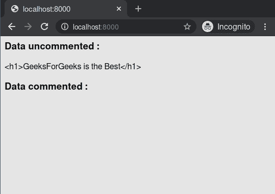

# comment–django 模板标记

> 哎哎哎:# t0]https://www . geeksforgeeks . org/comment-django 模板标签/

Django 模板是使用 Django 模板语言标记的文本文档或 Python 字符串。Django 是一个强大的包含电池的框架，为在模板中呈现数据提供了便利。Django 模板不仅允许将数据从视图传递到模板，还提供了一些有限的编程特性，如变量、循环、注释等。
本文围绕如何在 Template 中使用注释标签展开。模板会忽略和之间的所有内容。可以在第一个标签中插入可选的注释。例如，这在注释代码以记录代码被禁用的原因时非常有用。

句法

```py


```

例子

```py

    Commented out text with {{ create_date|date:"c" }}

```

## 注释–姜戈模板标签说明

举例说明如何在姜戈模板中使用注释标签。考虑一个名为 geeksforgeeks 的项目，它有一个名为 geeks 的应用程序。

> 请参考以下文章，查看如何在 Django 中创建项目和应用程序。
> 
> *   [如何利用姜戈的 MVT 创建基础项目？](https://www.geeksforgeeks.org/how-to-create-a-basic-project-using-mvt-in-django/)
> *   [如何在姜戈创建 App？](https://www.geeksforgeeks.org/how-to-create-an-app-in-django/)

现在创建一个视图，我们将通过它传递上下文字典。

## 蟒蛇 3

```py
# import Http Response from django
from django.shortcuts import render

# create a function
def geeks_view(request):
    # create a dictionary
    context = {
        "data" : "<h1>GeeksForGeeks is the Best</h1>",
    }
    # return response
    return render(request, "geeks.html", context)
```

创建 url 路径以映射到此视图。在极客/URL . py 中，

## 蟒蛇 3

```py
from django.urls import path

# importing views from views..py
from .views import geeks_view

urlpatterns = [
    path('', geeks_view),
]
```

在 templates/geeks.html 中创建模板，

## 超文本标记语言

```py
Data uncommented :
{{ data }}
Data commented :

    {{ data }}

```

让我们检查一下注释是否显示在模板中。

