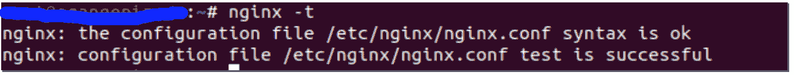
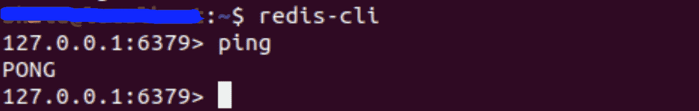
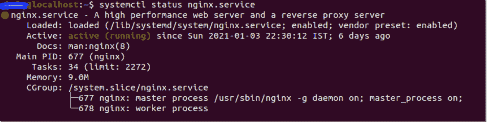

# 在 Ubuntu 服务器上配置 Django WebSocket 应用

> 原文:[https://www . geesforgeks . org/configuration-for-django-web socket-application-on-Ubuntu-server/](https://www.geeksforgeeks.org/configuration-for-django-websocket-application-on-ubuntu-server/)

本教程将详细介绍如何在 *Ubuntu 20.10 服务器*上配置 django websocket 应用程序的每一步。本文假设您熟悉 Django，并且运行了一个 ubuntu 远程服务器。要了解更多关于姜戈的信息，请结帐–[姜戈教程](https://www.geeksforgeeks.org/django-tutorial/)

首先，让我们看看我们将使用什么来投入生产，

1.  **Nginx**–网络和代理服务器
2.  达芙妮–我们的 ASGI(异步服务器网关接口)服务器，将为我们的 Django 应用程序提供服务
3.  **Redis 后端服务器**–它将处理我们的网络套接字连接( **ws://** )

### **engine**配置

安装 Nginx 和主管

```
$ sudo apt install nginx supervisor
```

在您的/etc/nginx/sites-available/文件夹中创建您的服务器并添加以下内容，

```
upstream redis_backend_server{
server localhost:6379;
}

upstream app_server {
server localhost:9090;
}

server {
listen 80;
listen 443 ssl;
keepalive_timeout 700;

ssl_certificate <path to your cert>;
ssl_certificate_key <path to your key>;

server_name foo.com www.foo.com;
access_log <path to your access logs>;
error_log <path to your error logs>;

add_header X-Frame-Options SAMEORIGIN;
add_header Content-Security-Policy "frame-ancestors self https://foo.com";

location /static/ {

root /var/www/staticfiles/;

  }

if ($scheme = http) {
       return 301 https://$server_name$request_uri;
  }

location / {
       include proxy_params;
       proxy_pass http://app_server;
  }

location /ws {
   proxy_pass http://redis_backend_server;
   proxy_http_version 1.1;
   proxy_set_header Upgrade $http_upgrade;
   proxy_set_header Connection "upgrade";

   proxy_ssl_certificate <path to your cert>;
   proxy_ssl_certificate_key <path to your key>;

   proxy_redirect off;
   proxy_set_header Host $host;
   proxy_set_header X-Real-IP $remote_addr;
   proxy_set_header X-Forwarded-For $proxy_add_x_forwarded_for;
   proxy_set_header X-Forwarded-Host $server_name;
   proxy_set_header X-Forwarded-Proto  $scheme;
   }
}
```

**注意**–用你的 IP 或域名替换 foo。

现在保存配置并重新启动 Nginx，

```
$ sudo service nginx reload
```

检查配置是否正确，如下所示，



完成后，让我们继续实际的应用服务器。

### 达芙妮配置

安装达芙妮

```
$ pip3 install daphne
```

测试事情是否正常，

```
$ daphne -p 8001 project.asgi:application
```

你应该在你的终端里看到类似的东西，


在浏览器中转到 <server-ip>:8001 检查应用是否工作。</server-ip>

在/etc/supervisor/conf.d/文件夹中创建 django_server 并添加以下内容，

```
[fcgi-program:django_server]
# TCP socket used by Nginx backend upstream
socket=tcp://localhost:9090

# Directory where your site's project files are located
directory= <path>

# Each process needs to have a separate socket file, so we use process_num
# Make sure to update "mysite.asgi" to match your project name
command=<path to daphne> -u /run/daphne/daphne%(process_num)d.sock --endpoint fd:fileno=0 --access-log - --proxy-headers project.asgi:application

# Number of processes to startup, roughly the number of CPUs you have
numprocs=1
# Give each process a unique name so they can be told apart
process_name=asgi%(process_num)d

# Automatically start and recover processes
autostart=true
autorestart=true

# Choose where you want your log to go
stdout_logfile=<path to your asgi logs>
redirect_stderr=true
```

**注意**–用您的项目名称替换项目

一旦完成，我们必须为我们的套接字创建一个运行目录，

```
$ sudo mkdir /run/daphne/
```

重新启动并更新主管配置，

```
$ sudo supervisorctl reread
$ sudo supervisorctl update
```

我知道这很难接受，我们只需再走一步就能让我们的服务器启动并运行。所以和我在一起。

### 重定向后端服务器配置

这是一台服务器，它将处理达芙妮服务器转发的所有网络套接字连接。

安装重定向服务器

```
$ sudo apt install redis-server
```

编辑 Redis 配置，使其作为服务与我们的系统一起运行

```
$ sudo nano /etc/redis/redis.conf
```

将配置文件中的“监督否”更改为“监督系统”

```
$ sudo systemctl restart redis.service
```

检查服务器是否处于活动状态并正在运行

```
sudo systemctl status redis
```

您应该会得到以下回应



最后，一切就绪并运行后，您应该可以看到您的应用程序在您的服务器上启动并运行。

