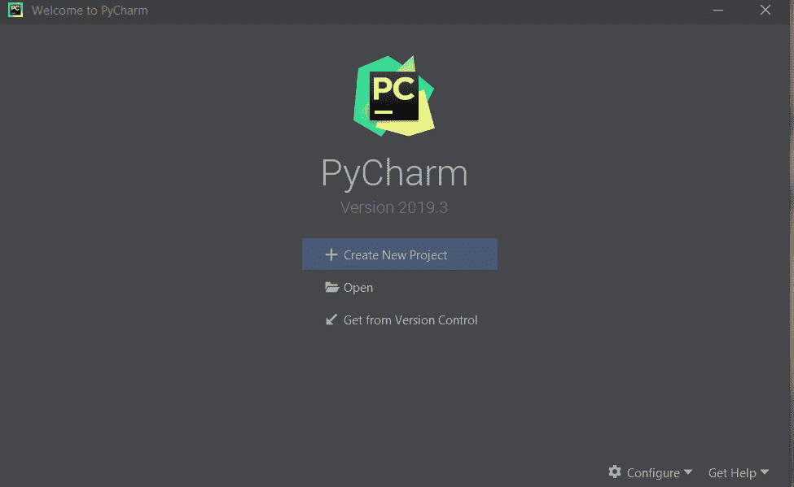
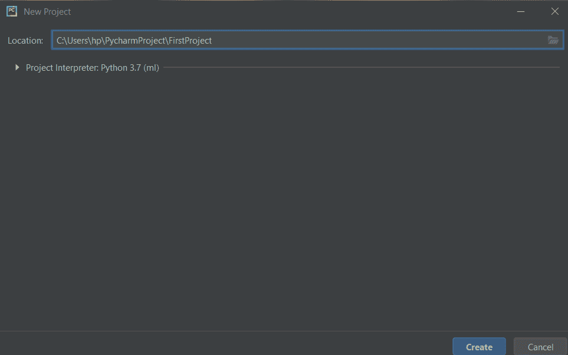
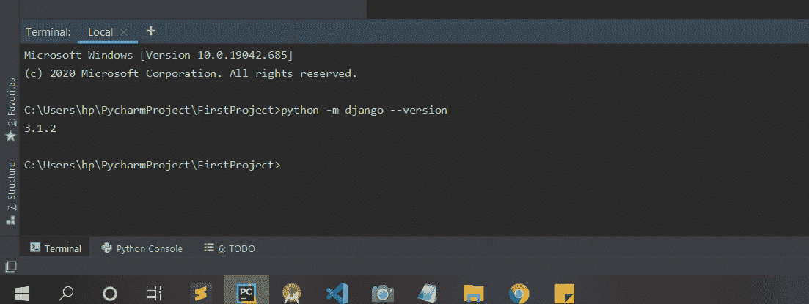
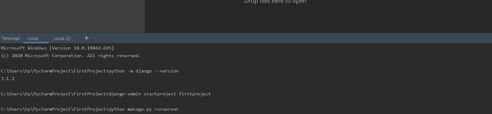
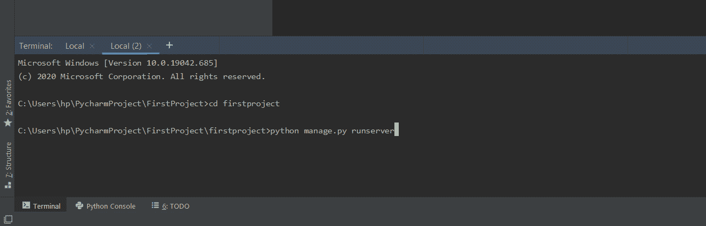
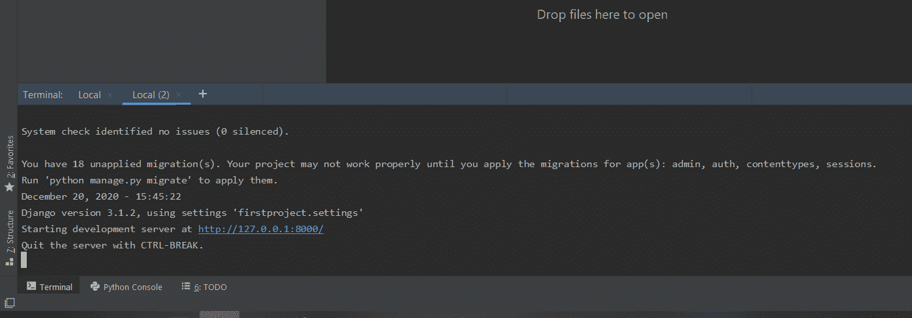

# 使用 Pycharm 终端

在 Pycharm 创建一个新的 Django 项目

> 原文:[https://www . geesforgeks . org/create-a-new-django-project-in-py charm-using-py charm-terminal/](https://www.geeksforgeeks.org/create-a-new-django-project-in-pycharm-using-pycharm-terminal/)

[PyCharm](https://www.geeksforgeeks.org/django-introduction-and-installation/?ref=lbp) 是 JetBrains 开发的最流行的 Python-IDE 之一，用于执行 Python 语言的脚本。PyCharm 提供了许多有用的功能，如代码完成和检查、调试过程、对各种编程框架(如 Flask 和 Django)的支持、包管理等。PyCharm 主要用 Python 为生产性开发提供了各种工具。

[Django](https://www.geeksforgeeks.org/django-introduction-and-installation/?ref=lbp) 是一个基于 Python 的 web 框架，它允许您快速创建 web 应用程序，而没有通常使用其他框架会发现的所有安装或依赖问题。它是非常可扩展的。

让我们开始使用 PyCharm 终端在 Pycharm 中创建新的 Django 项目。

**分步实施**

**第一步:**打开你的 PyCharm，点击**新建项目**。



**第二步:**选择你的目录，然后给你的项目命名，然后点击**创建**。



**步骤 3 :** 然后检查你的电脑中是否安装了 Django。

在位于左下角的 pycharm 终端中键入以下命令。：

```
python -m django --version
```

如果它已经安装，那么你会看到 Django 版本安装在你的电脑。如果没有，那么可以参考[姜戈介绍和安装](https://www.geeksforgeeks.org/django-introduction-and-installation/?ref=lbp)。



**第 4 步:**使用以下命令启动项目-

```
django-admin startproject firstproject
```



**步骤 5:** 将目录更改为 firstproject。

```
cd firstproject
```



**步骤 6:** 在 **cmd** 中键入以下命令启动服务器–

```
python manage.py runserver
```



点击给定的网址**后(http://127.0.0.1:8000/)。**您将看到您的开发服务器，如下图所示。

