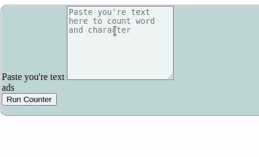

# 使用 Django

创建单词计数器应用程序

> 原文:[https://www . geesforgeks . org/create-word-counter-app-using-django/](https://www.geeksforgeeks.org/create-word-counter-app-using-django/)

在本文中，我们将使用 **Django** 制作一个简单的工具来统计文本中的单词数量。在进入这个话题之前，你需要对姜戈有一些基本的了解。

> 参考下面的文章来了解 Django 的基础知识。
> 
> *   [姜戈基础](https://www.geeksforgeeks.org/django-basics/)
> *   [如何利用姜戈的 MVT 创建基础项目？](https://www.geeksforgeeks.org/how-to-create-a-basic-project-using-mvt-in-django/)

现在继续制作我们的单词计数器，首先，我们需要创建一个函数，我们可以在其中编写计算单词的逻辑。

**view . py**

## 蟒蛇 3

```py
from django.shortcuts import render

# defining function for wordcounter
def counter(request):
    # checking if method is POST or not
    if request.method == 'POST':

        # taking text input
        text = request.POST['texttocount']

        # checking weather text is empty
        # or not
        if text != '':

            # splitting the text and taking length
            # of that
            word = len(text.split())

            # defining boolean so that we can keep
            # track of process later
            i = True

            # returning HTML page with data, if calculated
            # successfully
            return render(request, 'counter.html',
                          {'word': word, 'text': text, 'i': i, 'on': 'active'})

        else:
            # returning HTML page without data, if any
            # error occurs
            return render(request, 'counter.html', {'on': 'active'})

    else:
        # returning HTML page if request.method is not POST
        return render(request, 'counter.html', {'on': 'active'})
```

**说明:**

首先，我们创建了一个计数器函数，它将从前端接收文本输入。之后，它将检查文本是否为空。然后它会从文本中分离出单词，并测量它们的长度。此外，将该长度存储到名为**“word”的变量中。**我们还创建了一个布尔值，它将用于跟踪以后的过程。如果这个过程成功完成，那么它将返回一个带有存储在 word &文本中的数据的 HTML 页面。如果这个过程不能成功完成，那么它将返回相同的没有任何数据的 HTML 页面。

创建函数后，我们需要为它定义一个网址。我们这里将使用**http://localhost:8000/counter**。为此，请打开您的 urls.py 文件夹并编写以下代码。

## 蟒蛇 3

```py
from django.urls import path
from . import views
from django.conf import settings
from django.conf.urls.static import static

urlpatterns = [
    path('counter',views.counter, name='counter'),
]
```

之后，我们需要为此创建一个 HTML 页面。在这里，你可以运用你的设计技巧，准备你自己的设计，并命名为 counter.html。在这里，我们将展示你可以面对的逻辑。

首先，我们将检查布尔为真或假，以了解过程是否成功完成。如果这是真的，那么我们可以向前看。稍后，我们将使用单词变量在 Jinja 格式的帮助下打印输出。然后，我们将创建一个表单，从用户那里获取数据，这些数据将被发送到我们的计数器函数中。因为我们使用 **POST** 方法来处理请求，所以我们必须给出。

**counter.HTML**

## 超文本标记语言

```py

<div class="mb-2" style="border-style: groove;border-radius: 10px;">
  <div class="card-header">
    <p class="m-0" style="font-size: 20px;">{{word}} Word's in that text</p>

  </div>
</div>


<div class="col-12 pb-3" style="background-color:  #c2d6d6; border: 2px; border-style: groove; border-radius: 10px;">
  <form action="counter" method="POST"> 
    <div class="form-group">
      <label for="text1">Paste you're text</label>
      <textarea class="form-control" placeholder="Paste you're text here to count word and character"
                name="texttocount" id="text1" rows="8" style="background-color: #f0f5f5;">{{text}}</textarea>
    </div>

    <!-- ads section start-->
    <div class="text-center">
      ads
    </div>

    <!-- ads section end -->
    <div class="form-group text-center">
      <button type="submit" class="btn btn-primary w-25" >Run Counter</button>
    </div>
  </form>
</div>
```

**输出:**

